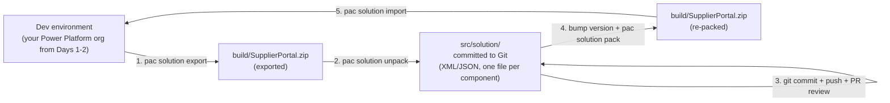

# Lab 10: Solution Packaging and Dataverse Dependencies

## What you will build

A Dataverse solution that packages your SPA site with every dependency (tables, columns, web roles, table permissions, site settings), unpacked into XML and committed alongside the SPA source — so PR reviewers see Dataverse changes line-by-line, not as opaque binary blobs.

## Prerequisites

- Completed [Lab 09: Source Control](./09-source-control.md) — portal directory is a Git repo on GitHub
- SPA site uses the **enhanced data model** (required to add an SPA site to a solution; if you scaffolded with `/create-site` you already have this)
- PAC CLI 2.6.3 or higher (`pac help` shows the version)

## Learning objectives

By the end of this lab you will be able to:

1. Assemble a Power Pages site solution with every Dataverse component the site depends on (tables, columns, relationships, web roles, table permissions, site settings)
2. Apply the **unpack-to-source-control** pattern: export → unpack → commit → pack → import
3. Explain why solution `.zip` files are not source-controlled, and what reviewers see in a PR diff instead
4. Wire site settings to **environment variables** so each target environment supplies its own values at solution import time

---

## Why solutions, why now

Your portal isn't just React code. It's also a Dataverse data model: the `cr_invoice` table you created in Lab 02, the columns on it, the web roles you assigned, the table permissions that gate Web API access, and the site settings that enable the Web API in the first place.

The `/deploy-site` flow you used earlier only moved the React bundle. Every Dataverse change is still in your dev environment, **in nobody's source control, with no audit trail**. The moment you need to recreate this portal in a second environment, you'll click those changes again from memory.

A **Dataverse solution** packages all of those components together as a unit. Once your site and its dependencies are in a solution, you can:

- Export the solution from dev, import it into integration / pre-prod / prod
- Diff the solution contents in a PR (with the unpack pattern below)
- Roll back a Dataverse change with `git revert`
- Hand the repo to a teammate who can recreate the portal end-to-end

> **Two directories, two purposes.** Your repo will end up with both `.powerpages-site/` (created by Lab 01's `/create-site`) and `src/solution/` (created by this lab). They're not duplicates — they have different jobs:
>
> - **`.powerpages-site/`** is the SPA site's own configuration, consumed by `pac pages upload-code-site`. It's specific to the *site*: site settings, web roles, table permissions tied to this site's runtime.
> - **`src/solution/`** is the unpacked Dataverse solution, consumed by `pac solution pack/import`. It's specific to the *data model*: tables, columns, relationships, plus the same site-related components for repackaging across environments.
>
> There's overlap on web roles, table permissions, and site settings — both directories list them. The solution is the source of truth for cross-environment portability; `.powerpages-site/` is the source of truth for the local site upload. Re-export the solution after any maker-portal change to keep them aligned.

Further reading: [Create and deploy a single-page application in Power Pages](https://learn.microsoft.com/power-pages/configure/create-code-sites), [`pac solution` reference](https://learn.microsoft.com/power-platform/developer/cli/reference/solution)

---

## Part A: assemble the solution in the Maker portal

Solutions for SPA sites are assembled in the **maker portal**, not via PAC CLI. The CLI handles export / unpack / pack / import; the maker portal handles the membership of which components belong to the solution.

> **UI may have moved.** The Power Platform maker portal evolves rapidly. If a button or panel name in the steps below doesn't match what you see, check the [Microsoft Learn solutions docs](https://learn.microsoft.com/power-apps/maker/data-platform/solutions-overview) for the current navigation.

### Step 1: create the solution

1. Go to https://make.powerapps.com/
2. Confirm the environment selector (top-right) is your dev environment
3. In the left nav, select **Solutions**
4. Select **+ New solution**
5. Fill in:
   - **Display name:** `Supplier Portal`
   - **Name:** `SupplierPortal` (no spaces, used in PAC CLI commands later)
   - **Publisher:** select an existing publisher or create a new one (use a stable prefix, for example `cr` if your tables already use `cr_`)
   - **Version:** `1.0.0.0`
6. Select **Create**

### Step 2: add the SPA site

1. Inside the new solution, select **Add existing > Site > Site**
2. Select your supplier portal site
3. Confirm

The site is now in the solution. Components that ship with the site (the site files themselves, default site components) are tracked automatically.

### Step 3: add Dataverse dependencies

**Important:** Dataverse components are **not auto-discovered**. You must add each one explicitly.

For each item below, in your solution, select **Add existing > [Component type]** and pick the matching item:

| Component type | What to add |
|---|---|
| **Table** | `cr_invoice` (and any other custom tables you added in Lab 02) |
| **Web Role** | `Authenticated Users` (or whatever role you assigned in Lab 02) |
| **Table Permission** | The permission records that grant the Authenticated Users role access to `cr_invoice` and related tables |
| **Site Setting** | All `Webapi/cr_invoice/*` settings (Enabled, Fields), plus any other site settings your portal depends on |

> **Tip:** when adding a table, the dialog asks "Include all components, or select components?" — pick **Select components** and check the columns, forms, and views your portal actually uses. Including everything is tempting but bloats the solution and slows pipeline runs.

### Step 4: verify solution membership

In your solution, you should now see:

- 1 Site (the SPA site)
- 1 or more Tables
- 1 or more Web Roles
- 1 or more Table Permissions
- Several Site Settings

If something is missing, your CI deploys will fail later when the missing component is referenced by something that *was* deployed. Better to find it now.

> **Tip:** if a component doesn't appear in your unpacked solution after `pac solution unpack` later in this session, the most common cause is that it wasn't actually added to the solution here. Re-check membership in the maker portal before assuming the unpack misbehaved.

---

## Part B: the Unpack-to-Source-Control pattern

This is the heart of the ALM phase. **Solution `.zip` files are not source-controlled.** They are opaque binary blobs — a PR reviewer cannot diff them, merge conflicts on them are unresolvable, and the file format makes "what changed in this PR" invisible.

Instead, we **unpack** the zip into XML and JSON files (one file per component) and commit *those* to Git. PR reviewers then see a clean line-by-line diff of every Dataverse change, side-by-side with the SPA code changes.

### The Five-Step cycle



Each numbered arrow above maps one-to-one to a sub-step below.

### Step 1: export

Authenticate against your dev env and export the solution as **unmanaged**:

```bash
pac auth list
pac org who

mkdir -p build src/solution
pac solution export --name SupplierPortal --path build --overwrite
```

The export lands as `build/SupplierPortal.zip` — already blocked by `.gitignore`.

### Step 2: unpack

Unpack the zip into source so reviewers can see structured, diffable XML/JSON:

```bash
pac solution unpack --zipfile build/SupplierPortal.zip --folder src/solution --packagetype Unmanaged
```

This populates `src/solution/` with directories like `Entities/`, `WebRoles/`, `SiteSettings/`, `TablePermissions/` — one XML/JSON file per component. Spend a minute with `ls src/solution` to see the structure.

### Step 3: commit, push, and review

```bash
git add src/solution .gitignore
git status              # confirm build/SupplierPortal.zip is NOT staged
git commit -m "Add Supplier Portal solution as unpacked source"
git push
```

Open the GitHub web view (`gh repo view --web`), open `src/solution/`. This is what your reviewers will see — structured, diffable, auditable. A new column appears as a single XML attribute change. A new web role appears as a single new file.

### Step 4: bump version and pack

When you (or a teammate) pull an approved branch, first bump the version, then re-pack the source into a zip. The version stamp is what lets CI and humans tell deploys apart:

```bash
git pull origin main
pac solution online-version --solution-name SupplierPortal   # or bump in maker portal solution settings
pac solution pack --folder src/solution --zipfile build/SupplierPortal.zip --packagetype Unmanaged
```

In Lab 12, the CI pipeline bumps the version automatically before each integration deploy.

### Step 5: import

Import the re-packed zip into the target environment to apply the changes:

```bash
pac solution import --path build/SupplierPortal.zip --force-overwrite --publish-changes
```

`--force-overwrite` lets the import overwrite components that already exist. `--publish-changes` publishes customizations after the import so they're live without a manual publish.

---

## What reviewers see in a PR

Imagine you add a `cr_memo` column to `cr_invoice`, then run export → unpack → commit. Open a PR. Your reviewer sees:

```diff
src/solution/Entities/cr_invoice/Entity.xml
@@ -42,6 +42,12 @@
       <DisplayName>Notes</DisplayName>
       <Description>Internal notes</Description>
     </Attribute>
+    <Attribute PhysicalName="cr_memo">
+      <Type>nvarchar</Type>
+      <MaxLength>500</MaxLength>
+      <DisplayName>Memo</DisplayName>
+      <Description>Free-text memo for finance reviewers</Description>
+    </Attribute>
   </Attributes>
```

That's the payoff. Without unpack, the reviewer would see a 200KB binary blob and have to take your word for what changed. With unpack, the change reads like ordinary code.

---

## Part C: Env-Specific site settings via environment variables

The solution you just assembled captures the *structure* (tables, columns, web roles, table permissions, site settings) and flows the same values to every environment. But each environment legitimately needs different values: dev points at a sandbox payment provider, prod points at the live one; dev allows test users, prod doesn't. Same site setting, different value per env.

For SPA sites (which use the **enhanced data model**), Microsoft Learn recommends **environment variables for site settings** as the way to handle this. Instead of hardcoding `Search/Enabled = true` in the source environment, you wire the site setting to reference an *environment variable*; each target environment supplies its own value at solution import time. Power Platform Pipelines (Lab 13) prompts the operator for these values during promotion.

> **Why this beats hardcoded site settings.** Without environment variables, every env-specific change means re-exporting the solution from a "configured" source environment, which couples your dev environment to your release process. With environment variables, the *solution* stays env-agnostic and *each target env* owns its own values.
>
> Further reading: [Use environment variables with site settings](https://learn.microsoft.com/power-pages/configure/environment-variables-for-site-settings)

### Prerequisites for environment variables

Microsoft Learn calls out three version requirements for environment variables to work in Power Pages:

- Dataverse server version 9.2.25013.x or later
- Power Pages package version 1.0.2501.x or later
- Power Pages runtime version 9.7.1.x or later

If you provisioned your dev environment recently, you likely meet all three. If you're on an older tenant, your Power Platform admin can confirm versions in the admin center.

### Step 1: pick a site setting to wire up

For the hands-on, we'll wire one site setting to an environment variable so you see the full flow end-to-end. Pick something visibly different per env — `Search/Enabled` is a good demo because you can flip it on in dev and off in prod and see the impact in the UI.

> **What's NOT supported.** Per Learn: site settings with the data type `data source` cannot be wired to environment variables. Site settings with the data type `secret` require Azure Key Vault setup (covered briefly at the end of this section). For your first environment variable, pick a string or boolean site setting like `Search/Enabled`, `Authentication/Registration/Enabled`, or `HTTP/SecureRandomCookie`.

### Step 2: create the environment variable definition (in the solution)

1. Open the [Power Apps maker portal](https://make.powerapps.com/) in your dev environment
2. Open the **Supplier Portal** solution you created in Part A
3. Select **+ New** → **More** → **Environment variable**
4. Fill in:
   - **Display name:** `Search Enabled`
   - **Schema name:** `cr_searchenabled` (lowercase; Dataverse stores logical names in lowercase. Note the prefix `cr_` matches your publisher.)
   - **Data type:** `Yes/No`
   - **Default value:** `Yes`
5. Save

The environment variable definition is now part of the solution. The default value (`Yes`) is what target environments inherit unless they supply their own value.

### Step 3: wire the site setting to the environment variable

1. Open the **Power Pages Management app** for your dev environment
2. Go to **Site Settings**
3. Open the `Search/Enabled` site setting (or create it if it doesn't exist)
4. In the **Source** dropdown, change from `Value` to **Environment Variable**
5. In the **Environment Variable** lookup, select the `cr_searchenabled` definition you just created (search by schema name)
6. Save

The site setting now reads its runtime value from the environment variable instead of a hardcoded value.

### Step 4: add the environment variable to the solution

If you created the variable from inside the solution (Step 2), it's already a solution component. Confirm:

1. Back in the maker portal, open your solution
2. Verify the environment variable definition appears in the components list
3. Also verify the `Search/Enabled` site setting is in the solution (`Add existing > Site Setting` if not)

### Step 5: Re-Export and Re-Unpack

The solution now carries the environment variable wiring. Re-run the export → unpack flow from Part B so the changes hit Git:

```bash
pac solution export --name SupplierPortal --path build --overwrite
pac solution unpack --zipfile build/SupplierPortal.zip --folder src/solution --packagetype Unmanaged

git add src/solution
git commit -m "Wire Search/Enabled to cr_searchenabled environment variable"
```

A reviewer of this commit sees the new environment variable definition file and the updated site setting reference — the Dataverse-side change is auditable alongside any SPA code changes.

### Step 6: what happens at import time

Two ways to set target-env values:

- **Manual solution import** (Power Pages Management app or solution import UI): the importer is prompted to assign a value to each environment variable in the solution. Skip the prompt and the default value (from Step 2) is used.
- **Power Platform Pipelines** (Lab 13): the deployment user supplies the value for each environment variable when triggering the stage promotion. Pipelines stores these values per stage so subsequent runs reuse them.

> **Cache reminder.** When you change an environment variable's value (in any env), clear the site cache for the change to take effect: in **design studio**, select **Sync**; or sign in to the portal, browse to `/_services/about`, and select **Clear cache**; or restart the portal from the Power Platform admin center.

### Best practices (from learn)

- **Use environment variables only for ALM-related site settings** — not for every site setting. Wiring everything to environment variables can degrade performance.
- **Name consistently:** schema names like `cr_searchenabled`, `cr_authRegistrationEnabled`, `cr_apiBaseUrl` group together visually.
- **Document each variable** in the description field — the next person to debug a misbehaving target env will thank you.
- **Test in a non-prod env** before applying changes to production.

### What if a setting Can't be wired to an environment variable?

A few scenarios that environment variables don't cover cleanly:

- **`data source` data type site settings** — explicitly unsupported per Learn
- **Per-env content snippet text** that isn't a site setting (e.g., a custom welcome banner that should differ per env)
- **Per-env values inside Dataverse table records you wrote yourself** (rare, but possible)

For SPA sites these are out of scope for environment variables. The pragmatic options are:

- **Drive UI values from the SPA itself** — React reads the env at runtime
- **Read config from a Dataverse table at runtime** via the Web API
- **Live with the same value across envs** if the difference doesn't actually matter

The runtime-read pattern is short. Read a site setting wired to an environment variable from the browser:

```typescript
// src/services/configService.ts
export async function getSiteSetting(name: string): Promise<string | null> {
  const res = await fetch(`/_api/sites/sitesettings?$filter=adx_name eq '${name}'&$select=adx_value`);
  if (!res.ok) return null;
  const data = await res.json();
  return data.value?.[0]?.adx_value ?? null;
}

// usage
const searchEnabled = await getSiteSetting("Search/Enabled");
```

The site setting resolves on the server using the environment variable's value for whichever environment the SPA is running in — no per-env code branches needed.

---

## Troubleshooting

| Problem | Fix |
|---|---|
| `pac solution export` says "Solution not found" | Confirm spelling matches the solution **Name** (not Display name): `pac solution list` lists everything in the env. |
| Unpack fails with "invalid zip" | Re-export — partial downloads happen on flaky networks. |
| Pack fails with "missing component" | Someone deleted a file from `src/solution/` without re-exporting. Either restore from Git or re-export from dev. |
| Import fails on a fresh env with "missing dependency" | Your solution is missing a Dataverse component (table, web role, site setting). Open the solution in the maker portal and add the missing piece. |
| `.zip` file accidentally committed | `git rm --cached build/SupplierPortal.zip && git commit -m "Remove zip from tracking"`. Verify `.gitignore` excludes `*.zip` and `build/`. |

## Verification

You have completed this lab when:

- [ ] `pac solution list` shows your solution (e.g., `SupplierPortal`) in the dev environment
- [ ] An exported solution zip exists locally and `pac solution unpack` produced an `src/solution/` tree of XML files
- [ ] `git status` shows the unpacked `src/solution/` folder tracked, and `*.zip` files are ignored via `.gitignore`
- [ ] At least one site setting is wired to an environment variable definition (visible under `src/solution/EnvironmentVariableDefinitions/`)
- [ ] `pac solution pack` from `src/solution/` produces a zip without errors
- [ ] A re-import of the packed zip into the dev environment succeeds and the env-variable-backed site setting still resolves correctly

## Fallback

If `pac solution export`, `pack`, or `import` fails repeatedly:

1. Run `pac auth list` and `pac org who` — confirm you are pointed at the intended environment
2. If the export hangs or returns an empty zip, the source environment may still be applying changes from the maker portal. Wait 60 seconds and retry.
3. If `pac solution unpack` produces a malformed `src/solution/` tree, delete the folder and re-run unpack — partial files left from a previous interrupted run will confuse the next pack.
4. If `pac solution import` complains about a missing dependency, the target environment lacks a Dataverse component (table, web role, site-setting type). Add it to the source solution in the maker portal, re-export, retry import.
5. As a last resort, fall back to manual solution-import via the maker portal: upload the zip under **Solutions → Import**, supply environment variable values when prompted, then `pac solution list` to confirm the import landed.

## Key takeaways

- Solutions for SPA sites are assembled in the maker portal; PAC CLI handles export/unpack/pack/import only
- Dataverse dependencies (tables, web roles, table permissions, site settings) are **not auto-discovered** — add each one explicitly
- The unpack pattern (export → unpack → commit; pack → import) makes Dataverse changes reviewable in a PR
- Never commit solution `.zip` files; commit the unpacked `src/solution/` tree instead
- **Environment variables for site settings** keep env-specific values out of source and flow naturally through solution imports and Power Platform Pipelines
- After changing an environment variable's value in any env, clear the site cache (Sync, `/_services/about` → Clear cache, or restart the portal)

## What's next

→ [Lab 11: Branching Strategy and Developer Workflows](./11-branching-and-workflows.md)
