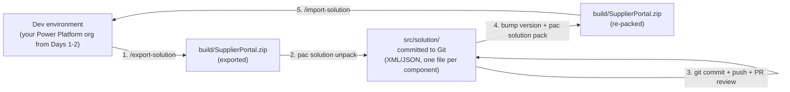

# Lab 11: Package the solution and dependencies

## Goal

Package the SPA site and Dataverse dependencies into a solution that can be reviewed, versioned, and promoted across environments.

**Estimated time:** about 30-45 minutes.

## State you carry forward

- Completed [Lab 10: Put the site under source control](./10-source-control.md): portal directory is a Git repo on GitHub
- Completed [Lab 09: Run a security review](../integrate/09-security-review.md): release-readiness security pass against the integration env
- SPA site uses the **enhanced data model** (required to add an SPA site to a solution; `/create-site` produces this by default)
- PAC CLI 2.6.3 or higher (`pac help` shows the version): `/setup-solution` and the other ALM skills require it
- Active PAC CLI session against your dev environment (`pac auth list`)

> **Before you start, confirm your Lab 10 state.** This lab commits the unpacked solution alongside the source you pushed in Lab 10:
>
> - [ ] The portal directory is a Git repo with `origin` on GitHub (`git remote -v`)
> - [ ] `.gitignore` excludes `*.zip` and `build/` (Lab 10, Step 2): you're about to export zips into `build/`
> - [ ] If you intend to follow Lab 12's PR workflow, branch protection on `main` is on (Lab 10, Step 6); enable it now if you skipped it

## Learning objectives

By the end of this lab you will be able to:

1. Use `/plan-alm` to detect project state and propose an ordered ALM execution plan, then approve the plan before any change applies
2. Use `/setup-solution` to author the solution, classify site settings by sensitivity, propose environment variables, and (optionally) provision Azure Key Vault for secret-type values
3. Apply the **unpack-to-source-control** pattern so Dataverse changes diff cleanly in a PR
4. Explain why `/setup-solution` runs in **sync mode** on re-runs, and what the solution split recommendation means
5. Recognise when to fall back to manual maker-portal solution assembly

> **Further reading:** [Power Platform solutions overview](https://learn.microsoft.com/power-platform/alm/solution-concepts-alm) · [Environment variables for site settings](https://learn.microsoft.com/power-pages/configure/environment-variables-for-site-settings) · [Azure Key Vault overview](https://learn.microsoft.com/azure/key-vault/general/overview) · [`pac solution` reference](https://learn.microsoft.com/power-platform/developer/cli/reference/solution)

---

## Why solutions, why now

Your portal isn't just React code. It's also a Dataverse data model: the `cr_invoice` table you created in Lab 02, the columns on it, the web roles you assigned, the table permissions that gate Web API access, the site settings that enable the Web API in the first place, the server logic endpoints you added in Lab 05, the cloud flow registrations from Lab 06, and the identity provider configuration from Lab 02 Part 5.

The `/deploy-site` flow you used earlier only moved the React bundle. Every Dataverse change is still in your dev environment, **in nobody's source control, with no audit trail**. The moment you need to recreate this portal in a second environment, you'll click those changes again from memory.

A **Dataverse solution** packages all of those components together as a unit. Once your site and its dependencies are in a solution, you can:

- Export the solution from dev, import it into integration / pre-prod / prod
- Diff the solution contents in a PR (with the unpack pattern below)
- Roll back a Dataverse change with `git revert`
- Hand the repo to a teammate who can recreate the portal end-to-end

> **Managed vs unmanaged, you'll meet both.** A solution exports in one of two forms, for two different jobs. **Unmanaged** is the editable development form: its components are human-readable XML you can unpack, diff, and commit. That's what this lab uses for source control (`pac solution unpack ... --packagetype Unmanaged`). **Managed** is the sealed, versioned form built for promotion *into* other environments: you don't edit it, you import it as a unit. Lab 13 exports and promotes the **managed** solution to integration, pre-prod, and prod. Same components, two packaging modes: keep the distinction in mind, because it decides which command you reach for.

> **Two directories, two purposes.** Your repo will end up with both `.powerpages-site/` (created by Lab 01's `/create-site`) and `src/solution/` (created by this lab). They have different jobs:
>
> - **`.powerpages-site/`** is the SPA site's own configuration, consumed by `pac pages upload-code-site`. It's specific to the *site*: site settings, web roles, table permissions tied to this site's runtime.
> - **`src/solution/`** is the unpacked Dataverse solution, consumed by `pac solution pack/import`. It's specific to the *data model*: tables, columns, relationships, plus the same site-related components for repackaging across environments.
>
> There's overlap on web roles, table permissions, and site settings. Both directories list them. The solution is the source of truth for cross-environment portability; `.powerpages-site/` is the source of truth for the local site upload. Re-running `/setup-solution` after maker-portal changes keeps them aligned.
>
> **Carry-forward:** Labs 12-13 assume both directories stay in the repo. `src/solution/` is what PR reviewers and CI/Pipelines package; `.powerpages-site/` is what local plugin skills and direct site upload continue to read.

---

## Part 1: orient with `/plan-alm`

The ALM phase has eight skills (`/setup-solution`, `/ensure-pipelines-host`, `/setup-pipeline`, `/deploy-pipeline`, `/force-link-environment`, `/export-solution`, `/import-solution`, `/diagnose-deployment`). You don't run them by hand. `/plan-alm` is the **entry point** that orchestrates the lot.

### Step 1.1: run `/plan-alm` once at the top

In your AI coding CLI:

```
/plan-alm

Promote the supplier portal from this dev env through integration,
pre-prod, and prod. Use Power Platform Pipelines for promotion;
Azure Key Vault is acceptable for any secret-type site settings.
```

The plugin will:

1. **Detect project state:** does a solution already exist? Is the `src/solution/` tree present? Is Power Platform Pipelines configured for this tenant? Is the dev env authenticated?
2. **Ask about your promotion strategy:** Pipelines vs. manual export/import, target stages, Key Vault yes/no, any constraints.
3. **Render a visual plan** at `docs/alm-plan.html` listing every action it intends to take and in what order.
4. **Wait for your approval** before running any downstream skill.

> **Important:** `/plan-alm` is **idempotent and resumable**. If a downstream skill fails midway, run `/plan-alm` again. It reads the plan from disk and resumes from the last successful step. Don't try to run `/setup-solution` by hand after a partial failure; let the plan resume.

### Step 1.2: read the plan

Open `docs/alm-plan.html` and skim it. For the supplier portal scenario, the plan typically lays out:

| Phase | Skill | What it does |
|---|---|---|
| **1. Author solution** | `/setup-solution` | Creates publisher + solution, adds Power Pages components, classifies site settings, proposes env variables (this lab) |
| **2. Pipelines host** | `/ensure-pipelines-host` | Provisions or detects the Pipelines host environment ([Lab 13: Promote across environments](./13-multi-env-promotion.md)) |
| **3. Pipeline definition** | `/setup-pipeline` | Registers the pipeline in Dataverse, binds stages to target envs ([Lab 13: Promote across environments](./13-multi-env-promotion.md)) |
| **4. Stage deployments** | `/deploy-pipeline` | Triggers a deployment for a target stage ([Lab 13: Promote across environments](./13-multi-env-promotion.md)) |
| **5. Post-deploy** | `/test-site` + `/diagnose-deployment` | Verifies the deployment and matches any failure against the catalog ([Lab 13: Promote across environments](./13-multi-env-promotion.md)) |

For this lab, you're going to complete **Phase 1** end-to-end. Phases 2-5 land in Lab 13.

---

## Part 2: author the solution with `/setup-solution`

`/setup-solution` does what you used to do by hand in the maker portal: create a publisher, create a solution, add every Power Pages component (site, web roles, server logic endpoints, cloud flow registrations, OAuth providers), and walk you through env-variable classification for site settings.

### Step 2.1: run `/setup-solution`

If `/plan-alm` approved Phase 1, it invokes `/setup-solution` automatically. Otherwise:

```
/setup-solution

Author a solution called Supplier Portal that packages this site
and everything it depends on. Use the cr publisher to match my
existing custom tables. Classify site settings: anything that
varies per env becomes an environment variable, anything sensitive
goes into Azure Key Vault. Default version 1.0.0.0.
```

The plugin will:

1. Detect the publisher prefix from your existing custom tables (or ask) and use it for the new solution.
2. Create the publisher and the **Supplier Portal** solution (if neither exists yet).
3. Walk the site's components and add each one to the solution:
   - The Power Pages site itself
   - Every web role under `.powerpages-site/web-roles/`
   - Every server logic endpoint (from Lab 05)
   - Every cloud flow registration (from Lab 06)
   - Every OAuth provider configured by `/setup-auth` (from [Lab 02, Part 5](../build/02-dataverse-and-security.md#part-5-configure-authentication-with-setup-auth))
   - Each table referenced by your site code (`/integrate-webapi`-generated services)
4. **Classify every site setting by sensitivity** into one of three buckets:
   - **Same-everywhere:** same value across environments; stays as a plain site setting
   - **Env-specific:** varies across environments; becomes an [environment variable](https://learn.microsoft.com/power-pages/configure/environment-variables-for-site-settings)
   - **Secret:** credential-like (connection strings, API keys); offered for Azure Key Vault storage
5. **Propose** the full component list, env-variable wiring, and (optional) Azure Key Vault provisioning.

> **Reference only. Your output may differ.** The plugin tailors the component list, env-variable choices, and publisher prefix to your repo's actual state. Approve the proposal; don't hand-edit the generated solution.

### Step 2.2: review the classification

This is the highest-leverage step in the lab. The plugin shows a table like:

| Setting | Classification | Why |
|---|---|---|
| `Webapi/cr_invoice/enabled` | Same-everywhere | Must be true in every env |
| `Search/Enabled` (env variable `cr_searchenabled`) | Env-specific | Off in dev, on in prod, etc. |
| `Authentication/OpenIdConnect/EntraExternalId/ClientId` | Env-specific | Different app registration per env |
| `Authentication/OpenIdConnect/EntraExternalId/ClientSecret` | Secret | Credential, proposed for Key Vault |
| `Mpn/PartnerId` | Same-everywhere | Identical across envs |

Verify each row. The plugin is conservative (it errs toward treating things as env-specific or secret). You can downgrade items that are genuinely uniform. Be careful: **anything misclassified as same-everywhere will leak the dev value into prod at import time**.

### Step 2.3: approve and let the plugin write the changes

After you approve:

1. The plugin creates the env variable definitions in the dev env's solution and **wires each affected site setting** to its variable.
2. If you accepted Azure Key Vault, the plugin runs the Azure-side provisioning (`az keyvault create`, role assignment for the deployment service principal, secret upload).
3. The site setting wiring now reads from the Key Vault secret URI. The secret value itself never sits in the solution.

> **Note:** Azure Key Vault provisioning needs an authenticated Azure CLI session (`az account show`) and permission to create a vault in the target subscription. If you can't provision Key Vault now, decline the Key Vault offer. The plugin keeps secret-type settings as plain env variables and you can lift them into Key Vault later by re-running `/setup-solution`.

### Step 2.4: `/setup-solution` sync mode on re-runs

If a solution already exists for your site, re-running `/setup-solution` enters **sync mode**:

- It reconciles component membership: anything new in `.powerpages-site/` or `src/` that isn't in the solution gets added.
- It re-classifies any new site settings.
- It does **not** create a new solution, change the version, or modify components you've already approved.

Treat sync mode as a routine action after every meaningful change to the site (new server logic, new auth provider, new table). Lab 13's `/deploy-pipeline` runs sync mode automatically before each promotion.

### Step 2.5: handle the split recommendation (if surfaced)

For large or entangled portals, the plugin may surface a **split recommendation** during classification:

```
The solution would contain 47 components across 8 unrelated feature
areas. Solutions this large risk dependency-cycle failures and slow
imports. Recommended split:

  Supplier Portal Core  - site, web roles, auth, core tables
  Supplier Portal AI    - AI hooks + server logic for summarization
  Supplier Portal Flows - cloud flow registrations

Confirm the split before I write the components.
```

Accept the split if the plugin recommends it. Multi-solution promotion is supported by `/deploy-pipeline` and avoids the failure modes of a monolithic solution. Decline only if you have a specific reason (regulatory boundary, deploy-windowing).

---

## Part 3: unpack-to-source-control

`/setup-solution` does the maker-portal authoring. The unpack-to-source-control loop is still your job. The solution `.zip` is an opaque binary, but the unpacked source diffs cleanly in PRs.

### The five-step cycle



Each numbered arrow above maps one-to-one to a sub-step below.

> **Note:** Steps 1 and 5 use the new skills (`/export-solution`, `/import-solution`) because they add a completeness check, optional staging, and `deploymentSettings.json` handling on top of `pac solution export/import`. Steps 2 and 4 still use raw `pac solution unpack/pack`: those are deterministic mechanical operations the plugin does not wrap.

### Step 3.1: `/export-solution`

`/export-solution` wraps `pac solution export` with a **completeness check**: it verifies every component the plugin authored is present before exporting, so you don't export a partial solution.

```
/export-solution
```

When prompted, export **Supplier Portal** from dev **as unmanaged** into `build/`. The plugin runs the completeness check (warns if anything authored by `/setup-solution` is missing), then exports to `build/SupplierPortal.zip`. The `.zip` is already blocked by `.gitignore`.

> **Tip:** For ad-hoc exports outside the orchestrated plan, you can still drop down to `pac solution export --name SupplierPortal --path build --overwrite`. The skill is the recommended path because of the completeness check.

### Step 3.2: unpack

Unpack the zip into source so reviewers can see structured, diffable XML/JSON:

```bash
pac solution unpack --zipfile build/SupplierPortal.zip --folder src/solution --packagetype Unmanaged
```

This populates `src/solution/` with directories like `Entities/`, `WebRoles/`, `SiteSettings/`, `TablePermissions/`, `EnvironmentVariableDefinitions/`: one XML/JSON file per component. Spend a minute with `ls src/solution` to see the structure.

### Step 3.3: commit, push, and review

```bash
git add src/solution .gitignore
git status              # confirm build/SupplierPortal.zip is NOT staged
git commit -m "Add Supplier Portal solution as unpacked source"
git push
```

Open the GitHub web view (`gh repo view --web`), open `src/solution/`. This is what your reviewers will see: structured, diffable, auditable. A new column appears as a single XML attribute change. A new web role appears as a single new file. A new environment variable wiring is one new file plus a one-line change in the affected site setting.

### Step 3.4: bump version and pack

When you (or a teammate) pull an approved branch, first bump the version, then re-pack the source into a zip:

```bash
git pull origin main
pac solution online-version --solution-name SupplierPortal   # or bump in maker portal
pac solution pack --folder src/solution --zipfile build/SupplierPortal.zip --packagetype Unmanaged
```

### Step 3.5: `/import-solution`

`/import-solution` wraps `pac solution import` with optional **staging**. For unfamiliar target envs, it can import in stage-only mode first to validate dependencies before applying.

```
/import-solution
```

When prompted, import `build/SupplierPortal.zip` into the dev env in **direct mode**, publishing changes after import.

For high-stakes target envs (pre-prod, prod), use staged mode instead:

```
/import-solution
```

When prompted, import `build/SupplierPortal.zip` into pre-prod in **staged mode** first, and have it prompt you before applying if staging passes.

---

## What reviewers see in a PR

Imagine you add a `cr_memo` column to `cr_invoice`, run `/export-solution`, unpack, and commit. Open a PR. Your reviewer sees:

```diff
src/solution/Entities/cr_invoice/Entity.xml
@@ -42,6 +42,12 @@
       <DisplayName>Notes</DisplayName>
       <Description>Internal notes</Description>
     </Attribute>
+    <Attribute PhysicalName="cr_memo">
+      <Type>nvarchar</Type>
+      <MaxLength>500</MaxLength>
+      <DisplayName>Memo</DisplayName>
+      <Description>Free-text memo for finance reviewers</Description>
+    </Attribute>
   </Attributes>
```

That's the payoff. Without unpack, the reviewer would see a 200KB binary blob and have to take your word for what changed. With unpack, the change reads like ordinary code.

---

## Part 4: env variables and key vault, what `/setup-solution` did, and what stays manual

`/setup-solution` already wired your env-specific site settings to environment variables (Step 2.2) and your secret-type settings to Azure Key Vault (if you accepted that offer in Step 2.3). You don't need to wire them by hand. But two things still belong to you:

### What `/setup-solution` did

- Created an env variable definition for each env-specific site setting (e.g. `cr_searchenabled`, `cr_authClientId`, `cr_authAuthority`).
- Updated each affected site setting in the dev env to **read its value from the env variable** instead of from a hardcoded value.
- For secret-type settings, created Key Vault secrets and pointed the env variables at the secret URIs.
- Added every env variable definition (and Key Vault wiring) to the solution.

### What stays manual

1. **Per-stage values are supplied at promotion time.** The variable *definitions* travel with the solution; the *values* are stage-specific. In [Lab 13](./13-multi-env-promotion.md), `/deploy-pipeline` collects each stage's values and applies them through a `deploymentSettings.json` file at import, so the env variable definitions you create here are the exact mechanism Lab 13 uses to give pre-prod and prod their own configuration. (A manual maker-portal import prompts for the same values in its wizard instead.)
2. **Manual imports outside Pipelines still prompt for values.** If you import the solution by hand (maker portal → Solutions → Import), the importer asks for env variable values during the import wizard.
3. **Cache reminder.** When you change an environment variable's value (in any env), clear the site cache for the change to take effect: in **design studio**, select **Sync**; or sign in to the portal, browse to `/_services/about`, and select **Clear cache**; or restart the portal from the Power Platform admin center.

### What if a setting can't be wired

A few scenarios that environment variables don't cover cleanly:

- **`data source` data type site settings:** explicitly unsupported per Learn
- **Per-env content snippet text** that isn't a site setting (a custom welcome banner that should differ per env)
- **Per-env values inside Dataverse table records you wrote yourself** (rare, but possible)

For SPA sites these are out of scope for environment variables. The pragmatic options are:

- **Drive UI values from the SPA itself:** React reads the env at runtime
- **Read config from a Dataverse table at runtime** via the Web API
- **Live with the same value across envs** if the difference doesn't actually matter

---

## Troubleshooting

| Problem | Fix |
|---|---|
| `/plan-alm` says "no PAC CLI session" | Run `pac auth list`. If empty, `pac auth create --environment <dev-url>`. Re-run `/plan-alm`. |
| `/setup-solution` proposes the wrong publisher prefix | Cancel the proposal, ask the plugin to use the prefix from your existing tables (`/setup-solution Use the cr prefix for the publisher`). The plugin re-reads existing components and re-proposes. |
| Key Vault provisioning fails with "subscription not found" | The Azure CLI session is signed in without an Azure subscription. Run `az login` (without `--allow-no-subscriptions`) and try again, or decline Key Vault for this run and revisit later. |
| `/export-solution` says "solution incomplete" | The completeness check found components the plugin authored that aren't in the dev env's solution. Re-run `/setup-solution` (sync mode) to reconcile, then export. |
| `pac solution export` says "Solution not found" | Confirm spelling matches the solution **Name** (not Display name): `pac solution list` lists everything in the env. |
| Unpack fails with "invalid zip" | Re-export: partial downloads happen on flaky networks. |
| Pack fails with "missing component" | Someone deleted a file from `src/solution/` without re-exporting. Either restore from Git or re-export from dev. |
| `/import-solution` fails on a fresh env with "missing dependency" | Run with staged mode first (`/import-solution ... staged mode`). Staged mode tells you exactly which dependency is missing without leaving the target env half-imported. |
| `.zip` file accidentally committed | `git rm --cached build/SupplierPortal.zip && git commit -m "Remove zip from tracking"`. Verify `.gitignore` excludes `*.zip` and `build/`. |

## Verification

You have completed this lab when:

- [ ] `/plan-alm` produced an approved plan at `docs/alm-plan.html`
- [ ] `/setup-solution` ran and your dev env has a `Supplier Portal` solution (visible in `pac solution list`) with the site, web roles, table permissions, server logic endpoints, cloud flow registrations, OAuth providers, and tables added
- [ ] Every env-specific site setting is wired to an environment variable definition (visible under `src/solution/EnvironmentVariableDefinitions/` after unpack)
- [ ] Secret-type site settings are either backed by Azure Key Vault references or consciously left as plain env variables
- [ ] `/export-solution` produced `build/SupplierPortal.zip` and the completeness check passed
- [ ] `pac solution unpack` produced an `src/solution/` tree of XML files; `git status` shows it tracked and `*.zip` files ignored
- [ ] `pac solution pack` from `src/solution/` produces a zip without errors
- [ ] `/import-solution` of the packed zip back into the dev env succeeds and the env-variable-backed site settings still resolve correctly

### Generic debug prompt

If any step fails partway, paste the output back to your AI coding CLI:

```
/plan-alm reported a partial-failure state on /setup-solution.
Here is the output. Resume from where it stopped:

[paste output, including the path to docs/alm-plan.html]
```

## Fallback

If `/plan-alm` or `/setup-solution` aren't available in your tenant, or you need to set up a solution by hand for any reason, the **manual maker-portal flow** still works end-to-end:

1. **Create the solution.** make.powerapps.com → Solutions → **+ New solution**. Display name `Supplier Portal`, Name `SupplierPortal` (no spaces), pick a publisher with the `cr_` prefix, version `1.0.0.0`.
2. **Add the SPA site.** Inside the solution → **Add existing > Site > Site** → pick your supplier portal site.
3. **Add Dataverse dependencies explicitly.** Dataverse components are **not auto-discovered**. Add each one through **Add existing > [Component type]**:

   | Component type | What to add |
   |---|---|
   | **Table** | `cr_invoice` (and any other custom tables from Lab 02) |
   | **Web Role** | `Authenticated Users` (or whatever role you assigned) |
   | **Table Permission** | The permission records that grant Authenticated Users access to `cr_invoice` and related tables |
   | **Site Setting** | All `Webapi/cr_invoice/*` settings, plus `Authentication/*` settings written by `/setup-auth`, plus any other site settings your portal depends on |
   | **Connection reference** | Each cloud flow's connection (from Lab 06) |
   | **Environment variable definition** | One per env-specific or secret site setting (see Part 4 above) |

4. **Wire site settings to env variables manually.** Open the Power Pages Management app for the dev env → **Site Settings** → open the relevant setting → change **Source** from `Value` to **Environment Variable** → select the matching env variable definition.
5. **Export and unpack as in Part 3.** From here, the flow rejoins the orchestrated path: export → unpack → commit → pack → import.

The manual flow loses the classification proposal, the Key Vault provisioning, the completeness check, and sync-mode reconciliation. Use it only when the skills aren't an option.

> **Why the UI might have moved.** The Power Platform maker portal evolves rapidly. If a button or panel name in the fallback steps doesn't match what you see, check the [Microsoft Learn solutions docs](https://learn.microsoft.com/power-apps/maker/data-platform/solutions-overview) for the current navigation.

## Key takeaways

- `/plan-alm` is the entry point for the ALM phase: it orchestrates `/setup-solution`, `/ensure-pipelines-host`, `/setup-pipeline`, `/deploy-pipeline`, `/test-site`, and `/diagnose-deployment` in the right order
- `/setup-solution` does the maker-portal authoring for you: publisher, solution, component membership, env-variable classification, and (optional) Azure Key Vault provisioning
- The classification step (Same-everywhere / Env-specific / Secret) is the highest-leverage decision: misclassification leaks dev values into prod
- `/export-solution` adds a completeness check before exporting so you never export a partial solution
- `/import-solution` supports staged mode for high-stakes target envs: use it for pre-prod and prod
- The unpack-to-source-control loop is unchanged: solution `.zip` is never committed; `src/solution/` is the diffable source of truth
- Manual maker-portal assembly is still the documented fallback when the skills aren't available

## Next step

→ [Lab 12: Adopt branching and developer workflows](./12-branching-and-workflows.md)
