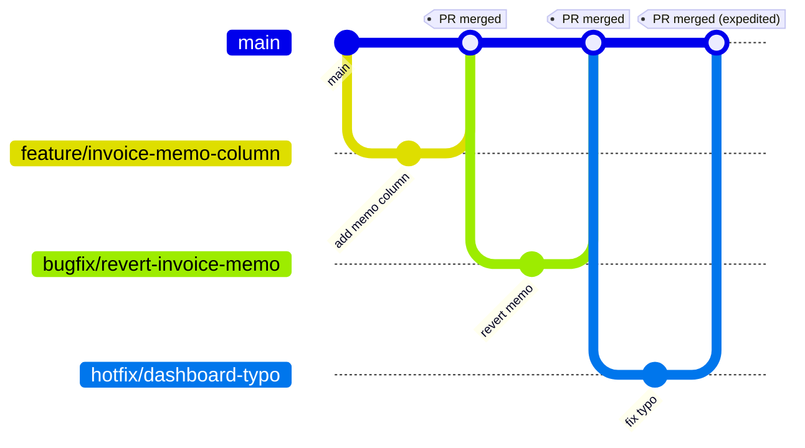
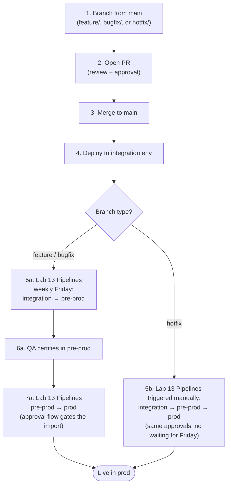

# Lab 12: Branching Strategy and Developer Workflows

## What you will build

A working understanding of trunk-based development applied to an SPA-site repo, exercised through three real workflows: feature development (with combined SPA + Dataverse PR), rollback via `git revert`, and a hotfix that promotes faster than the weekly cadence.

## Prerequisites

- Completed [Lab 10: Source Control](./10-source-control.md) (Git repo on GitHub)
- Completed [Lab 11: Solution Packaging and Dataverse Dependencies](./11-solution-and-dependencies.md) (`src/solution/` tree committed)
- Branch protection on `main` enabled (Lab 10, Step 6). If you skipped it, enable it now or expect direct pushes to `main` instead of PRs

## Learning objectives

By the end of this lab you will be able to:

1. Choose between trunk-based and GitFlow for an SPA-site repo, with a defensible reason
2. Run the three core developer workflows (feature development, rollback, hotfix) end-to-end on the supplier portal repo
3. Read a PR diff that mixes SPA code changes and Dataverse XML changes, and review both in one place

> **Further reading:** [Adopt a Git branching strategy](https://learn.microsoft.com/azure/devops/repos/git/git-branching-guidance) · [Microsoft Power Platform ALM basics](https://learn.microsoft.com/power-platform/alm/basics-alm) · [How Microsoft uses Git internally (Release Flow)](https://learn.microsoft.com/devops/develop/how-microsoft-develops-devops)

---

## Part 1: branching strategy

### The three pillars (per Microsoft git branching guidance)

The strategy in this lab is the one Microsoft documents in [Adopt a Git branching strategy](https://learn.microsoft.com/azure/devops/repos/git/git-branching-guidance). It rests on three pillars:

1. **Use feature branches for all new features and bug fixes.** Even small fixes get their own branch. Branches are inexpensive. There's no benefit to batching unrelated work onto one.
2. **Merge feature branches into `main` using pull requests.** Reviews are where quality is enforced. Avoid merging anything to `main` outside of a PR.
3. **Keep `main` high-quality and current.** The build passes, tests pass, and `main` is always something a teammate can branch from with confidence.

A strategy that extends these three pillars without contradicting them is the strategy your team should pick.

### Why this fits SPA sites

SPA-site repos suit the feature-branch workflow especially well:

- Source files are text (TypeScript, TSX, XML) and merge cleanly with normal Git tooling
- The unpack pattern from Lab 11 means no opaque-blob conflicts on Dataverse changes
- The integration environment acts as a "production-like" gate. Breakage caught there in hours beats breakage caught in a release branch a week later

### What about GitFlow?

[GitFlow](https://nvie.com/posts/a-successful-git-branching-model/) introduces a long-lived `develop` branch alongside `main`, plus release branches that stabilize before merging back. It can suit large teams with fortnightly release calendars and multiple parallel features that need long stabilization. For a typical Power Pages portal (small team, continuous deployment to integration, a managed solution flowing through Power Platform Pipelines), GitFlow adds friction (the `develop` branch drifts from `main`) without solving a problem you have. Skip it.

### Releases: Power Platform pipelines, not release branches

Microsoft's branching guidance documents **release branches** as the way to coordinate and stabilize a release. We deviate from that recommendation here for one reason: in a Power Pages SPA-site repo, the release artifact isn't just a code bundle. It's a Dataverse managed solution plus per-environment variable values plus a site reactivation step. **Power Platform Pipelines** (Lab 13) handles all three; a Git release branch alone cannot.

So in this track:

- `main` is always deployable to integration
- Promotion from integration → pre-prod → prod is owned by **Pipelines**, not by Git release branches
- If your team adopts long-lived release branches later (for example, you're maintaining a v1 portal in prod while v2 develops on `main`), follow the MS pattern: branch off `main` as `release/<version>`, fix bugs in the release branch via PRs, and **cherry-pick** fixes back to `main` to keep the mainline current. Workflow C below shows the cherry-pick mechanic.

### Pull request quality bar

The MS guidance is opinionated about how PRs should run:

- **Roughly two reviewers** is the [research-backed sweet spot](https://www.microsoft.com/research/publication/convergent-software-peer-review-practices/). More is diminishing returns
- **Automatic reviewer assignment** (via [CODEOWNERS](https://docs.github.com/en/repositories/managing-your-repositories-settings-and-features/customizing-your-repository/about-code-owners) on GitHub or branch policies on Azure Repos) so the right people see the PR without the author hunting for them
- **Required successful build** before merge. The branch protection you set up in Lab 10 is where you'd enforce a build check if your team runs one
- **Descriptive PR body** so the reviewer can pick up cold; for our portal, link to the integration-env URL (or a screenshot) once the change is deployed to integration. That's the "linked staged build" MS recommends

Lab 10's branch protection requires 1 approval; bump to 2 for a real team and add a CODEOWNERS file so reviewers are assigned automatically.

### Long-Running branches and feature flags

The whole strategy assumes branches are short-lived (hours to days). When a feature genuinely needs weeks (a redesign that ships behind a toggle, a phased migration), don't keep the branch alive that long. Merge to `main` early and gate the unfinished feature with a [feature flag](http://martinfowler.com/articles/feature-toggles.html). For a Power Pages SPA, a flag can be as simple as a site setting (`Features/InvoiceRedesign/Enabled`) read at app boot and used to switch the rendered component.

### Branch naming conventions

The MS guide suggests several patterns. Pick one and stick with it across your team. The scheme we'll use for the rest of this track:

| Prefix | Purpose | Lifetime | Example |
|---|---|---|---|
| `feature/` | New features and enhancements | Hours to days | `feature/invoice-memo-column` |
| `bugfix/` | Bug fixes, non-urgent | Hours to days | `bugfix/dashboard-empty-state` |
| `hotfix/` | Urgent prod fixes that bypass the weekly cadence | Hours, not days | `hotfix/login-redirect-loop` |

Per-user prefixes also work and some teams prefer them for visibility. `users/<username>/<description>` (for example, `users/asmith/fix-login-redirect`) is a documented MS pattern. Pick one scheme; mixing schemes across a team is the actual problem.

The prefixes mostly help reviewers and on-call: a `hotfix/*` PR is a signal to expedite review and to manually promote through Pipelines once integration is green.

Further reading: [Microsoft Git branching guidance](https://learn.microsoft.com/azure/devops/repos/git/git-branching-guidance), [Power Platform ALM basics](https://learn.microsoft.com/power-platform/alm/basics-alm), [How Microsoft uses Git internally (Release Flow)](https://learn.microsoft.com/devops/develop/how-microsoft-develops-devops)

---

## Part 2: workflow A: feature development

You'll add a `cr_memo` column to the invoice table, expose it in the SPA, and watch the PR show both the React change *and* the XML schema change side-by-side.

### Step 1: branch from main

```bash
git switch main
git pull
git switch -c feature/invoice-memo-column
```

### Step 2: make the Dataverse change in dev

1. Open the maker portal (your dev env, your solution)
2. On `cr_invoice`, add a column: **Display name** "Memo", **Name** `cr_memo`, **Type** "Text", **Max length** 500
3. Save

### Step 3: refresh the unpacked solution

```bash
pac solution export --name SupplierPortal --path build --overwrite
pac solution unpack --zipfile build/SupplierPortal.zip --folder src/solution --packagetype Unmanaged
```

Quick `git status`: you should see one or two changed files under `src/solution/Entities/cr_invoice/` reflecting the new column.

### Step 4: wire the memo into the SPA

Two edits, one in the typed service and one in the list component. Paths assume the React scaffolding from Lab 01. Adjust if you used Vue, Angular, or Astro.

**`src/services/invoiceService.ts`**: add `cr_memo` to the OData `$select` so the new column comes back in API responses:

```typescript
// before
const fields = "cr_invoiceid,cr_invoicenumber,cr_amount,cr_status";

// after
const fields = "cr_invoiceid,cr_invoicenumber,cr_amount,cr_status,cr_memo";
```

**`src/components/invoices/InvoiceList.tsx`**: render the new column in the table:

```tsx
// in the table header row
<th>Memo</th>

// in the table body row, alongside the other <td> cells
<td>{invoice.cr_memo ?? "-"}</td>
```

Test locally:

```bash
npm run dev
# Browse the portal, confirm the memo column appears (empty for existing rows -- that's expected)
```

### Step 5: commit, push, open the PR

```bash
git add .
git commit -m "Add memo column to invoice list

Finance asked for a free-text memo so reviewers can flag urgent items
without changing the formal status field."

git push -u origin feature/invoice-memo-column
gh pr create --fill
```

### Step 6: review the PR

Open the PR in the GitHub web view. You'll see two kinds of changes in the same review:

- **SPA changes**: TypeScript and TSX files showing the new column wired up
- **Dataverse changes**: XML in `src/solution/Entities/cr_invoice/` showing the schema change

This is the payoff from Lab 11's unpack pattern. A reviewer sees the full picture of what's shipping in one diff.

### Step 7: merge

Approve the PR (or have a teammate approve it). Merge into `main`. The change is now on `main`, ready to deploy to integration and promote onward.

---

## Part 3: workflow B: rollback

You'll roll back the memo column you just shipped in Workflow A. The exercise is end-to-end: undo the SPA change, undo the Dataverse schema change, push a revert PR, and watch the integration environment return to its pre-memo state.

### The scenario

After the memo column landed in integration, finance reviewers started using it as a free-text status field, bypassing the actual `cr_status` choice column. Stakeholders complained that reports built on `cr_status` no longer match what people see on the portal. The decision is to pull `cr_memo` out of production and design a constrained replacement later.

### Forward-Fix or roll back?

Reverting a Dataverse-coupled commit is more destructive than reverting a code-only commit. Decide before you start:

| Situation | Roll back? |
|---|---|
| The change is only in code (TypeScript, CSS, config) | **Yes**: reverting is cheap |
| The change added a Dataverse column and the column is empty in every environment | **Yes**: column drops cleanly |
| The change added a column and **users have written values into it** in prod | **No, forward-fix instead**: reverting the import drops the column and the data with it. Hide the field in UI, archive the values, then plan a clean removal |
| The change added a relationship or table that downstream apps already query | **No, forward-fix**: breaking a dependency contract via revert is worse than the original bug |

For our memo exercise the column is empty in integration (just deployed, no real data), so a clean revert is fine. In prod with data, you'd take the forward-fix path.

### Why `git revert`, not `git reset`

| Command | What it does | When to use |
|---|---|---|
| `git revert <sha>` | Creates a *new* commit that undoes the change. Safe on shared branches because it preserves history. | **Always for shared branches like `main`** |
| `git reset --hard <sha>` | Rewrites history to remove the commit. Anyone who pulled that commit is now out of sync; force-push is required. | Only for branches you alone use, before pushing |

For `main`, always revert. Never reset.

### Step 1: find the merge commit

```bash
git switch main
git pull
git log --oneline -5
# d4e5f6 Merge pull request #4 from feature/invoice-memo-column
# a1b2c3 ...previous commit on main
```

Copy the merge SHA (`d4e5f6` in the example).

### Step 2: branch and revert

```bash
git switch -c bugfix/revert-invoice-memo
git revert -m 1 <merge-sha>
```

`-m 1` tells revert "the first parent of this merge is what to keep". That's `main` before the feature merged. Without `-m`, Git refuses to revert a merge commit because it doesn't know which side to keep.

The revert produces one new commit that undoes **both** the React/TypeScript edits and the XML changes under `src/solution/Entities/cr_invoice/`. Open `git diff HEAD~1` to confirm the column wiring is gone from both `invoiceService.ts`, `InvoiceList.tsx`, and the `cr_invoice` entity XML.

> **Squash-merge variant.** GitHub's default for many repos is squash-merge, which produces a single commit on `main` rather than a merge commit. In that case, drop `-m 1` and revert the squashed commit directly: `git revert <commit-sha>`. Look for the squashed commit's hash in `git log --oneline -5`. It'll be a normal commit, not a merge.

### Step 3: verify locally

Before opening the PR, confirm the SPA still builds and behaves as expected without the memo column:

```bash
npm run dev
# Browse the invoice list -- the Memo column should be gone
# No console errors about a missing cr_memo field
```

If the build fails, the revert touched something the rest of the codebase depends on (e.g., a type imported elsewhere). Fix the dependency on the same branch before pushing. Never push a known-broken revert and "fix forward".

### Step 4: push and open the revert PR

```bash
git push -u origin bugfix/revert-invoice-memo
gh pr create --fill --title "Revert: Add memo column to invoice list"
```

In the PR body, **link to the original PR** and write one or two sentences on *why* the revert is happening. Reviewers (and the next person reading `git log` six months from now) need this context to avoid re-introducing the same change blindly.

### Step 5: merge

Approve and merge the revert PR. The same two artifacts move as for the original feature merge:

1. **SPA bundle** is rebuilt without the memo column wiring and uploaded to the integration env.
2. **Solution** is re-packed from the now-reverted `src/solution/` and re-imported. The `cr_memo` column is removed from the `cr_invoice` entity in Dataverse.

### What success looks like

After the CI run goes green:

- [ ] The integration portal's invoice list no longer shows a Memo column
- [ ] In the maker portal, `cr_invoice` no longer has a `cr_memo` column under Columns
- [ ] `git log --oneline` on `main` shows the original merge **and** the revert commit: history is preserved, not rewritten
- [ ] Any rows that had values in `cr_memo` have lost those values along with the column (this is why the prod-data case in the decision table forces a forward-fix instead)

---

## Part 4: workflow C: hotfix

Hotfixes are for **production breakage that cannot wait** for the next weekly promotion. They skip the normal feature cadence.

### When to hotfix

| Situation | Hotfix? |
|---|---|
| Login redirect loops; nobody can sign in | **Yes** |
| Submitting an invoice writes to the wrong table | **Yes** |
| Dashboard chart label is misspelled | **No**: next feature release |
| Performance is 2x slower than usual | **Probably no**: investigate first; not every regression needs a hotfix |

### The pattern

1. Branch from `main` directly (you skip `feature/` because you're not iterating)
2. Use the `hotfix/` prefix as a clear signal in the PR title
3. Open a PR with a tight, focused diff: no refactoring, no scope creep
4. Get expedited review (one approver, sometimes the reviewer is the on-call engineer)
5. Merge: the hotfix lands on `main` just like a `feature/` merge would
6. To get the hotfix into prod faster than the weekly cadence: **trigger the Pipelines pre-prod → prod stage manually** from the maker portal once the integration deploy is green and you've smoke-tested. The approval flow still runs (Lab 13); a hotfix doesn't skip approval, it skips the *waiting* part of the weekly schedule.
7. **Forward-port if needed.** In our setup the hotfix branches from `main` and merges back to `main`, so the fix is already on `main`, nothing to forward-port. The forward-port problem only appears once you adopt long-lived release branches (see Part 1, "Releases: Power Platform Pipelines, Not Release Branches"). At that point the fix is made on the release branch first, and you cherry-pick it to `main` so the next release doesn't regress. The MS-recommended mechanic looks like this:

   ```bash
   git switch main
   git pull
   git switch -c bugfix/forward-port-login-redirect
   git cherry-pick <hotfix-commit-sha>
   git push -u origin bugfix/forward-port-login-redirect
   gh pr create --fill --title "Forward-port: login-redirect hotfix"
   ```

   Cherry-picking (not merging) keeps you in control of *which* commits move back to `main`. Release branches accumulate release-specific commits you don't want on the mainline.

### Hotfix Mini-Exercise

Pretend the dashboard heading reads "Suplier Portal" (typo) and is visible to every signed-in user. Walk through:

```bash
git switch main
git pull
git switch -c hotfix/dashboard-typo

# Edit src/pages/Dashboard.tsx to fix the typo

git add src/pages/Dashboard.tsx
git commit -m "Fix Suplier → Supplier in dashboard heading"
git push -u origin hotfix/dashboard-typo

gh pr create --fill --title "Hotfix: Dashboard heading typo"
```

The PR is one-line. Reviewer approves in 30 seconds. Merge lands the fix on `main` and you deploy it to integration. To get to prod faster than next Friday, you'd then trigger the Pipelines integration → pre-prod → prod stages manually with expedited approvals. Total time from typo report to fix in prod: 30 minutes if approvals are responsive.

---

## Workflow diagrams

### Branches and merges

The three workflows on a single timeline, mapped onto the [MS feature-branch model](https://learn.microsoft.com/azure/devops/repos/git/git-branching-guidance), feature branches off `main`, PR review, merge back:



PR review and the required build check sit between each branch's last commit and the merge into `main`. They're enforced by branch protection (Lab 10) and don't show up as commits in Git history.

### End-to-End deployment flow

What happens after each merge, deploying to integration and then promoting through Lab 13 (Pipelines to pre-prod and prod):




---

## Verification

You have completed this lab when:

- [ ] You can state the three pillars of the MS feature-branch workflow (feature branches, PR-based merge, high-quality `main`) and explain why this lab uses Power Platform Pipelines instead of release branches
- [ ] You can describe when to start a `feature/...`, `bugfix/...`, `hotfix/...`, or `users/...` branch and which branch each merges back into
- [ ] You've opened at least one practice PR from a feature branch into `main` and merged it (with branch protection enforcing review where enabled)
- [ ] You ran the rollback exercise: reverted the memo-column merge commit, opened a `bugfix/revert-...` PR, merged it, and confirmed the integration env returned to its pre-memo state (column gone in the SPA list, `cr_memo` gone from `cr_invoice` in the maker portal)
- [ ] You can articulate, in one sentence each, when to use `git revert` versus `git reset --hard` (revert: shared branches; reset: local-only branches)
- [ ] You can name at least one situation where you'd **forward-fix instead of revert** a Dataverse-coupled commit (column removal would drop user-entered data; relationship removal would break a dependent app)
- [ ] The team's branching rules are written down somewhere your repo's contributors can find them (README, CONTRIBUTING.md, or wiki)

---

## Fallback

If branch protection cannot be applied via `gh` or the GitHub UI:

1. **Org-level enforcement.** If your repo lives in an organisation with org-wide rulesets, branch protection on the repo may be disabled or overridden. Talk to your org admin to grant the repo a ruleset that includes "require pull request before merging" and "require review from code owners" on `main`.
2. **Free plan limitation.** Branch protection on the GitHub Free plan only applies to public repos. If the repo is private and you need branch protection, either make the repo public (per the deploy setup in the early labs), upgrade to GitHub Pro/Team, or document the workflow rules in `CONTRIBUTING.md` and rely on team discipline until a paid plan is available.
3. **Workflow without enforcement.** All four branching workflows in this lab (feature, rollback, hotfix) function correctly without branch protection. The protection upgrades them from "convention" to "enforced". Continue with the lab; revisit protection after the access issue is resolved.
4. **PR review still works.** Even without enforcement, you can require PRs by team agreement. `gh pr create` and `gh pr review` work on any repo regardless of branch protection.

## Key takeaways

- The MS branching guidance reduces to three pillars: feature branches, PR-based merge, and a high-quality `main`. Don't pick GitFlow for a typical Power Pages portal. It adds friction without solving a problem you have
- Power Platform Pipelines (Lab 13) takes the place of long-lived release branches in this stack because the release artifact is solution + env-variable values + reactivation, not just a code bundle
- A clean PR shows SPA changes and Dataverse XML changes side-by-side, thanks to the unpack pattern from Lab 11
- `git revert` is the safe way to undo on shared branches; `git reset --hard` is only safe on branches you haven't pushed
- Reverting a Dataverse-coupled commit is destructive on data: a column-add revert removes the column **and** any values users wrote to it. Forward-fix when prod data is at stake; revert freely when the change was only in code
- Hotfix branches follow the same path as feature branches; what changes is *promotion*: a hotfix triggers Pipelines manually instead of waiting for the weekly cadence
- If your team adopts long-lived release branches later, **cherry-pick** fixes back to `main` per MS guidance. Never merge a release branch into `main`

## What's next

→ [Lab 13: Multi-Environment Promotion](./13-multi-env-promotion.md)
