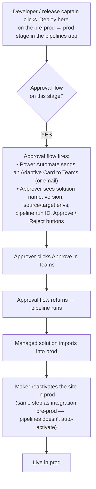
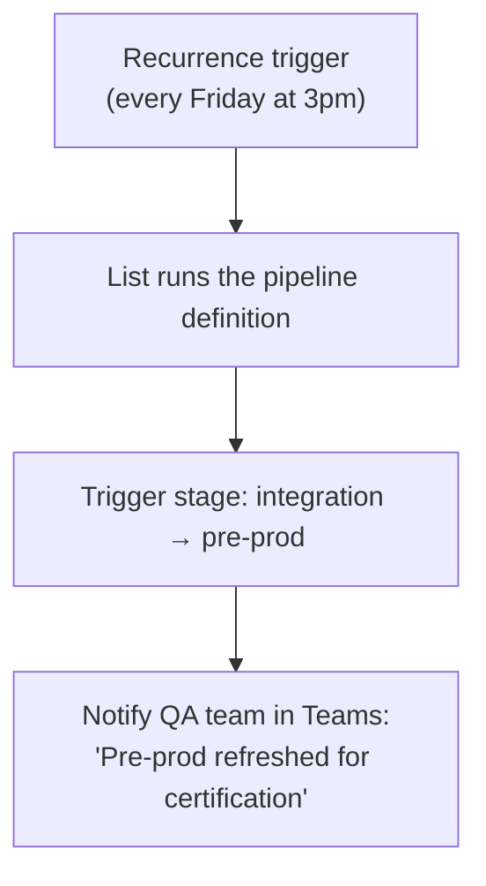

# Lab 13: Multi-Environment Promotion

## What you will learn

How Power Platform Pipelines moves your managed solution from integration → pre-prod → prod, prompting for environment variable values per stage, with manual approval gating the final prod deploy. This lab is observational (a demo against a presenter-managed environment set) — the takeaway is the conceptual map and the URLs to come back to when you set this up for your own org.

## Prerequisites

- Completed [Lab 12: CI/CD with GitHub Actions](./12-cicd-github-actions.md) (CI deploys to your integration env)
- Watching only — this lab walks through demo flows against a presenter-managed environment set, not hands-on configuration

## Learning objectives

By the end of this lab you will be able to:

1. Describe what a Power Platform admin sets up off-stage to make Power Platform Pipelines work, and where to read more if you want to set it up yourself
2. Watch a managed solution promote from integration → pre-prod, and explain why the site needs a manual reactivation step afterward
3. Watch a one-click prod deploy with manual approval — Adaptive Card in Teams, click-to-approve flow, pipeline resumption
4. Recognize when to use Power Platform Pipelines (multi-env Dataverse promotion) versus GitHub Actions (single-env CI)

---

## Why pipelines, why now

Your Lab 12 GitHub Actions workflow deploys to **one** environment (your integration env). It can't promote between environments because it has no concept of "the same change moving through stages with approvals."

**Power Platform Pipelines** is the Microsoft-managed promotion engine that fills that gap. It lives inside Power Platform itself, runs against managed solutions, and handles the multi-stage flow with optional approvals.

Two things to know up front:

- Pipelines move **managed solutions**, not unmanaged. The integration env exports the solution as managed; pipelines imports the managed version into pre-prod and prod.
- Pipelines does **not** auto-activate the site after deploy. A maker has to reactivate the site in the target environment. We'll see this in the demo.

Further reading: [Power Platform pipelines](https://learn.microsoft.com/power-platform/alm/pipelines), [Power Pages pipelines](https://learn.microsoft.com/power-pages/configure/power-pages-pipelines)

---

## The admin setup you Don't see

Before you can run a promotion, your **Power Platform admin** sets up the host environment, pipeline definition, and stages *off-stage*. You don't author this from scratch every time — it's a one-time admin activity per pipeline. Knowing what exists matters for two reasons: (a) you'll know what to ask your admin for in your own org, and (b) if you're the admin, you'll know where to start.

### The pieces

| Piece | What it is | Who owns it |
|---|---|---|
| **Host environment** | A dedicated environment (often the dev tenant default) where pipeline definitions live and the deployment app runs. | Power Platform admin |
| **Pipeline definition** | A named record (for example, "supplier-portal-promotion") that ties stages together. | Power Platform admin |
| **Stages** | Ordered records, each pointing at a target environment (dev → integration → pre-prod → prod) and the deployment user identity for that stage. | Power Platform admin |
| **Target environments** | Pre-provisioned. The deployment service principal is granted the System Customizer role in each. | Power Platform admin |
| **Approval flows (optional)** | Power Automate flows attached to a stage that gate promotion behind a manual approval. We'll see this in the prod-deploy section below. | Power Platform admin (often co-built with maker / dev lead) |
| **Security roles** | `Deployment Pipeline User` on the host env for makers; `Deployment Pipeline Administrator` for admins. | Power Platform admin |

### What this means for you

When you go back to your org and want to set up pipelines:

- **You're a developer:** ask your Power Platform admin to set up a pipeline definition pointing at your dev → integration → pre-prod → prod environments, and grant you `Deployment Pipeline User` on the host env. Then you can trigger promotions from the maker portal.
- **You're the admin:** start at [Power Platform pipelines — Set up pipelines](https://learn.microsoft.com/power-platform/alm/pipelines#set-up-pipelines). It's a one-time setup, not per-developer.
- **Your org doesn't have a host environment yet:** the admin creates one (it can be the existing default environment). Pipelines requires it before stages can be defined.

This is a typical separation of concerns — pipelines admin is one-time platform work, individual deploys are the everyday developer activity.

Further reading: [Power Platform pipelines — Set up pipelines](https://learn.microsoft.com/power-platform/alm/pipelines#set-up-pipelines), [Power Pages pipelines](https://learn.microsoft.com/power-pages/configure/power-pages-pipelines)

---

## The demo: integration → Pre-prod

The presenter's environment set is configured as: **Dev → Integration → Pre-prod → Prod**. We'll watch a promotion from integration to pre-prod.

### Step 1: confirm the integration state

In the integration env (the same one your Lab 12 CI deployed to):

1. Maker portal → Solutions → Supplier Portal
2. Confirm the version matches what Lab 12's CI just deployed
3. Confirm the site is active and the latest dashboard heading is live

### Step 2: trigger the pipeline and supply environment variable values

In the host environment, open the **Pipelines** app:

1. Select the `supplier-portal-promotion` pipeline
2. Select the stage "integration → pre-prod"
3. Select **Deploy here**
4. **Pipelines prompts for environment variable values.** This is the wiring from Lab 10 paying off: the solution carries the `cr_searchenabled` environment variable definition, and Pipelines now asks what value pre-prod should use. Set it to `No` (or whatever pre-prod-specific value you need), then confirm.

For more on how environment variable values are supplied during pipeline deployments, see [Use environment variables with site settings — Pipelines](https://learn.microsoft.com/power-pages/configure/environment-variables-for-site-settings#manage-environment-variables).

The pipeline:

- Exports the solution from integration **as managed**
- Imports the managed solution into pre-prod, applying the env variable values you supplied
- Runs whatever post-deploy steps are configured (none in our case)

Run time: typically 1-3 minutes for a small solution.

### Step 3: reactivate the site in Pre-prod

The site object lives inside the solution, but the actual *runtime* (the public URL serving the SPA) is environment-specific and **does not auto-activate** after the import. Our pre-prod environment now has the solution with the site definition in it, but the site is inactive.

To activate:

1. Switch the maker portal context to the pre-prod environment
2. **Power Pages** → find the just-imported site
3. Select **Activate** (or **Reactivate** if it had been activated previously)
4. Wait 1-2 minutes for provisioning
5. Confirm the pre-prod portal URL serves the latest content

> **Why this is a separate step:** the Dataverse solution carries the site definition, table permissions, web roles, and site settings. The runtime activation — spinning up the actual public URL with the SPA bundle — is a per-environment provisioning step that the pipeline doesn't (and arguably shouldn't) automate. It's the same reason `/activate-site` was its own step earlier in the track.

### Step 4: clear the site cache

After Pipelines applies the env variable values you supplied in Step 2, the site needs a cache flush before the new values surface in the UI.

Pick one of:

- **Sync** in design studio (the simplest path)
- Sign in to the pre-prod portal as an admin, browse to `/_services/about`, select **Clear cache**
- Restart the portal from the Power Platform admin center

### Step 5: hand the site to QA

The pre-prod env now serves the site with everything Lab 12's CI deployed to integration. QA / test engineers run their certification suite here. If the suite passes, this same managed solution is what promotes to prod next.

---

## Promote to production with manual approval

The same `supplier-portal-promotion` pipeline has one more stage: **pre-prod → prod**. This stage has an **approval flow** attached — a Power Automate flow that intercepts the deploy request and routes it for human sign-off before the pipeline imports anything into prod.

The approver can be:

- A specific named user (the engineering manager or release captain)
- A group (anyone in the Release Approvers Microsoft 365 group)
- A multi-stage chain (engineering manager AND security review AND product owner)

### The flow

### What the demo shows

When the presenter triggers the pre-prod → prod stage, watch:

1. The "Awaiting approval" status in the pipelines app
2. The Adaptive Card landing in Teams
3. The approver clicking Approve
4. The pipeline resuming and importing the managed solution
5. The reactivation in the prod env's maker portal
6. The prod URL serving the site, with the change that started its life as a feature branch days ago

End-to-end (committed change → prod): hours to days, with humans in the loop at every promotion gate.

Further reading: [Power Platform pipelines — approvals](https://learn.microsoft.com/power-platform/alm/pipelines), [Power Pages pipelines](https://learn.microsoft.com/power-pages/configure/power-pages-pipelines)

---

## The weekly cadence

In our recommended setup, the integration → pre-prod promotion runs **once a week** (typically Friday afternoon) so QA has the weekend to certify a stable build for Monday's prod release window.

The trigger isn't a human clicking "Deploy here" weekly. It's a **Power Automate flow** that runs the pipeline on a schedule:

The flow definition is straightforward: a **Recurrence** trigger (UTC schedule), a **List rows** action against the `deploymentpipeline` table to find the pipeline by name, an **HTTP request** action against the Pipelines deploy endpoint with the stage ID, and a **Post message** to a Teams channel. Wire it once, runs forever. The full reference is on Learn: [Power Platform pipelines](https://learn.microsoft.com/power-platform/alm/pipelines).

---

## Three tools, three layers

You now have three pieces in play. They're complementary, not competing — each owns a layer of the delivery story.

| Tool | Owns | Don't use it for |
|---|---|---|
| **GitHub Actions / Azure DevOps** | Code-side build (npm, lint, test). SPA bundle upload via `upload-paportal`. PR validation. Single-env deploys triggered by code changes. | Multi-env Dataverse solution promotion. Approval gating between environments. |
| **Power Platform Pipelines** | Managed-solution promotion across environments. Prompts for environment variable values per stage. Approval flows. Audit-friendly stage history inside Dataverse. | SPA build (no Node.js runtime). Code-side tests. Per-PR validation. |
| **Environment variables for site settings** | Env-specific values for site settings. Defined in the solution; values supplied per target env at import or via Pipelines stage prompts. | Non-site-setting records. For SPA sites, those typically don't need env-specific overrides; if they do, drive them from the SPA at runtime instead. |

A typical delivery for a single change goes:

1. Developer opens a PR — GitHub Actions runs build + tests, doesn't deploy
2. PR merges to `main` — GitHub Actions deploys solution + SPA to integration env; site settings resolve via the integration env's environment variable values
3. Friday afternoon — Power Automate triggers Power Platform Pipelines to promote the managed solution from integration to pre-prod; the operator (or scheduled flow with stored values) supplies pre-prod values for each environment variable
4. Pre-prod sits over the weekend for QA certification
5. Monday — approver clicks "Approve" on the Pipelines pre-prod → prod stage; managed solution lands in prod with prod-specific env variable values

Each tool does the part it's best at. Environment variables for site settings is what makes multi-env config tractable on SPA sites — no per-env workflow plumbing required.

---

## Verification

You have completed this lab when:

- [ ] You can locate your Power Platform Pipelines configuration in the host environment and identify the dev → integration → pre-prod → prod stages
- [ ] You've run a pipeline promotion of your managed solution from integration to pre-prod (or watched your admin run it) and seen the per-stage environment variable value prompts
- [ ] After a successful pipeline import, you've manually reactivated the SPA site in the target env (Power Pages admin center → site → **Reactivate**)
- [ ] You've cleared the site cache (Sync, `/_services/about` → Clear cache, or portal restart) after env variable values change, and verified the new value surfaces in the running site
- [ ] A pre-prod → prod promotion has executed with manual approval (or you've configured the approval flow and can describe how it works)
- [ ] You can articulate the three tools / three layers split: GitHub Actions (build + upload), Pipelines (solution + env variable promotion), env variables (per-env site setting values)

---

## Fallback

If Power Platform Pipelines is not available in your tenant, your admin has not set up host/stage envs, or pipeline runs keep failing:

1. **Confirm the host environment.** Pipelines requires a dedicated **host environment** with the Pipelines app installed. Without it nothing in this lab works. Ask your Power Platform admin whether one exists and whether your user has the **Deployment Pipeline User** role.
2. **Multi-env without Pipelines (interim).** You can promote between environments using the same `pac solution import` flow from Lab 10, applied per target environment, supplying environment variable values on each import (manually in the maker portal or via a parameterised script). It loses the audit trail and approval gates Pipelines provides, but the deploy itself works.
3. **Fewer environments (smaller setup).** If your tenant only has dev + prod (no integration or pre-prod), collapse the pipeline to a two-stage flow with a manual approval before prod. The mechanics from this lab still apply — you have fewer stages.
4. **Reactivation step is still manual.** Whether you use Pipelines or a fallback, reactivating the SPA site after import is a Power Pages admin centre action. There is no first-class CLI for it today.
5. **Cache clear after env variable changes.** Independent of how the solution arrived in the target env, environment variable value changes need a site-cache clear (Sync, `/_services/about` → Clear cache, or portal restart) before the new value surfaces.

## Key takeaways

- Power Platform Pipelines moves **managed solutions** between environments; the integration env exports as managed for downstream stages
- Pipelines **prompts for environment variable values per stage** — this is the payoff from Lab 10's site-setting wiring
- Pipelines admin setup (host env, pipeline definitions, stages, security roles) is one-time platform work owned by your Power Platform admin — not a per-developer task
- After every pipeline import, **the site needs a manual reactivation** in the target env
- After environment variable values change, **clear the site cache** (Sync, `/_services/about` → Clear cache, or restart the portal)
- Three tools, three layers: GH Actions (code build + upload), Pipelines (solution + env variable promotion), env variables (site setting values per env)

## What's next

You've reached the end of the lab track. To keep learning, see the resources list and optional next steps in the [track overview](../intro.md).
