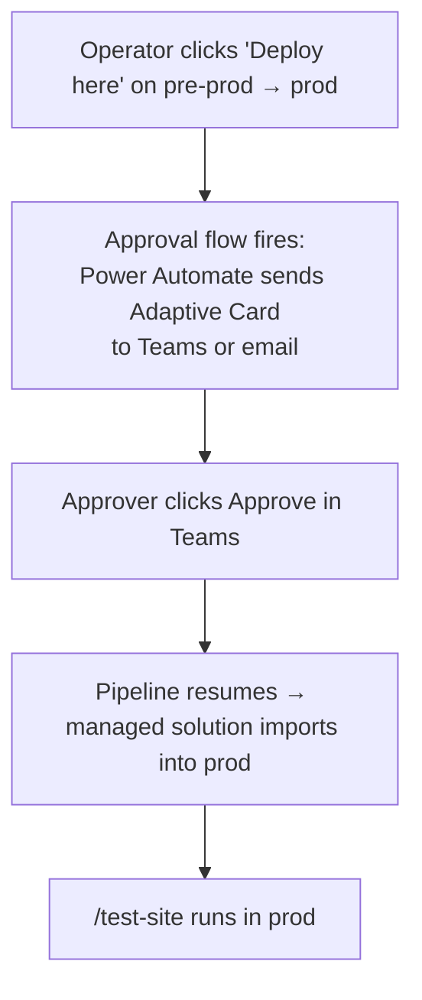

# Lab 13: Promote across environments

## Goal

Promote the managed solution through integration, pre-prod, and production with Power Platform Pipelines and deployment diagnostics.

## State you carry forward

- Completed [Lab 11: Package the solution and dependencies](./11-solution-and-dependencies.md) (`/plan-alm` ran, `/setup-solution` authored the solution, env-variable wiring is in place)
- Your integration environment is deployed and up to date. It's the source stage the pipeline promotes from
- Pre-prod and prod target environments exist (or your admin can provision them)
- Tenant-level permission to install the Pipelines app in a host environment, OR an existing pipelines host you can use
- For the alternative manual path: PAC CLI authenticated against each target env

## Learning objectives

By the end of this lab you will be able to:

1. Use `/ensure-pipelines-host` to provision (or detect) the host environment that pipeline definitions live in
2. Use `/setup-pipeline` to register a pipeline definition, define stages, and bind each stage to a target environment
3. Use `/deploy-pipeline` to trigger a stage promotion with per-stage environment-variable overrides via `deploymentSettings.json`
4. Use `/test-site` and `/diagnose-deployment` to verify a deployment and recover from common failures
5. Use `/force-link-environment` to recover from the "environment already linked to a different host" error, and know why this action requires explicit consent
6. Recognize when Power Platform Pipelines is the right promotion tool, and fall back to `/export-solution` + `/import-solution` for manual promotion when Pipelines isn't available

---

## Why pipelines, why now

Deploying to a single environment, your integration env, gets a change live in one place, but that's only the first step. Promoting the *same* change onward through pre-prod to production, safely and with approvals, is a different problem: it needs a concept of "the same change moving through stages with approvals."

**Power Platform Pipelines** is the Microsoft-managed promotion engine that fills that gap. It lives inside Power Platform itself, runs against managed solutions, and handles the multi-stage flow with optional approvals. The new ALM skills wrap every interaction with Pipelines, so you describe what you want and the plugin produces the Dataverse records and orchestrates the runs.

Two things to know up front:

- Pipelines move **managed solutions**, not unmanaged. Recall the distinction from [Lab 11](./11-solution-and-dependencies.md#why-solutions-why-now): unmanaged is the editable form you commit to source control; managed is the sealed form built for promotion. The integration env exports the solution as managed; pipelines imports the managed version into pre-prod and prod.
- Pipelines does **not** auto-activate the site after deploy. A maker has to reactivate the site in the target environment. `/test-site` calls this out and offers to run `/activate-site` for you in sequence.

> **The big picture: two layers.** Before diving in, it helps to know the boundary between the pieces: **Power Platform Pipelines** (this lab) owns managed-solution promotion across environments with approvals; **environment variables** (Lab 11) supply each stage's configuration. [Part 6](#part-6-the-promotion-layers-reference) lays out exactly who owns what. Skim it now if you want the map before the steps.

> **Further reading:** [Power Platform pipelines](https://learn.microsoft.com/power-platform/alm/pipelines) · [Power Pages pipelines](https://learn.microsoft.com/power-pages/configure/power-pages-pipelines) · [Pipeline deployment settings](https://learn.microsoft.com/power-platform/alm/pipelines-deployment-settings)

---

## Part 1: resume `/plan-alm` for the promotion phase

The plan you approved in Lab 11 carries through to this lab. Re-run `/plan-alm` and it picks up where it left off: Phase 1 (Author solution) is complete, Phases 2-5 are pending.

Before you resume, confirm `docs/alm-plan.html` exists from Lab 11. The pipeline and deployment ledgers are created later in this lab (`docs/alm/pipeline-ledger.json` after `/setup-pipeline`, `docs/alm/deployment-ledger.json` after `/deploy-pipeline`), so they do not need to exist before the first `/plan-alm` resume.

### Step 1.1: re-run `/plan-alm`

```
/plan-alm
```

The plugin reads the persisted plan at `docs/alm-plan.html`, detects that `/setup-solution` already ran, and proposes the remaining phases. Approve the plan and let it drive the rest.

> **Note:** Every ALM skill reads from and writes to artifacts on disk: the solution manifest, plan data, pipeline ledger, deployment ledger, and test results. The orchestration is **resumable and auditable**. To see what happened at any step, inspect the artifacts.

---

## Part 2: provision the host with `/ensure-pipelines-host`

Power Platform Pipelines requires a **host environment** with the Pipelines app installed. The host environment is where pipeline definitions live and the deployment app runs. It is not a target. It is the control plane.

### Step 2.1: run `/ensure-pipelines-host`

`/plan-alm` invokes this automatically; you can also run it directly:

```
/ensure-pipelines-host
```

The skill guides you through it. When it offers host options, pick the lowest-cost one available in your tenant. The plugin will:

1. Check whether a free platform host is available for your tenant (newer tenants get one without an explicit install).
2. If no platform host exists, check whether the **Pipelines app** can be installed on an existing environment (typically the default environment).
3. If neither is available, propose a **custom host**: a dedicated environment you provision for this purpose.
4. Report the chosen host and persist the choice so downstream skills don't ask again.

> **Important:** A host environment is **per-tenant**, not per-pipeline. If your tenant already has a host (set up for another project), the plugin detects and reuses it. Don't create a second host without a specific reason. The cost is real and you typically don't need separation.

### Step 2.2: handle the `/force-link-environment` case

A target environment can only be linked to **one** Pipelines host at a time. If pre-prod or prod is already linked to a different host (set up for another project, or by a previous admin), `/setup-pipeline` will fail with "environment already linked."

The recovery is `/force-link-environment`:

```
/force-link-environment
```

The skill asks which environment to reassign, which host currently holds it, and which host to move it to. The plugin will:

1. Re-confirm the source host (the one currently linked) and the target host (the one you want to use).
2. Warn that any in-flight pipelines from the old host will stop seeing this target.
3. **Require your explicit confirmation** before applying.
4. Apply the reassignment via the Pipelines admin API.

> **Important:** `/force-link-environment` is **reversible**. You can re-run it to point back at the original host. But it does interrupt any in-flight runs from the previous host. Coordinate with whoever set up the previous host before running it in shared tenants.

---

## Part 3: define the pipeline with `/setup-pipeline`

A pipeline definition is a named Dataverse record on the host environment that ties stages together and points each stage at a target env. `/setup-pipeline` writes this record for you.

### Step 3.1: run `/setup-pipeline`

```
/setup-pipeline
```

The skill walks you through naming the pipeline and defining its stages. For this lab, name it `supplier-portal-promotion`, define three stages (integration → pre-prod → prod, with integration being the env you've been deploying to), and choose your signed-in user as the deployment identity on each stage. The plugin will:

1. Confirm the pipeline name and the target env URLs for each stage.
2. Verify the deployment user (service principal or named user) has the **Deployment Pipeline User** role on the host env and **System Customizer** (or higher) on each target env.
3. Write the pipeline definition + stage records to Dataverse on the host env.
4. Persist a **pipeline ledger** entry locally at `docs/alm/pipeline-ledger.json` so subsequent skills can resolve the pipeline by name.

### Step 3.2: review the pipeline in the pipelines app

Open the Pipelines app on the host env. You should see `supplier-portal-promotion` with three stages. Each stage shows its target environment, deployment user, and any approval flow you wired up.

### Step 3.3: attach an approval flow to the prod stage

`/setup-pipeline` registers stages; attaching a Power Automate approval flow to the pre-prod → prod stage is done in the Pipelines app (or via a Power Automate import). The prod-stage approval flow has the shape:



The approver can be a specific named user, a group (Microsoft 365 Release Approvers group), or a multi-stage chain.

---

## Part 4: promote with `/deploy-pipeline`

`/deploy-pipeline` is the workhorse. It triggers a deployment for a specified stage, applies per-stage environment-variable overrides through `deploymentSettings.json`, and tracks state in a **deployment ledger** at `docs/alm/deployment-ledger.json`.

### Step 4.1: integration → pre-prod

```
/deploy-pipeline
```

The skill asks which stage to promote and the per-stage env-variable values to apply. Promote the integration state to **pre-prod**, and when prompted for pre-prod values, supply `cr_searchenabled = No` and `cr_authClientId = <pre-prod app registration's client id>`. The plugin will:

1. Export the solution from integration **as managed** (the pre-prod env imports the managed version).
2. Write `deploymentSettings.json` containing your per-stage env-variable overrides. This file is what Pipelines reads to know which value to apply per env.
3. Trigger the **integration → pre-prod** stage on the host env.
4. Poll the pipeline run until it completes; report the result.
5. Append a row to the deployment ledger (`docs/alm/deployment-ledger.json`) for auditability.

> **Why deploymentSettings.json beats prompting.** In the maker-portal Pipelines UI, an operator is prompted for each env variable value on every run. `/deploy-pipeline` writes a `deploymentSettings.json` so the values are repeatable. Commit `docs/alm/deploymentSettings.json` only when it contains non-secret values. If a deployment settings file contains secrets, keep it in `docs/alm/deploymentSettings.local.json` (gitignored in Lab 10) or move the secret values to Key Vault. Coordinate per-team.

### Step 4.2: reactivate the site in pre-prod

The site object travels inside the solution, but the **runtime activation** (the public URL serving the SPA) is environment-specific and **does not auto-activate** after the import. `/deploy-pipeline` flags this in its output and asks whether to run `/activate-site` against the pre-prod env automatically:

```
Pipeline deploy completed. Pre-prod env has the solution but the
site is inactive. Run /activate-site against pre-prod now?
```

Accept the offer. The plugin runs `/activate-site` with the pre-prod env's context, provisions the public URL, and returns control once the URL is reachable.

### Step 4.3: clear the cache and `/test-site`

After Pipelines applies the env-variable values you supplied in Step 4.1, the site needs a cache flush before the new values surface in the UI. `/deploy-pipeline` performs the flush automatically; if you need to do it manually:

- **Sync** in design studio (simplest)
- Sign in to the pre-prod portal as an admin, browse to `/_services/about`, select **Clear cache**
- Restart the portal from the Power Platform admin center

Now verify the deployment with `/test-site`:

```
/test-site

Verify the pre-prod deployment. Crawl the public pages, run a
role-based access check with a supplier-role test account, hit
/_api/cr_invoices for a read sanity check, and capture the
response shape from /_api/serverlogics/validate-po.
```

The plugin uses a browser to:

1. Crawl representative pages and confirm 200 responses.
2. Sign in with a role-based test account and verify access matches the role.
3. Verify `/_api/` calls and capture response shapes from `/_api/serverlogics/` endpoints.
4. Report the result as `PASS`, `WARNINGS`, or `FAIL`, with per-check details linked from the plan.

A `FAIL` triggers `/diagnose-deployment` in the next step. `WARNINGS` (e.g. slow response, missing meta tags) are surfaced but don't block promotion.

### Step 4.4: pre-prod → prod (with approval)

After QA certification on pre-prod passes, trigger the prod promotion:

```
/deploy-pipeline
```

Promote **pre-prod to prod**, and when prompted for prod values, supply `cr_searchenabled = Yes` and `cr_authClientId = <prod app registration's client id>`.

If you attached an approval flow to the prod stage (Step 3.3), the pipeline pauses after `/deploy-pipeline` triggers it:

- The "Awaiting approval" status appears in the pipelines app
- An Adaptive Card lands in Teams (or email)
- An approver clicks Approve
- The pipeline resumes and imports the managed solution into prod
- `/deploy-pipeline` resumes its polling and reports the result

After import, repeat reactivation + cache clear + `/test-site` (Steps 4.2 + 4.3) for prod.

End-to-end (committed change → prod): hours to days, with humans in the loop at every promotion gate.

---

## Part 5: recover failures with `/diagnose-deployment`

When a `/deploy-pipeline` or `/test-site` step fails, `/diagnose-deployment` is the next step. It matches the failure against a catalog of known deployment errors and proposes a fix.

### Step 5.1: run `/diagnose-deployment`

```
/diagnose-deployment

The /deploy-pipeline run for pre-prod just failed. Here is the
error from the deployment ledger:

[paste the error]

Diagnose and propose a fix.
```

The plugin matches the error against its catalog. Common matches:

| Failure | Root cause | Fix |
|---|---|---|
| **Stale manifest** | A component was added/removed in the dev env but `/setup-solution` wasn't re-run in sync mode | Re-run `/setup-solution`, re-export, retry deploy |
| **Missing dependency** | Target env lacks a Dataverse component (table, web role, site-setting type) | Add the missing component to the source solution, re-export, retry |
| **Host conflict** | Target env is linked to a different Pipelines host | Run `/force-link-environment` to reassign |
| **Blocked JavaScript** | A site setting or WAF rule on the target blocks an inline script | Resolve via `/manage-headers` or `/manage-firewall` ([Lab 09: Run a security review](../integrate/09-security-review.md)) |
| **Expired authentication** | Your PAC CLI or `az` session expired | Re-authenticate (`pac auth create`, `az login --allow-no-subscriptions`) and re-run the deploy |

The plugin proposes a fix and **never applies it without your consent**. Approve the fix, then re-run `/deploy-pipeline` for the failed stage.

### Step 5.2: re-run from the ledger

You don't need to re-run the entire `/plan-alm`. The deployment ledger persists the per-stage state, so `/deploy-pipeline` reads the last failed stage and resumes from there.

---

## Part 6: the promotion layers (reference)

You now have two complementary pieces in play. Each owns a layer of the delivery story.

| Tool | Owns | Don't use it for |
|---|---|---|
| **Power Platform Pipelines (via `/deploy-pipeline`)** | Managed-solution promotion across environments. Per-stage env-variable values through `deploymentSettings.json`. Approval flows. Audit-friendly stage history inside Dataverse. | SPA build (no Node.js runtime). Code-side tests. Per-PR validation. |
| **`/setup-solution`-authored env variables and Key Vault** | Env-specific site setting values, and secret-type values via Azure Key Vault. Variable definitions in the solution; values supplied per stage by `/deploy-pipeline`. | Non-site-setting records. For SPA sites, those typically don't need env-specific overrides; if they do, drive them from the SPA at runtime instead. |

A typical delivery for a single change goes:

1. The change is merged and deployed to your integration env; site settings resolve via the integration env's environment-variable values
2. Friday afternoon: `/deploy-pipeline` promotes the managed solution from integration to pre-prod with pre-prod env-variable values from `deploymentSettings.json`
3. `/test-site` validates the pre-prod env over the weekend (or on-demand)
4. Monday: approver clicks "Approve" on the Pipelines pre-prod → prod stage; managed solution lands in prod with prod-specific env-variable values; `/test-site` runs final smoke against prod

Each tool does the part it's best at.

---

## Troubleshooting

| Problem | Fix |
|---|---|
| `/ensure-pipelines-host` says "no eligible host" | Your tenant has no platform host and the default env doesn't qualify for app install. Provision a dedicated host env (Power Platform admin center → environments → +New) and re-run the skill. |
| `/setup-pipeline` fails with "environment already linked" | Target env is bound to a different Pipelines host. Run `/force-link-environment` to reassign. |
| `/deploy-pipeline` waits indefinitely on "Awaiting approval" | The approval flow on this stage is enabled but the approver hasn't acted. Check Teams / email. If the approver is unavailable, you can reassign the approval through the Power Automate run history. |
| `/test-site` fails the role-based access check | The role assignments in the target env don't match what the SPA expects. Re-export from dev with the correct web role / table permission state, redeploy. |
| `/diagnose-deployment` says "no catalog match" | The failure is novel; the plugin prints the raw error and proposes a manual investigation path. Paste the error into a focused prompt for a one-off fix. |
| Site setting value not surfacing after env variable change | Clear the site cache: in design studio select **Sync**; or sign in to the portal, browse to `/_services/about`, select **Clear cache**; or restart the portal from the admin center. |
| `/import-solution` staged mode says "ok" but apply fails | The dependency check passes in stage mode but a runtime dependency (e.g. a plug-in trust) fails on apply. Read the apply-mode error, address it, re-run apply. |

## Verification

You have completed this lab when:

- [ ] `/ensure-pipelines-host` reports a usable host environment for your tenant
- [ ] `/setup-pipeline` registered the `supplier-portal-promotion` pipeline on the host env with stages bound to integration / pre-prod / prod
- [ ] `/deploy-pipeline` ran the **integration → pre-prod** stage and reported success; the deployment ledger at `docs/alm/deployment-ledger.json` has a passing entry
- [ ] `/test-site` reported `PASS` against pre-prod
- [ ] An approval flow gates the **pre-prod → prod** stage (or you can describe how it would be wired)
- [ ] At least one prod-stage promotion has run (or is wired and waiting for approval)
- [ ] You have run `/diagnose-deployment` against at least one failure (real or simulated) and can read its output
- [ ] You can articulate when to use Pipelines (multi-env promotion) versus env variables (per-env values)

### Generic debug prompt

If a skill fails partway, paste the output back to your AI coding CLI:

```
/deploy-pipeline failed on the pre-prod stage. Here is the error
from docs/alm/deployment-ledger.json. Run /diagnose-deployment
and propose a fix:

[paste the error]
```

## Fallback

If Power Platform Pipelines is not available in your tenant, the plugin still gives you a clean manual path through `/export-solution` and `/import-solution`. This is **not** the same as running raw `pac solution export/import`. The skills add a completeness check, optional staging, and per-stage `deploymentSettings.json` handling.

### Manual path step 1: `/export-solution` from the source env

```
/export-solution
```

The skill guides you through the export. Export **Supplier Portal** from integration **as managed** into `build/`; its completeness check warns you if anything authored by `/setup-solution` is missing.

### Manual path step 2: `/import-solution` into the target env in staged mode

For high-stakes target envs (pre-prod, prod), use staged mode:

```
/import-solution
```

When prompted, import `build/SupplierPortal_managed.zip` into **pre-prod** in staged mode, apply the pre-prod env-variable values (`cr_searchenabled = No`, `cr_authClientId = <pre-prod client id>`) from a deploymentSettings file, and have it prompt you before applying.

The plugin runs the import in stage-only mode, reports any conflicts or missing dependencies, and applies after your approval. Then run `/activate-site` and `/test-site` against the target env (Steps 4.2 + 4.3 above).

### Other recovery paths

1. **Fewer environments (smaller setup).** If your tenant only has dev + prod (no integration or pre-prod), collapse the pipeline to a two-stage flow with a manual approval before prod. The mechanics from this lab still apply. You have fewer stages.
2. **Reactivation step is still manual.** Whether you use Pipelines or the manual path, reactivating the SPA site after import is a Power Pages admin centre action. `/deploy-pipeline` and `/import-solution` both offer to run `/activate-site` automatically. Accept the offer.
3. **Cache clear after env variable changes.** Independent of how the solution arrived in the target env, env-variable value changes need a site-cache clear (Sync, `/_services/about` → Clear cache, or portal restart) before the new value surfaces.
4. **As a last resort, fall back to raw `pac solution import`.** This works but skips every safeguard the skills layer adds. Use only when you're debugging the skills themselves.

When to use the manual path:

- Tenant doesn't have Pipelines available
- You need a one-time backport to a non-pipeline target env (e.g., a sandbox for debugging)
- A pipeline run is blocked by a tooling bug and you need to unblock the release

In every other case, prefer `/deploy-pipeline`. The audit trail, approval gates, and stage-history visibility are worth it.

## Key takeaways

- `/plan-alm` orchestrates the full ALM phase; each pipeline skill (`/ensure-pipelines-host`, `/setup-pipeline`, `/deploy-pipeline`, `/force-link-environment`, `/test-site`, `/diagnose-deployment`) is a building block the plan invokes
- Pipelines move **managed solutions**; the integration env exports as managed for downstream stages
- `/deploy-pipeline` supplies per-stage env-variable values through `deploymentSettings.json`, version-controllable, repeatable
- After every pipeline import, **the site needs a reactivation** in the target env (the skill offers to run `/activate-site` automatically)
- After environment variable values change, **clear the site cache** (Sync, `/_services/about` → Clear cache, or restart the portal)
- `/diagnose-deployment` matches failures against a catalog and proposes fixes, never applies them without consent
- `/force-link-environment` recovers from host conflicts; the action is reversible but interrupts in-flight runs from the previous host
- The manual `/export-solution` + `/import-solution` path is a documented fallback when Pipelines isn't available
- Two layers: `/deploy-pipeline` for managed-solution promotion, `/setup-solution`-authored env variables for per-stage configuration

## Next step

You've reached the end of the lab track. To keep learning, see the resources list and optional next steps in the [track overview](../intro.md).
