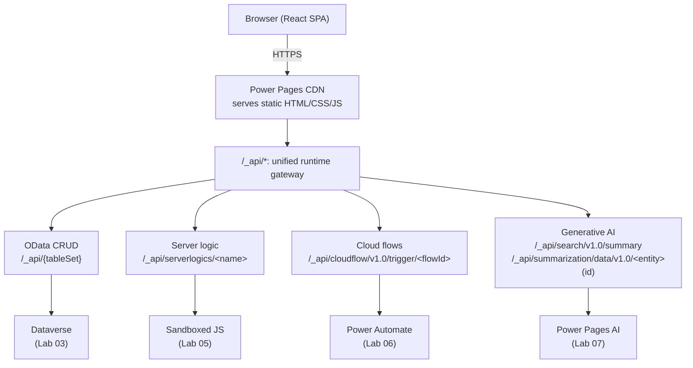

# Lab 01: Scaffold a Power Pages SPA

## Goal

Scaffold a complete Supplier Invoice Submission Portal as a React SPA with mock data, five styled pages, and local preview support.

**Estimated time:** about 20-30 minutes.

## State you carry forward

- [Build phase setup](00-setup.md) completed and verified (Node.js, PAC CLI, Azure CLI, AI coding CLI, Power Pages plugin)
- [Prompt Cheat Sheet](../reference/prompt-cheat-sheet.md) open in a tab for reference
- Familiarity with the ACE framework (Action / Context / Examples): see the [Prompt Cheat Sheet](../reference/prompt-cheat-sheet.md); this lab's prompt uses ACE structure with a Jobs-To-Be-Done framing of the requirements

> **Before you start, confirm your toolchain.** This lab assumes the [Build phase setup](00-setup.md) is done. Verify:
>
> - [ ] Node.js and PAC CLI are installed and on your PATH (`node --version`, `pac --version`)
> - [ ] The Power Pages plugin is installed in your AI coding CLI
> - [ ] `/help` (or the plugin's skill list) shows `/create-site`
>
> If any of these fail, finish [Build phase setup](00-setup.md) before continuing.

---

## About Power Pages SPA sites

Before scaffolding, a quick orientation to the platform you're building on.

### What is a Power Pages SPA site?

A **single-page application (SPA) site in Microsoft Power Pages** is a modern site type built with standard web frameworks (React, Angular, Vue, or Astro) and deployed to the Power Pages platform. Instead of writing Liquid templates in the portal management app, you write front-end code in your local editor, then deploy the compiled site to Power Pages. Later labs add live data through the Power Pages Web API, server logic, cloud flows, and AI APIs. See the official docs: [Create and deploy a single-page application in Power Pages](https://learn.microsoft.com/power-pages/configure/create-code-sites).

### Architecture



- The SPA runs entirely in the browser as static HTML, CSS, and JavaScript
- All backend access goes through `/_api/*` after later labs add live integrations. Lab 03 starts with OData CRUD on Dataverse, then Labs 05-07 add server logic, Power Automate cloud flows, and generative AI APIs.
- Authentication uses server-side session cookies managed by Power Pages
- The site is deployed as compiled static files, no server-side rendering

### SPA vs traditional Liquid

| Aspect | Traditional (Liquid) | SPA site |
|--------|---------------------|-----------------|
| **Rendering** | Server-side (Liquid templates) | Client-side (React/Vue/Angular) |
| **Development** | Portal Management App or local IDE + Liquid | Local IDE with standard web tooling |
| **Framework** | Proprietary Liquid syntax | React, Angular, Vue, or Astro |
| **Deployment** | Sync via portal management | `pac pages upload-code-site` |
| **Data access** | Liquid entities + Web API | Web API, server logic, and cloud flows (all via `/_api/`) |
| **Customization** | Constrained by Liquid capabilities | Full framework flexibility |
| **Power BI embedded** | Supported via `` Liquid tag | Not supported |
| **Developer experience** | Portal-specific skills needed | Standard frontend skills transfer |

### Supported frameworks

Power Pages SPA sites support four frameworks: **React** (built with Vite), **Angular** (Angular CLI), **Vue** (Vite), and **Astro** in static mode.

**Constraints:**
- No server-side rendering (SSR): Next.js, Nuxt, Remix, and SvelteKit are not supported
- The compiled output must be static HTML/CSS/JS
- All backend access happens through the platform's `/_api/` runtime gateway (Web API (OData CRUD), server logic, and cloud flows), not a server you run yourself

### Tech stack used in this Lab

This lab uses **React + TypeScript + Tailwind CSS + Vite**, following **Microsoft Fluent Design** language. The canonical example is a **Supplier Invoice Submission Portal** with 5 pages.

---

## Learning objectives

By the end of this lab you will be able to:

1. Use your AI coding CLI's `/create-site` skill to generate a complete React + TypeScript + Tailwind CSS portal
2. Define site requirements covering 5 pages with routes, components, and mock data
3. Review the generated project structure and understand each folder's purpose
4. Preview the site locally at localhost:5173 with mock data

> **Further reading:** [Create and deploy a single-page application in Power Pages](https://learn.microsoft.com/power-pages/configure/create-code-sites) · [Power Pages plugin for GitHub Copilot CLI and Claude Code](https://learn.microsoft.com/power-pages/configure/create-code-site-using-claude-code) · [Power Platform CLI introduction](https://learn.microsoft.com/power-platform/developer/cli/introduction)

---

## Step 1: create a project directory

Open your terminal and create a new directory for the project:

```bash
mkdir supplier-invoice-portal
cd supplier-invoice-portal
```

Launch your AI coding CLI:

```bash
claude            # Claude Code
# or
copilot           # GitHub Copilot CLI
```

Quick verification, confirm the Power Pages plugin is available:

```
/help
```

You should see `/create-site` listed among the available skills.

---

## Step 2: run `/create-site`

Type `/create-site` in your AI coding CLI, then paste the following prompt. It uses the **ACE structure** (Action / Context / Examples) for the prompt skeleton, with a **Jobs-To-Be-Done (JTBD)** framing of the requirements: the functional jobs sit in the Context, so the generated architecture follows the user goals rather than a fixed page list. The two work together: ACE keeps the prompt well-organized, JTBD keeps it focused on outcomes.

```
[ACTION]
Build a Supplier Invoice Submission Portal as a React + TypeScript + Tailwind CSS single-page 
application. Its architecture and user experience must be designed strictly to solve the 
Jobs-To-Be-Done (JTBD) defined below.

Primary job: Enable suppliers to submit invoices against purchase orders and track their 
progress so the business gets paid accurately and on time.

[CONTEXT]
Tech stack: React, TypeScript, Tailwind CSS.
Design: a clean, professional, Microsoft Fluent Design-inspired aesthetic.

Functional jobs the app must satisfy:
- Submit an Invoice: a submission flow capturing the required billing details (PO number, 
  amount, due date) to initiate the payment process.
- Track Payment Lifecycle: a visual tracking system to monitor the step-by-step status of a 
  specific invoice.
- Monitor Account Health: a dashboard with a high-level view of aggregated financial metrics 
  (total invoices, amounts under review, amounts approved, and amounts paid).
- Find Past Invoices: robust search and filter capabilities to locate historical invoices by 
  status, dates, or specific identifying numbers.
- Verify Invoice Details: a detailed view for individual invoices, showing granular data and a 
  status timeline for record-keeping and dispute resolution.

Layout & navigation constraints:
- All layouts and components must be mobile-responsive by default.
- Public layout (unauthenticated): a top navigation bar with the application logo and a 
  "Sign In" call-to-action, plus a standard footer with copyright information.
- Application layout (authenticated): a header (logo + user profile dropdown) and a left-aligned 
  sidebar linking to Dashboard, Submit Invoice, and My Invoices, with the active item clearly 
  indicated using the primary color.

[EXAMPLES]
- Status lifecycle to model: Draft -> Submitted -> Under Review -> Approved/Rejected -> Paid.
- Mock data: seed 10 sample invoices, PO-2026-001 through PO-2026-010, amounts $1,500-$85,000, 
  spread across the full status lifecycle, dates Jan-Mar 2026.
- Mock the signed-in user as "Nancy Anderson (sample)" from "Adventure Works (sample)".
```

> **Tip:** This prompt follows the **ACE structure** (Action / Context / Examples) with a Jobs-To-Be-Done framing of the requirements. The [Prompt Cheat Sheet](../reference/prompt-cheat-sheet.md#the-create-site-prompt-ace-exemplar) breaks down the ACE framework and shows another worked example you can compare against.

---

## Step 3: review and approve the plan

Your AI coding CLI will analyze your prompt and present an implementation plan. Before approving, verify:

- [ ] All five functional jobs map to pages (Landing (public), Dashboard, Submit Invoice, Invoice List, Invoice Detail) each with a sensible route (e.g. `/`, `/dashboard`, `/invoices/new`, `/invoices`, `/invoices/:id`)
- [ ] Framework is React + Vite + TypeScript
- [ ] Tailwind CSS is included
- [ ] Mock data is mentioned (10 invoices)
- [ ] Navigation structure matches (sidebar for authenticated, top nav for public)

If something is missing, tell your AI coding CLI before approving:

```
The plan looks good, but I don't see the status timeline on the Invoice Detail page. 
Please include it. Also make sure the mock data has 10 invoices with mixed statuses.
```

Once the plan looks correct, approve it to start generation.

---

## Step 4: watch the scaffold generation

Your AI coding CLI will now generate the entire project. Watch the terminal as files are created.

### Key files to watch for

| File | Purpose |
|------|---------|
| `src/pages/LandingPage.tsx` | Public landing with hero and value props |
| `src/pages/Dashboard.tsx` | Metric cards and recent invoices table |
| `src/pages/SubmitInvoice.tsx` | Invoice submission form |
| `src/pages/InvoiceList.tsx` | Filterable, sortable invoice table |
| `src/pages/InvoiceDetail.tsx` | Invoice details with status timeline |
| `src/components/` | Reusable components (StatusBadge, MetricCard, InvoiceTable, etc.) |
| `src/data/mockInvoices.ts` | 10 sample invoices with realistic data |
| `src/types/` | TypeScript interfaces for Invoice, User, etc. |
| `powerpages.config.json` | Deployment configuration (`siteName`, `compiledPath`, `defaultLandingPage`) |
| `docs/` | Where the plugin writes design-decision artifacts (plans, audits) as you run later skills |
| `CLAUDE.md` | Project context for future AI coding CLI sessions |

### What is happening

1. Your AI coding CLI scaffolds the React + Vite project with TypeScript and Tailwind CSS
2. Installs dependencies (`npm install`)
3. Creates each page component with proper routing
4. Generates reusable components (StatusBadge, MetricCard, Sidebar, Header)
5. Creates mock data with 10 invoices (PO-2026-001 through PO-2026-010)
6. Sets up navigation (left sidebar for authenticated pages, top nav for landing)
7. Creates `powerpages.config.json` for deployment
8. Makes git commits at key milestones

> **Don't worry** if the generation takes a few minutes. The agent is creating a complete project with multiple files.

---

## Step 5: preview locally

Once generation is complete, start the development server:

```bash
npm run dev
```

Open your browser to `http://localhost:5173` (Vite's default port).

### Walk through each page

**1. Landing Page** (route: `/`)
- [ ] A hero / intro section introducing the portal (exact copy is AI-generated)
- [ ] Supporting value props or feature highlights
- [ ] "Sign In" button visible in the top nav
- [ ] Footer with copyright at the bottom

**2. Dashboard** (route: `/dashboard`)
- [ ] Welcome banner: "Welcome back, Nancy Anderson (sample)"
- [ ] Four metric cards: Total Invoices, Under Review, Approved, Total Paid
- [ ] Recent invoices table with 5 rows
- [ ] "Submit New Invoice" button

**3. Submit Invoice** (route: `/invoices/new`)
- [ ] Form with PO Number, Amount, and Due Date fields (Description optional)
- [ ] Submit and Cancel buttons
- [ ] Try submitting. Expect a success toast or redirect

**4. Invoice List** (route: `/invoices`)
- [ ] All 10 invoices displayed in a table
- [ ] Status filter dropdown (try filtering by "Approved")
- [ ] Search box (try searching "PO-2026-003")
- [ ] Select a row to navigate to detail

**5. Invoice Detail** (route: `/invoices/:id`)
- [ ] Invoice number and status badge in header
- [ ] Details card with PO#, Amount, Description, Dates, Company
- [ ] Status timeline showing progression

> **Expected:** All pages render with Fluent Design styling (Segoe UI font, a Fluent primary blue, card-based layouts with subtle shadows). Data is mock data. Lab 03 connects the portal to live Dataverse.

---

## Step 6: review the generated code

Open the project in your code editor and explore the structure.

> **Reference only. Your output may differ.** The structure and snippets below illustrate what the plugin *typically* generates. The plugin adapts its output to your exact prompt (you may get more or fewer pages, different component names, alternative folder names, additional helpers), so your project may look different in small ways. Use these samples to understand the **concept** and **why** the project is organized this way, not as line-for-line targets. If your scaffold differs meaningfully, ask your AI coding CLI to explain the layout before renaming files.

### Project structure

```
supplier-invoice-portal/
├── src/
│   ├── pages/           # One file per route
│   ├── components/      # Reusable UI components
│   ├── data/            # Mock data (replaced in Lab 03)
│   ├── types/           # TypeScript interfaces
│   └── App.tsx          # Router and layout
├── powerpages.config.json   # siteName + compiledPath + defaultLandingPage for PAC CLI
├── .powerpages-site/        # Will hold permissions and settings (empty for now)
├── docs/                    # Agent-generated plans and audits (populated by later labs)
├── CLAUDE.md                # Project context
├── package.json
├── tailwind.config.js
├── tsconfig.json
└── vite.config.ts
```

### Things to look at

**Mock data** (`src/data/mockInvoices.ts`): Open this file and note the 10 invoices with realistic data:

| Invoice # | PO # | Amount | Status |
|-----------|------|--------|--------|
| INV-100001 | PO-2026-001 | $12,500 | Paid |
| INV-100002 | PO-2026-002 | $3,750 | Paid |
| INV-100003 | PO-2026-003 | $28,000 | Approved |
| INV-100004 | PO-2026-004 | $8,200 | Approved |
| INV-100005 | PO-2026-005 | $1,500 | Under Review |
| INV-100006 | PO-2026-006 | $45,000 | Under Review |
| INV-100007 | PO-2026-007 | $6,800 | Submitted |
| INV-100008 | PO-2026-008 | $15,300 | Submitted |
| INV-100009 | PO-2026-009 | $2,100 | Rejected |
| INV-100010 | PO-2026-010 | $85,000 | Draft |

All linked to mock user "Nancy Anderson (sample)" at "Adventure Works (sample)".

**powerpages.config.json**: This tells PAC CLI how to upload your site. Three fields are required (`siteName`, `compiledPath`, and `defaultLandingPage`):
```json
{
  "$schema": "https://www.schemastore.org/powerpages.config.json",
  "siteName": "Supplier Invoice Portal",
  "compiledPath": "dist",
  "defaultLandingPage": "index.html"
}
```
Later labs add an optional `bundleFilePatterns` field here to clean up stale bundles on each deploy (Lab 08). See the [`powerpages.config.json` reference](https://learn.microsoft.com/power-pages/configure/create-code-sites#defining-upload-parameters-with-powerpagesconfigjson).

**CLAUDE.md**: Review the project context your AI coding CLI created. This file will help your AI coding CLI maintain consistency in future sessions.

### The `docs/` folder: your design-decisions audit trail

As you run plugin skills across the next labs, each one saves a self-contained HTML artifact into `docs/`: the plan it proposed before making changes, the ER diagram it drew up, or the security audit it produced. By the end of the track you will typically have:

| File | Written by | What it captures |
|------|------------|------------------|
| `data-model-plan.html` | `/setup-datamodel` | ER diagram + proposed tables, columns, and relationships |
| `permissions-plan.html` | `/integrate-webapi` | Table-permission matrix (scope, CRUD, web roles) |
| `permissions-audit.html` | `/audit-permissions` | Security findings grouped by severity |
| `cloud-flow-plan.html` | `/add-cloud-flow` | Flow registration plan with web roles and trigger |
| *other plan files* | `/add-server-logic`, `/add-ai-webapi` | Same pattern: each skill's plan step writes its artifact here |

Each file is a stand-alone report with diagrams, tables, and the rationale the agent used. Open any of them in a browser to replay the agent's thinking. This folder is your durable record of the design choices AI made on your behalf: useful for code review, onboarding a teammate onto the project, or auditing the site after the fact.

---

## Verification

You have completed this lab when:

- [ ] `npm run dev` runs without errors
- [ ] `http://localhost:5173` loads the landing page
- [ ] All 5 pages are accessible via navigation
- [ ] Dashboard shows 4 metric cards with correct data
- [ ] Invoice list shows 10 invoices with mixed statuses
- [ ] Invoice detail shows the status timeline
- [ ] Status filter and search work on the invoice list
- [ ] `powerpages.config.json` exists at the project root with `"compiledPath": "dist"`

---

## Troubleshooting

| Problem | Solution |
|---------|----------|
| `npm run dev` fails with Node error | Verify `node --version` is v18+. Delete `node_modules` and run `npm install`. |
| Blank page at localhost:5173 | Check browser console (F12) for errors. Try hard refresh (Ctrl+Shift+R). If Vite is running on a different port, check terminal output. |
| Generation hangs or seems stuck | Wait up to 60 seconds. If still stuck, try `/compact` and ask the agent to continue. As a last resort, `/clear` and re-run `/create-site`. |
| Fewer than 5 pages generated | Review what was generated. Ask the agent: "The Invoice Detail page is missing. Add it with route /invoices/:id." |
| Styling looks off (no Tailwind) | Check that `tailwind.config.js` exists and `src/index.css` imports Tailwind directives. Ask the agent to fix: "Tailwind CSS is not applied. Fix the configuration." |
| Mock data has fewer than 10 invoices | Ask the agent: "Update the mock data to include all 10 invoices with PO-2026-001 through PO-2026-010." |

### Generic debug prompt

If `/create-site` or one of the follow-up commands fails partway, paste the output back to your AI coding CLI:

```
I ran /create-site and it failed with the output below. Diagnose
what went wrong and propose a fix before applying anything.

[paste full terminal output, including any error and the last
prompts the agent ran]
```

## Fallback

If generation fails completely or takes too long, ask your AI coding CLI to **start over with a simpler prompt** (e.g. "create a 2-page React + TypeScript + Tailwind app with mock invoices"), then incrementally add the remaining pages.

---

## Key takeaways

- `/create-site` generates a complete, working React SPA from a natural language prompt
- The ACE-structured, JTBD-framed prompt produced all 5 pages with correct styling and mock data: the functional jobs in the Context mapped cleanly onto pages
- The project structure separates pages, components, data, and types cleanly
- `powerpages.config.json` is the bridge between your local project and Power Pages deployment
- The site currently uses mock data. The next labs replace it with live Dataverse data

## Next step

→ [Lab 02: Set up Dataverse and security](./02-dataverse-and-security.md)
