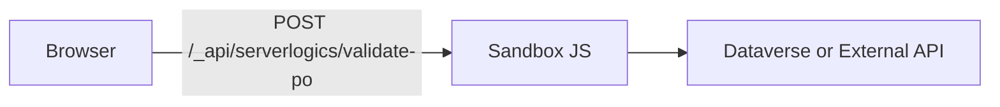
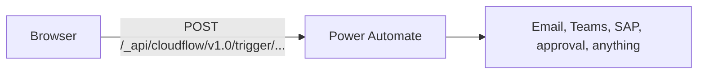
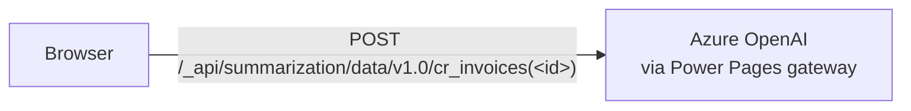

# Lab 04: Pick the Right Backend Pattern

## What You Will Learn

How to choose between the four integration patterns Power Pages SPA sites support — Web API, Server Logic, Cloud Flows, and AI API — using a one-page decision matrix that keeps you out of trouble.

## Prerequisites

- Completed [Lab 03: Connect to Live Data via Web API](../build/03-web-api-integration.md) (you've used the Web API pattern hands-on)

## Learning Objectives

By the end of this lab you will be able to:

1. Name the four integration patterns available to a Power Pages SPA site (Web API, Server Logic, Cloud Flows, AI API)
2. Pick the correct pattern for a given requirement using a short decision matrix
3. Describe the runtime and security model for each pattern (where it runs, who can call it, how auth works)

The Web API pattern from Lab 03 works well for straightforward CRUD but breaks down the moment you need to hide logic from the browser, talk to a non-Dataverse system, schedule something, or run a generative AI prompt.

This lab introduces the three patterns that fill those gaps and gives you a one-page decision matrix so you know which one to reach for in Labs 05, 06, and 07.

> **Further reading for each pattern:**
> - [Power Pages Web API overview](https://learn.microsoft.com/power-pages/configure/web-api-overview)
> - [Server logic overview](https://learn.microsoft.com/power-pages/configure/server-logic-overview)
> - [Configure Power Automate cloud flows in Power Pages](https://learn.microsoft.com/power-pages/configure/cloud-flow-integration)
> - [Data summarization API overview (preview)](https://learn.microsoft.com/power-pages/configure/data-summarization-api)

---

## Part 1: The Four Patterns

### 1. Web API (Lab 03)

You met this in Lab 03. The browser talks to Dataverse directly over OData.

| Aspect | Detail |
|--------|--------|
| Where it runs | Client (browser) |
| Auth | Cookie + CSRF token |
| Security | Table permissions + web roles |
| Good for | CRUD on Dataverse tables, filtered reads |
| Bad for | Logic that must not be inspectable, external APIs, async work |

### 2. Server Logic (Lab 05)

Server-side JavaScript running in the Power Pages sandboxed runtime. The code lives in your repo under `.powerpages-site/server-logic/` and is reachable at `/_api/serverlogics/<name>`.

| Aspect | Detail |
|--------|--------|
| Where it runs | Power Pages server sandbox (ECMAScript 2023, no npm, no browser APIs) |
| Auth | Cookie + CSRF token (same as Web API) |
| Security | Web roles assigned in the serverlogic YAML |
| Good for | Validate-and-execute business rules, calls to external REST APIs with secrets, state-machine enforcement |
| Bad for | Long-running work (default 120s timeout, configurable up to 240s), cross-system orchestration, scheduled jobs |

**Why it exists:** Some business rules must not run in the browser. A duplicate-invoice check that runs client-side can be skipped with DevTools. Server logic moves that check inside a runtime the user cannot inspect or bypass.

### 3. Cloud Flow (Lab 06)

Power Automate flow with the "When Power Pages calls a flow" trigger. The portal posts to `/_api/cloudflow/v1.0/trigger/<flowId>` with a payload wrapped in `eventData`.

| Aspect | Detail |
|--------|--------|
| Where it runs | Power Automate (Azure Logic Apps runtime) |
| Auth | Cookie + CSRF + web role check |
| Security | Web roles assigned in the `.cloudflowconsumer.yml` |
| Good for | Approval workflows, email/Teams notifications, connecting to 500+ Power Automate connectors, long-running async work |
| Bad for | Synchronous validation the UI needs to block on, calls that must return in under a second |

**Why it exists:** When you need Teams notifications, Outlook emails, approval chains, or cross-system orchestration, you reach for Power Automate. Cloud flows give you that reach without writing integration code.

### 4. Generative AI API (Lab 07)

Preview APIs built into Power Pages: Search Summary (`/_api/search/v1.0/summary`) and Data Summarization (`/_api/summarization/data/v1.0/`).

| Aspect | Detail |
|--------|--------|
| Where it runs | Power Pages AI gateway (Azure OpenAI under the hood) |
| Auth | Cookie + CSRF + site settings toggle + tenant governance |
| Security | Web roles + Web API table permissions + `Summarization/*` site settings |
| Good for | Summarizing a record, grounded search over site content, Copilot-style AI cards |
| Bad for | Freeform chat, non-summarization AI tasks, use cases that need the latest model before Microsoft ships it |

**Why it exists:** Dropping raw Azure OpenAI credentials in a browser is unsafe. These APIs expose vetted prompt templates through a managed gateway, with governance controls at tenant, environment, and site level.

---

## Part 2: The Decision Matrix

Use this when you are not sure which pattern fits.

| Question | If "yes" → use |
|----------|----------------|
| Is it a plain CRUD on one Dataverse table, from the browser? | **Web API** |
| Must the rule run where the user cannot inspect or skip it? | **Server Logic** |
| Does it call a non-Dataverse REST API that needs a secret (API key, client secret)? | **Server Logic** |
| Does it enforce a state-machine transition (Draft → Submitted → Approved)? | **Server Logic** |
| Does it send email, Teams messages, Outlook calendar invites, or talk to SAP/Salesforce/ServiceNow? | **Cloud Flow** |
| Does it need an approval chain with humans in the loop? | **Cloud Flow** |
| Does it summarize a Dataverse record into human-readable text? | **AI API (Data Summarization)** |
| Does it produce a grounded answer from search across your site? | **AI API (Search Summary)** |

### The Overlap Cases

Some scenarios fit more than one pattern. Here is how to pick:

| Scenario | Pick | Why |
|----------|------|-----|
| Validate a PO number is unique, then save the invoice | Server Logic (validate-and-execute) | Browser-side validation can be skipped; validating and writing in one server call is tamper-proof |
| Notify a finance manager when an invoice is submitted | Cloud Flow | Power Automate ships with Outlook, Teams, approval connectors -- don't rebuild this in code |
| Generate a one-paragraph summary of an invoice | AI API | A human-written summary prompt lives in a site setting; zero custom code after scaffolding |
| Call the Exchange Rate API to convert amounts to USD | Server Logic | External REST API needs an API key; that key must never reach the browser |
| Send a follow-up email 3 days after an invoice is submitted | Cloud Flow (scheduled) | Built-in scheduling primitives; server logic times out after 240s max |

---

## Part 3: Anti-Patterns and Common Confusion

### Don't do these

| Anti-pattern | Why it fails | What to do instead |
|--------------|--------------|--------------------|
| Validating business rules only in React, then writing via Web API | DevTools can skip the validation. Attackers or careless users hit the database unchecked. | Move validation into server logic that also performs the write (validate-and-execute pattern). |
| Calling external APIs (Stripe, SendGrid, etc.) with the API key in a React component | Every visitor can read the key from the bundle. | Server logic reads the key from a site setting backed by an environment variable (optionally Azure Key Vault). |
| Building an approval UI from scratch | Weeks of work to replicate what Power Automate ships. | Cloud flow with the Approvals connector; portal triggers the flow; Approvals center handles the UX. |
| Dropping an Azure OpenAI SDK call in the browser | Key leakage, prompt injection from URL params, no governance | Use Data Summarization / Search Summary APIs -- Microsoft-managed gateway, prompts live as site settings. |
| Server logic that only returns `{ valid: true/false }` | The client can skip the POST and write directly via Web API, bypassing the rule. | Make the server logic do both: validate **and** perform the Dataverse write in one call. |

### Common Confusion

**"Cloud flow vs. server logic -- they both run on the server?"**

Yes, but the runtimes are very different. Cloud flows are built in a visual designer by connecting pre-built steps. Server logic is JavaScript in your repo. Cloud flows have virtually no time limit and can run for hours. Server logic must finish in 120 seconds.

**"Can I call Power Automate from server logic?"**

Yes. Server logic can use `Server.Connector.HttpClient` to POST to a flow's trigger URL. This is useful when you need to do server-side work **and** trigger a flow at the end. But if the only reason to use server logic is to trigger a flow, just call the flow from the browser directly.

**"What if the AI API doesn't cover my use case?"**

Wrap Azure OpenAI in server logic. Put your API key in a site setting backed by Azure Key Vault. Call it from the portal the same way you would call any server logic endpoint.

---

## Key Takeaways

- Four patterns cover almost every Power Pages integration: Web API, Server Logic, Cloud Flow, AI API
- Pick by asking: "where does the rule need to run?" and "what does it need to reach?"
- Validate-and-execute beats validate-only for any browser-bypassable rule
- Cloud flows beat custom code for approvals, notifications, and cross-system work
- AI APIs beat raw Azure OpenAI when you want governance for free

## What's Next

→ [Lab 05: Add Server Logic](./05-add-server-logic.md)
