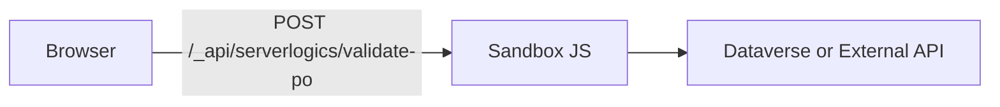
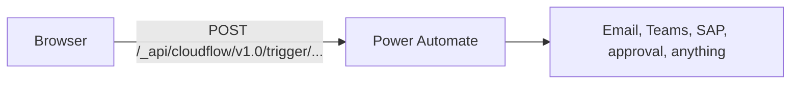
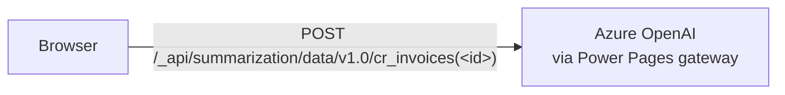

# Lab 04: Plan the service layer

## Goal

Create a reviewed integration plan that classifies each supplier portal feature into the right backend pattern before you build it.

**Estimated time:** about 20-30 minutes.

## State you carry forward

- Completed [Lab 03: Connect the SPA to live Dataverse data](../build/03-web-api-integration.md) (typed Web API service layer in `src/services/`, working CRUD on the deployed site)
- Working portal deployed (`.powerpages-site/` folder exists, deploy succeeded at least once)
- `/integrate-backend` available in your AI coding CLI session
- Active PAC CLI and Azure CLI sessions (`pac auth list`, `az account show`). If your Microsoft account has no Azure subscription, sign in once with `az login --allow-no-subscriptions`. The orchestrator uses Microsoft Entra ID-scoped tokens that work without one.

> **No new tools for the Integrate phase.** Labs 04-08 run on the same tooling you installed in the Build phase. The only optional add-on is a static-analysis tool for [Lab 09](./09-security-review.md). See [Integrate phase setup](00-setup.md).

## Learning objectives

By the end of this lab you will be able to:

1. Run `/integrate-backend` to produce a sequenced backend integration plan for the prototype
2. Read the plan and explain why each feature is classified into Web API, Server Logic, Cloud Flow, or AI API
3. Approve, request changes, pause, and resume the plan without losing progress
4. Map every plan step to the matching deep-dive lab (05/06/07) so you know when to follow the orchestrator and when to drop into a single skill manually

The Web API pattern from Lab 03 covered straightforward CRUD. The Supplier Invoice portal also needs a duplicate-PO check the browser cannot bypass, a Teams notification when invoices are submitted, and a one-paragraph AI summary on the Invoice Detail page. Each of those needs a different backend pattern. Rather than picking by hand and running separate skills, you will run **one** orchestrator that classifies the feature work for Labs 05-07 and drives the underlying skills in the right order. Lab 08 then takes the integrated portal and focuses on performance, testing, and deployment.

> **Important:** `/integrate-backend` is the orchestrator equivalent of working through the feature-building portions of Labs 05-07 yourself. Use it when you want a complete backend plan and end-to-end execution from a single prompt; pause and run Labs 05-07 individually whenever you want to learn or customize a specific pattern. If you let the orchestrator complete a feature, do **not** rerun that deep-dive lab for the same feature unless you intend to edit or replace what it generated.

> **Further reading for each pattern:**
> - [Power Pages Web API overview](https://learn.microsoft.com/power-pages/configure/web-api-overview)
> - [Server logic overview](https://learn.microsoft.com/power-pages/configure/server-logic-overview)
> - [Configure Power Automate cloud flows in Power Pages](https://learn.microsoft.com/power-pages/configure/cloud-flow-integration)
> - [Data summarization API overview (preview)](https://learn.microsoft.com/power-pages/configure/data-summarization-api)

---

## Part 1: run `/integrate-backend`

### Step 1.1: launch the orchestrator

In your AI coding CLI session:

```
/integrate-backend
```

The skill will:

1. Scan your prototype (React components, mock data, business rules, comments) to identify every feature that needs a service layer
2. Classify each feature into Web API (standard CRUD), Server Logic (server-side validation and external APIs), Cloud Flow (approval and notification workflows), or AI API (summarization and grounded search)
3. Propose a sequenced execution plan that respects dependencies (e.g., the Web API foundation runs before any Server Logic that calls it)
4. Open the plan in your browser for review
5. After you approve, orchestrate the underlying skills (`/integrate-webapi`, `/add-server-logic`, `/add-cloud-flow`, `/add-ai-webapi`) in the correct order, pausing between major steps so you can review generated code and test the site

### Step 1.2: review the plan

The plan that opens in your browser should show:

- [ ] A section per backend pattern (Web API, Server Logic, Cloud Flow, AI API)
- [ ] Under each pattern, the prototype features classified into it with a one-line "why"
- [ ] A dependency graph or ordering hint (Server Logic items depend on the Web API foundation, AI API items depend on the records they summarize, etc.)
- [ ] The list of underlying skills the orchestrator will invoke and in what order
- [ ] Any prerequisites flagged for your attention (missing site settings, table permissions, environment variables)

If something is misclassified (for example, the duplicate-PO check showing under Web API instead of Server Logic), request a change in the plan UI and describe the correction (e.g., *"this rule must be tamper-proof, so it belongs in Server Logic with validate-and-execute"*). The orchestrator will reclassify and redraw the plan. Otherwise approve.

> **Reference only: your plan may differ.** The exact section names, layout, and skills the orchestrator chooses depend on what is in your repo. The orchestrator adapts to your prototype, so do not rewrite your plan to match this lab line-for-line. Use these notes to understand the **shape** of a healthy plan; if anything in yours looks meaningfully different, ask your AI coding CLI to explain the choice before changing anything.

---

## Part 2: watch the orchestrator run

After you approve the plan, the orchestrator runs each step in sequence and pauses between them. You can stop anywhere, and resume by running `/integrate-backend` again.

> **Choose one path per feature.** The rest of the integrate phase is written as deep dives. If `/integrate-backend` already generated your duplicate-PO server logic, Lab 05 becomes a review/customization guide for that generated code. If it already registered your cloud flow, Lab 06 becomes a review/customization guide for that consumer. If it already added the AI summary/search features, Lab 07 becomes a review/customization guide. Lab 08 should still be completed after the feature work because it validates, optimizes, tests, and deploys the integrated portal.

### Step 2.1: web API foundation

The orchestrator runs `/integrate-webapi` first if your project does not already have a typed service layer. If you completed Lab 03 it detects the existing `src/services/webApi.ts`, `src/types/entities.ts`, and `src/services/invoiceService.ts` and skips ahead.

### Step 2.2: server logic items

For each feature classified as Server Logic, the orchestrator invokes `/add-server-logic`. It generates the sandbox JavaScript, the `.serverlogic.yml` metadata, the table-permission updates, and the React wiring, then pauses for review before deploying. Lab 05 walks through this in detail.

### Step 2.3: cloud flow items

For each notification or approval feature, the orchestrator invokes `/add-cloud-flow`, generates the `.cloudflowconsumer.yml` and the React trigger code, and pauses. Lab 06 covers this end-to-end.

### Step 2.4: AI API items

For each summarization or grounded-search feature, the orchestrator invokes `/add-ai-webapi` to scaffold the site settings, prompts, and the UI card. Lab 07 covers the AI APIs in depth.

> **Stop and resume any time.** The plan is **persistent, resumable, and editable**. Hit Ctrl-C, close the terminal, take a break, review code, run the deployed site, change your mind. Run `/integrate-backend` again and it picks up where you left off. You can also run any underlying skill (`/add-server-logic`, `/add-cloud-flow`, `/add-ai-webapi`) directly to tweak a single feature in isolation without re-running the orchestrator.

---

## Part 3: verify the plan output

After the orchestrator completes, or after you pause partway through, confirm the artifacts landed:

- [ ] `src/services/webApi.ts`, `src/services/<entity>Service.ts`, and `src/types/entities.ts` exist (Web API foundation)
- [ ] One folder under `.powerpages-site/server-logic/<name>/` for each Server Logic item in the plan, each containing a `.js` and a `.serverlogic.yml`
- [ ] One file under `.powerpages-site/cloud-flow-consumer/<name>.cloudflowconsumer.yml` for each Cloud Flow item
- [ ] React UI now calls the new services / endpoints / flows: no remaining mock-data imports for any feature in the plan
- [ ] Any plan or state artifact produced by the orchestrator is saved with the repo so you (or a teammate) can resume later
- [ ] The site has been deployed since the last orchestrator step (Server Logic and Cloud Flow endpoints only become reachable after deploy)

If any item is missing, run `/integrate-backend` again. The orchestrator detects partial state and offers to continue.

---

## Part 4: reference, the four patterns and the decision matrix

Use this section when you want to override the orchestrator's classification, run a single skill manually, or understand *why* a feature landed in one pattern rather than another.

### The four patterns

> **Note:** Throughout the labs, `cr_invoice` (singular) is the table's logical name used in permissions and metadata, and `cr_invoices` (plural) is the OData entity-set name used in Web API URLs. Both refer to the same table.

#### 1. web API (Lab 03)

You met this in Lab 03. The browser talks to Dataverse directly over OData.


| Aspect | Detail |
|--------|--------|
| Where it runs | Client (browser) |
| Auth | Cookie + CSRF token |
| Security | Table permissions + web roles |
| Good for | CRUD on Dataverse tables, filtered reads |
| Bad for | Logic that must not be inspectable, external APIs, async work |

#### 2. server logic (Lab 05)

Server-side JavaScript running in the Power Pages sandboxed runtime. The code lives in your repo under `.powerpages-site/server-logic/` and is reachable at `/_api/serverlogics/<name>`.



| Aspect | Detail |
|--------|--------|
| Where it runs | Power Pages server sandbox (ECMAScript 2023, no npm, no browser APIs) |
| Auth | Cookie + CSRF token (same as Web API) |
| Security | Web roles assigned in the serverlogic YAML |
| Good for | Validate-and-execute business rules, calls to external REST APIs with secrets, state-machine enforcement |
| Bad for | Long-running work (default 120s timeout, configurable up to 240s), cross-system orchestration, scheduled jobs |

**Why it exists:** Some business rules must not run in the browser. A duplicate-invoice check that runs client-side can be skipped with DevTools. Server logic moves that check inside a runtime the user cannot inspect or bypass.

#### 3. cloud flow (Lab 06)

Power Automate flow with the "When Power Pages calls a flow" trigger. The portal posts to `/_api/cloudflow/v1.0/trigger/<flowId>` with a payload wrapped in `eventData`.



| Aspect | Detail |
|--------|--------|
| Where it runs | Power Automate (Azure Logic Apps runtime) |
| Auth | Cookie + CSRF + web role check |
| Security | Web roles assigned in the `.cloudflowconsumer.yml` |
| Good for | Approval workflows, email/Teams notifications, connecting to 500+ Power Automate connectors, long-running async work |
| Bad for | Synchronous validation the UI needs to block on, calls that must return in under a second |

**Why it exists:** When you need Teams notifications, Outlook emails, approval chains, or cross-system orchestration, you reach for Power Automate. Cloud flows give you that reach without writing integration code.

#### 4. generative AI API (Lab 07)

Preview APIs built into Power Pages: Search Summary (`/_api/search/v1.0/summary`) and Data Summarization (`/_api/summarization/data/v1.0/`).



| Aspect | Detail |
|--------|--------|
| Where it runs | Power Pages AI gateway (Azure OpenAI under the hood) |
| Auth | Cookie + CSRF + site settings toggle + tenant governance |
| Security | Web roles + Web API table permissions + `Summarization/*` site settings |
| Good for | Summarizing a record, grounded search over site content, Copilot-style AI cards |
| Bad for | Freeform chat, non-summarization AI tasks, use cases that need the latest model before Microsoft ships it |

**Why it exists:** Dropping raw Azure OpenAI credentials in a browser is unsafe. These APIs expose vetted prompt templates through a managed gateway, with governance controls at tenant, environment, and site level.

### Decision matrix

Use this when you are not sure which pattern fits, or when reviewing a misclassification in the orchestrator's plan.

| Question | If "yes" → use |
|----------|----------------|
| Is it a plain CRUD on one Dataverse table, from the browser? | **Web API** |
| Must the rule run where the user cannot inspect or skip it? | **Server Logic** |
| Does it call a non-Dataverse REST API that needs a secret (API key, client secret)? | **Server Logic** |
| Does it enforce a state-machine transition (Draft → Submitted → Approved)? | **Server Logic** |
| Does it send email, Teams messages, Outlook calendar invites, or talk to SAP/Salesforce/ServiceNow? | **Cloud Flow** |
| Does it need an approval chain with humans in the loop? | **Cloud Flow** |
| Does it summarize a Dataverse record into human-readable text? | **AI API (Data Summarization)** |
| Does it produce a grounded answer from search across your site? | **AI API (Search Summary)** |

### Anti-patterns

| Anti-pattern | Why it fails | What to do instead |
|--------------|--------------|--------------------|
| Validating business rules only in React, then writing via Web API | DevTools can skip the validation. Attackers or careless users hit the database unchecked. | Move validation into server logic that also performs the write (validate-and-execute pattern). |
| Calling external APIs (Stripe, SendGrid, etc.) with the API key in a React component | Every visitor can read the key from the bundle. | Server logic reads the key from a site setting backed by an environment variable (optionally Azure Key Vault). |
| Building an approval UI from scratch | Weeks of work to replicate what Power Automate ships. | Cloud flow with the Approvals connector; portal triggers the flow; Approvals center handles the UX. |
| Dropping an Azure OpenAI SDK call in the browser | Key leakage, prompt injection from URL params, no governance | Use Data Summarization / Search Summary APIs: Microsoft-managed gateway, prompts live as site settings. |
| Server logic that only returns `{ valid: true/false }` | The client can skip the POST and write directly via Web API, bypassing the rule. | Make the server logic do both: validate **and** perform the Dataverse write in one call. |

### Common confusion

**"Cloud flow vs. server logic, they both run on the server?"**

Yes, but the runtimes are very different. Cloud flows are built in a visual designer by connecting pre-built steps. Server logic is JavaScript in your repo. Cloud flows have virtually no time limit and can run for hours. Server logic must finish within 120 seconds (configurable up to 240).

**"Can I call Power Automate from server logic?"**

Yes. Server logic can use `Server.Connector.HttpClient` to POST to a flow's trigger URL. This is useful when you need to do server-side work **and** trigger a flow at the end. But if the only reason to use server logic is to trigger a flow, just call the flow from the browser directly.

**"What if the AI API doesn't cover my use case?"**

Wrap Azure OpenAI in server logic. Put your API key in a site setting backed by Azure Key Vault. Call it from the portal the same way you would call any server logic endpoint.

---

## Verification

You have completed this lab when:

- [ ] `/integrate-backend` produced a plan and you reviewed every classification
- [ ] At least one feature in each applicable pattern (Web API, Server Logic, Cloud Flow, AI API) has been generated end-to-end
- [ ] You paused and resumed `/integrate-backend` at least once
- [ ] You can name, for any feature in the prototype, *why* it lives in the pattern it lives in
- [ ] The site has been deployed since the orchestrator's last step, and the new endpoints respond on the live URL
- [ ] No prototype feature in the plan still uses mock data

### Generic debug prompt

If `/integrate-backend` produces a plan that does not match your intent, paste this into your AI coding CLI:

```
The integration plan classified [feature name] as [pattern]. I expected 
[other pattern] because [reason: tamper-proof rule, external API with a 
secret, long-running async work, approval chain, etc.]. Please 
reclassify and explain whether my reasoning is correct or what I am 
missing.
```

If a sub-skill fails midway, paste this:

```
/integrate-backend halted while running [skill name] on [feature]. 
The error was [paste error]. Diagnose, fix the root cause, and resume 
from the failed step.
```

## Troubleshooting

| Error | What you see | Cause | Fix |
|-------|--------------|-------|-----|
| Plan classifies a security-critical check as Web API | "Validate PO uniqueness" listed under Web API | Prototype only validates in React, so the orchestrator infers a client-side rule | In the plan UI, request a change: "this rule must be tamper-proof. Reclassify as Server Logic (validate-and-execute)" |
| Orchestrator skips a feature you expected | The feature is missing from the plan entirely | The feature is not surfaced in any prototype component, mock data, or comment the orchestrator can read | Add a placeholder component or a clear intent comment, then re-run `/integrate-backend` |
| Resume restarts from the top | After Ctrl-C, the orchestrator begins from scratch | The plan/state file was deleted or never written | Re-run `/integrate-backend` once the prerequisites (PAC, Azure auth, deployed `.powerpages-site/`) are healthy; verify the plan/state file is present and committed |
| One sub-skill fails midway | The orchestrator halts at a specific step with the underlying skill's error | Underlying issue (PAC auth lapsed, table permission missing, deploy failed, etc.) | Fix the underlying issue, re-run `/integrate-backend`. It resumes from the failed step |
| Endpoint returns 404 after orchestrator finishes | `/_api/serverlogics/<name>` or cloud-flow trigger 404s | Site has not been deployed since the orchestrator generated the artifacts | Run `/deploy-site` (or accept the orchestrator's deploy prompt), then retest |

## Fallback

If `/integrate-backend` will not start, or the plan never opens:

1. Verify `pac auth list` and `az account show` both return active sessions; re-auth if needed
2. Confirm Labs 01-03 completed: `.powerpages-site/` exists, the site has been deployed, and `src/services/webApi.ts` from Lab 03 is in the repo
3. Run a single underlying skill manually to isolate where the problem is: `/integrate-webapi`, `/add-server-logic`, `/add-cloud-flow`, or `/add-ai-webapi`. If a single skill works, the issue is in the orchestrator integration, not the skill itself.
4. If the plan classification looks completely off, the orchestrator may not be reading your prototype correctly. Add explicit intent comments in the React components (e.g., `// Server-side rule: PO numbers must be unique across all suppliers`) and re-run.

## Key takeaways

- `/integrate-backend` is the meta-skill for backend feature integration. It plans, classifies, and orchestrates the feature-building work from Labs 05-07 from a single prompt
- Four patterns cover almost every Power Pages integration: Web API (browser CRUD), Server Logic (tamper-proof rules and external APIs), Cloud Flow (notifications and approvals), AI API (summarization and grounded search)
- Pick by asking: "where does the rule need to run?" and "what does it need to reach?"
- The orchestrator's plan is **persistent, resumable, and editable**: pause whenever you want to learn or customize, and run any single skill manually for fine-grained control
- Validate-and-execute beats validate-only for any browser-bypassable rule
- The site must be deployed for Server Logic and Cloud Flow endpoints to respond. Local development cannot exercise these patterns end-to-end

## Next step

→ [Lab 05: Add server logic](./05-add-server-logic.md): dive deep into the Server Logic pattern, especially when you want to understand or customize what the orchestrator generated.
