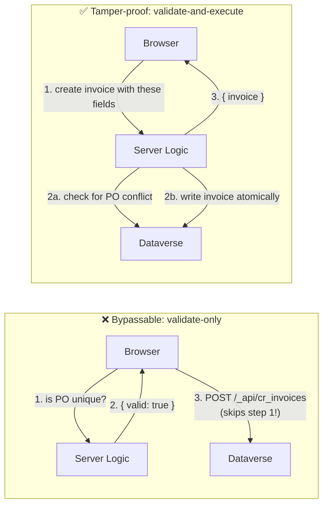

# Lab 05: Add server logic

## Goal

Add a server-side validate-and-execute endpoint that prevents duplicate purchase orders while creating invoices securely.

## State you carry forward

- Completed [Lab 04: Plan the service layer with /integrate-backend](./04-pick-backend-pattern.md)
- Working portal deployed (`.powerpages-site` folder exists)
- `/add-server-logic` available in your AI coding CLI session
- Active PAC CLI and Azure CLI sessions (`pac auth list`, `az account show`). The agent uses PAC CLI to deploy the generated server-logic files and the `az` token for any Dataverse calls it makes while wiring them up. If your Microsoft account has no Azure subscription, sign in once with `az login --allow-no-subscriptions`; the plugin uses Microsoft Entra ID-scoped tokens, which work without one.

> **Before you start, confirm your prior state.** This lab replaces a direct Web API write with a server-logic call, so the Web API layer must already be in place:
>
> - [ ] Lab 03's typed service layer exists (`src/services/webApi.ts`, `invoiceService.ts`) and the deployed site reads live data
> - [ ] If you ran `/integrate-backend` in Lab 04, its Web API step finished: server logic builds on top of that foundation
> - [ ] The `.powerpages-site/` folder exists and the site is deployed

## Learning objectives

By the end of this lab you will be able to:

1. Use `/add-server-logic` to scaffold a server-side endpoint that validates and executes a business rule
2. Explain the validate-and-execute pattern and why it is tamper-proof where client-side validation is not
3. Identify the four sandbox constraints that make server logic different from Node.js (no npm, no fetch, no DOM, 240s max timeout)
4. Wire a server logic endpoint into the React UI replacing a direct Web API call

The scenario: your Submit Invoice form currently lets a supplier submit the same PO number twice. Finance has asked you to reject duplicates. You could add the check in React, but anyone with DevTools can skip it. Instead, you will build a server-side endpoint that both checks for duplicates **and** creates the invoice, all in one call. The client cannot bypass it.

> **Further reading:** [Server logic overview](https://learn.microsoft.com/power-pages/configure/server-logic-overview) · [Author server logic](https://learn.microsoft.com/power-pages/configure/author-server-logic) · [Interact with Dataverse tables using server logic](https://learn.microsoft.com/power-pages/configure/server-logic-operations) · [Interact with external services using server logic](https://learn.microsoft.com/power-pages/configure/server-logic-external-services) · [Interact with Azure Function HTTP trigger](https://learn.microsoft.com/power-pages/configure/server-logic-azure-function)

---

## When to use Server-Side business logic

Before diving into the lab scenario, here's the broader picture of where server logic earns its place. Each row below describes a class of problem where running on the server, not the browser, is the right call.

| Category | Use Case | Example |
|---|---|---|
| **Security** | Secure content rendering | Healthcare portal returns patient data only after a server-side role check |
| **Security** | Secret and credential management | Stripe API key stays on the server; the client never sees it |
| **Security** | Server-side validation | Server rejects an order if the requested quantity exceeds inventory |
| **Security** | Rate limiting and abuse prevention | Maximum 5 support tickets per hour per user, enforced server-side |
| **Authorization** | Complex conditional permissions | A community moderator can edit posts only in their assigned community |
| **Authorization** | Row-level logic beyond table permissions | A manager approves expenses only for direct reports and only when the amount is under $1,000 |
| **Data Integrity** | Cross-entity transactions | Order + line items + inventory update all roll back together if any one fails |
| **Data Integrity** | Computed and derived data | Insurance premium is calculated server-side; the client sees only the result |
| **Data Integrity** | Business-rule enforcement | Permit status must follow `Submitted → Review → Approved` in sequence |
| **Data Integrity** | Skip the Power Pages cache | Force a fresh read from Dataverse when records are being updated outside the site and the SPA always needs the latest value |
| **Performance** | Batch operations | Dashboard fetches Contacts + Orders + Products in one server call |
| **Performance** | Data aggregation and transformation | Server returns 12 monthly totals instead of 10,000 raw rows |
| **Performance** | Structured response formatting | The same endpoint returns JSON, CSV, or XML based on what the caller asks for |
| **Integration** | Third-party services | Payment processed via a server-side Stripe or PayPal call |
| **Integration** | Customer on-prem services | Server calls an on-prem ERP through `Server.Connector.HttpClient` |
| **Dataverse components** | Existing plugins, actions, custom APIs, and functions | Invoke Dataverse plugins through actions to reuse existing business logic instead of duplicating it in Power Pages |

> **Rule of thumb.** If a check, calculation, secret, or aggregation can be skipped, faked, or scraped from the browser, it belongs on the server. The duplicate-PO check this lab builds falls into the **Security → Server-side validation** row.

---

## Part 1: sandbox constraints and the Validate-and-Execute pattern

### What server logic can do

Server logic is JavaScript that runs in a Power Pages-managed sandbox. Each file lives at `.powerpages-site/server-logic/<name>/<name>.js` and exposes up to five top-level functions: `get`, `post`, `put`, `patch`, `del` (not `delete`, a reserved keyword). Each function takes nothing and returns a string. Power Pages exposes the file at `/_api/serverlogics/<name>`.

Available SDK objects inside the sandbox:

| Object | Purpose |
|--------|---------|
| `Server.Context` | Query parameters, body, headers of the incoming request |
| `Server.Connector.Dataverse` | Synchronous CRUD on Dataverse tables (respects table permissions) |
| `Server.Connector.HttpClient` | Async calls to external REST APIs |
| `Server.User` | The calling Contact's identity and role membership |
| `Server.Sitesetting` | Read site setting values (for secrets, config) |
| `Server.Logger` | Log to Power Pages diagnostics |

### What server logic cannot do

| Constraint | What fails |
|-----------|------------|
| No npm packages | `require('axios')`, `import { foo } from 'bar'` |
| No browser APIs | `fetch`, `XMLHttpRequest`, `setTimeout`, `document`, `window` |
| No async Dataverse | `await Server.Connector.Dataverse.RetrieveMultipleRecords(...)`: these are synchronous |
| Execution timeout | Default 120 seconds, configurable up to 240 seconds via `ServerLogic/TimeoutInSeconds` site setting. Anything longer must move to a cloud flow. |
| ECMAScript 2023 only | Recent stage-3 proposals may not be available |

### The Validate-and-Execute pattern



The anti-pattern to avoid:

```
1. Client → Server Logic: "Is PO-2026-011 unique?"
2. Server Logic → Client: { valid: true }
3. Client → Web API: POST /_api/cr_invoices (creates the invoice)
```

Step 3 can happen without step 1. The client skips the validation call.

The pattern that actually protects the rule:

```
1. Client → Server Logic: "Create an invoice with these fields"
2. Server Logic:
   a. Read Dataverse to check for PO conflicts
   b. If conflict → return error
   c. If OK → write the invoice to Dataverse, return the new record
```

One server round-trip. The validation and the write are atomic. The client has no way to perform the write without going through the validation.

---

## Part 2: run /add-server-logic and review the output

### Step 2.1: describe the intent to Claude Code

In your AI coding CLI session:

```
/add-server-logic

Nothing currently stops a supplier from submitting the same PO number 
twice, which creates duplicate invoices for the finance team. When a 
supplier submits an invoice, check whether the PO number already 
exists. If it does, reject the submission and show a clear message to 
the supplier. The supplier must not be able to work around the check 
through the browser console or by refreshing the page.
```

Claude Code runs the 11-phase workflow from the skill. It will:

1. Verify the site is deployed (needs `.powerpages-site` folder from Lab 01)
2. Ask clarifying questions if anything is ambiguous
3. Fetch the latest Server Logic docs from Microsoft Learn
4. Render an HTML plan in your browser, review before approving
5. Create the code files, metadata YAML, and table permissions
6. Wire the UI
7. Offer to deploy

### Step 2.2: review the HTML plan

The plan that opens in your browser should show:

- [ ] One server logic item: name `validate-and-create-invoice` (or similar)
- [ ] HTTP method: POST
- [ ] SDK features: `Server.Connector.Dataverse`, `Server.Context`, `Server.Logger`, `Server.User`
- [ ] Web roles assigned: Authenticated Users (from Lab 02)
- [ ] Table permissions to verify: cr_invoice: Read, Create
- [ ] No secrets needed
- [ ] Files to create: `<name>.js`, `<name>.serverlogic.yml`

If something is off, select "Request changes" and describe the edit. Otherwise approve.

### Step 2.3: review the generated files

> **Reference only, your output may differ.** The code shown below illustrates what the plugin *typically* generates. The plugin adapts its output to your exact project (variable names, helper structure, comment style, error-handling shape), so your files may look different in small ways. Use these samples to understand the **concept** and the **why** behind each piece. Do not rewrite your generated files to match line-for-line. If something in your generated code looks meaningfully different, ask your AI coding CLI to explain the choice before changing anything.

After approval, four artifacts land in your repo.

**1. `.powerpages-site/server-logic/validate-and-create-invoice/validate-and-create-invoice.js`**: the sandbox code. The body should look roughly like:

```javascript
function post() {
    try {
        Server.Logger.Log("validate-and-create-invoice POST called");

        const body = JSON.parse(Server.Context.Body);
        const ponumber = body.ponumber;

        // 1. Check for duplicate PO
        const existing = Server.Connector.Dataverse.RetrieveMultipleRecords(
            "cr_invoices",
            "?$filter=cr_ponumber eq '" + ponumber + "'&$select=cr_invoiceid"
        );

        if (existing.value && existing.value.length > 0) {
            return JSON.stringify({
                status: "error",
                code: "DUPLICATE_PO",
                message: "An invoice with PO number " + ponumber + " already exists."
            });
        }

        // 2. Happy path -- create the invoice
        const contactId = Server.User.ContactId;
        const newInvoice = {
            cr_ponumber: ponumber,
            cr_amount: body.amount,
            cr_description: body.description,
            cr_duedate: body.duedate,
            "cr_submittedby@odata.bind": "/contacts(" + contactId + ")",
            "cr_suppliercompany@odata.bind": "/accounts(" + body.supplierCompanyId + ")",
            cr_status: 1 // Submitted
        };

        const created = Server.Connector.Dataverse.CreateRecord(
            "cr_invoices",
            JSON.stringify(newInvoice)
        );

        return JSON.stringify({
            status: "success",
            invoice: created
        });
    } catch (err) {
        Server.Logger.Error("validate-and-create-invoice POST failed: " + err.message);
        return JSON.stringify({
            status: "error",
            message: err.message
        });
    }
}
```

Walk through what makes this tamper-proof:

- The duplicate check reads live Dataverse data: stale client-side caches cannot fool it
- The `CreateRecord` call happens only after the check passes, in the same sandbox call
- The Contact ID comes from `Server.User`, not the request body: the client cannot impersonate another supplier

**2. `.powerpages-site/server-logic/validate-and-create-invoice/validate-and-create-invoice.serverlogic.yml`**: the metadata:

```yaml
adx_serverlogic_adx_webrole:
  - <Authenticated-Users-role-guid>
description: Validate PO uniqueness and create invoice record
display_name: Validate and Create Invoice
id: <generated-uuid>
name: validate-and-create-invoice
```

**3. Table permissions update (if not already covering Create):** Claude Code may add Create to the cr_invoice table permission or leave it if Lab 02 already covered it. Verify in `.powerpages-site/table-permissions/`.

**4. Frontend changes**, see Part 3.

---

## Part 3: wire the endpoint into submit invoice

Claude Code updates `src/pages/SubmitInvoice.tsx` (or equivalent) to call the new endpoint instead of the direct Web API POST. The change should look like:

**Before:**
```typescript
import { create } from '../services/invoiceService';

const handleSubmit = async (values) => {
  await create({
    cr_ponumber: values.ponumber,
    cr_amount: values.amount,
    // ...
  });
};
```

**After:**
```typescript
import { validateAndCreateInvoice } from '../services/serverLogicService';

const handleSubmit = async (values) => {
  const response = await validateAndCreateInvoice({
    ponumber: values.ponumber,
    amount: values.amount,
    description: values.description,
    duedate: values.duedate,
    supplierCompanyId: values.supplierCompanyId,
  });

  if (response.status === 'error') {
    if (response.code === 'DUPLICATE_PO') {
      setFormError('This PO number has already been submitted.');
    } else {
      setFormError(response.message);
    }
    return;
  }

  navigate('/invoices');
};
```

The new service file `src/services/serverLogicService.ts` contains the fetch + CSRF token logic. Depending on how your Lab 03 client is structured, the plugin either imports the existing anti-forgery-token helper from `webApi.ts` or defines an equivalent one in the new service. Either way, the token is fetched from `/_layout/tokenhtml` and sent as `__RequestVerificationToken`. If you see the logic duplicated and would rather share one helper, ask your AI coding CLI to extract it.

Verify:

- [ ] `src/services/serverLogicService.ts` exists and exports `validateAndCreateInvoice`
- [ ] Each call fetches `/_layout/tokenhtml` (or reuses the existing helper) and sends `__RequestVerificationToken`
- [ ] Submit Invoice no longer imports the direct `create` from `invoiceService` for the submission path
- [ ] Error state renders the DUPLICATE_PO message inline near the PO field

---

## Part 4: deploy and test

### Step 4.1: deploy

Accept Claude Code's offer to deploy, or run manually:

```
/deploy-site
```

Server logic only becomes reachable after deployment. You cannot test on localhost.

### Step 4.2: happy path test

1. Open the deployed site in an incognito window
2. Sign in with your work account
3. Submit Invoice → use a brand-new PO number like `PO-2026-042`
4. Expected: success message, redirect to Invoice List, new record shows in the list
5. Open make.powerapps.com and confirm the new invoice exists in the cr_invoice table

### Step 4.3: duplicate PO test

1. Go back to Submit Invoice
2. Re-enter `PO-2026-042` (the one you just submitted)
3. Expected: inline error "This PO number has already been submitted."
4. No record is created (verify in Dataverse, there should still be exactly one PO-2026-042)

### Step 4.4: tamper test (optional)

To prove the rule is tamper-proof, open DevTools Network tab and try to post directly to the Web API:

```javascript
const html = await fetch('/_layout/tokenhtml').then(r => r.text());
const token = html.match(/value="([^"]+)"/)[1];
fetch('/_api/cr_invoices', {
  method: 'POST',
  headers: {
    'Content-Type': 'application/json',
    '__RequestVerificationToken': token
  },
  body: JSON.stringify({ cr_ponumber: 'PO-2026-042', cr_amount: 100 })
})
  .then(r => console.log('Status:', r.status));
```

This bypass **still succeeds** because Lab 02's table permissions allow Create directly. To truly close the gap, remove Create from the cr_invoice table permission so the only path to creating an invoice is through the server logic endpoint.

Ask your AI coding CLI to do it:

```
Even after adding my duplicate-PO check, I can still bypass it by 
calling the API directly from the browser console. Close that loophole 
so the only way to create an invoice is through my validation logic. 
Then confirm that the Submit Invoice page still works.
```

> **Design takeaway:** Validate-and-execute only wins when the direct Web API path is also locked down. Server logic + narrower table permissions together make the rule enforceable.

---

## Troubleshooting

| Error | What You See | Cause | Fix |
|-------|-------------|-------|-----|
| 404 on `/_api/serverlogics/<name>` | Endpoint not found | Site not deployed after adding server logic | Run `/deploy-site` |
| 403 on POST | Forbidden | Missing CSRF token or web role | Ensure `__RequestVerificationToken` header is sent; verify Authenticated Users role is assigned in the YAML |
| Response `{ status: "error", message: "Cannot read property 'value' of undefined" }` | Dataverse call silently returned nothing | Missing or wrong table permission on cr_invoice | Add Read permission on cr_invoice for the Authenticated Users role, then redeploy |
| `Expected Guid for primary key 'id'` on deploy | PAC CLI crash | `.serverlogic.yml` missing `id` field | Claude Code uses the deterministic script which generates the GUID. Re-run `/add-server-logic` if you hand-edited |
| Timeout (default 120s, max 240s) | Request hangs, eventually fails | External API call or loop taking too long | Raise `ServerLogic/TimeoutInSeconds` up to 240 if the work is bounded, or move to a cloud flow for anything longer |
| `Server.Connector.Dataverse.RetrieveMultipleRecords is not a function` | Sandbox error | Used `fetch` instead of the SDK, or imported something | Server logic has no `fetch`: use `Server.Connector.HttpClient` for external calls and `Server.Connector.Dataverse` for Dataverse |

## Verification

You have completed this lab when:

- [ ] `.powerpages-site/server-logic/validate-and-create-invoice/` folder exists with `.js` and `.serverlogic.yml`
- [ ] `.serverlogic.yml` has a valid `id` GUID and at least one web role in `adx_serverlogic_adx_webrole`
- [ ] `src/services/serverLogicService.ts` exists with a `validateAndCreateInvoice` function
- [ ] Submit Invoice page calls the server logic endpoint (not the direct Web API)
- [ ] Site deployed and the endpoint responds at `/_api/serverlogics/validate-and-create-invoice`
- [ ] Happy path creates an invoice
- [ ] Duplicate PO returns an inline error and does not create a record

### Generic debug prompt

If anything fails and you're not sure where to start, paste this into Claude Code:

```
My duplicate-PO check isn't working. When I submit an invoice, I see 
[paste what you saw, such as the error message, "nothing happens", or 
"a duplicate was accepted"]. Find the cause and fix it.
```

## Fallback

If `/add-server-logic` fails to deploy:

1. Verify `.powerpages-site/` exists (server logic requires the deployed folder structure)
2. Run `pac auth who` to confirm the environment matches
3. Try `/deploy-site` first, then re-run `/add-server-logic`
4. If the generated `.js` has a syntax error, open it and check for `fetch`, `require`, or `async` on a function that doesn't use `await`. The sandbox rejects these

## Key takeaways

- Server logic solves the "browser can skip my validation" problem by running validation and the Dataverse write in one sandbox call
- The five function names are fixed (`get`, `post`, `put`, `patch`, `del`): no `delete`, no custom names
- Every function returns a string; use `JSON.stringify` for structured responses
- `Server.Connector.Dataverse` is synchronous; `Server.Connector.HttpClient` is async
- Validate-and-execute only wins if the direct Web API path is equally locked down
- The `/add-server-logic` plugin takes care of the boilerplate (web roles, metadata GUID, CSRF handling on the client)

## Next step

→ [Lab 06: Add Power Automate flows](./06-add-power-automate-flows.md)
