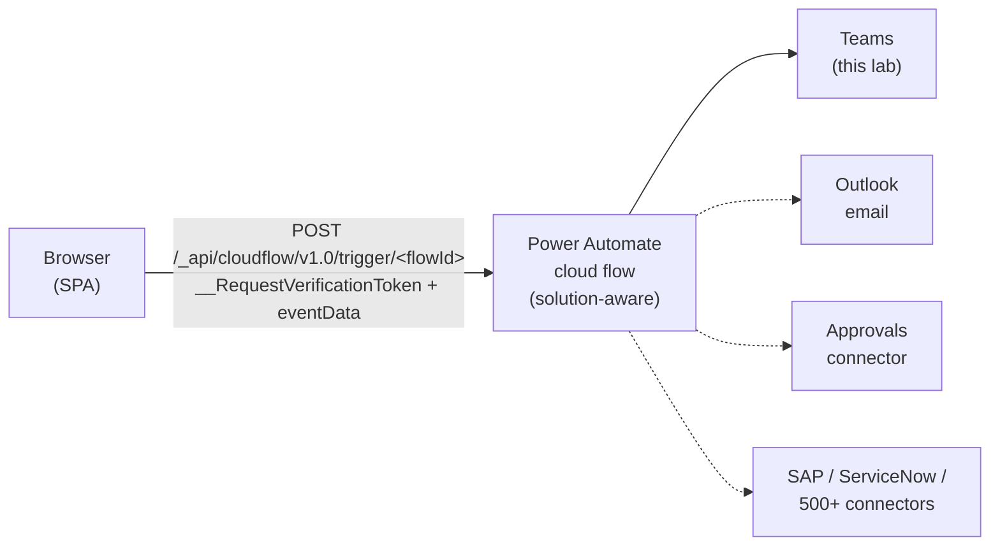

# Lab 06: Add Power Automate flows

## Goal

Add a Power Automate cloud flow that sends a Teams notification when a supplier submits an invoice.

**Estimated time:** about 30-45 minutes.

## State you carry forward

- Completed [Lab 05: Add server logic](./05-add-server-logic.md) (you've seen the CSRF and web role pattern once)
- Access to Power Automate (`make.powerautomate.com`) with permission to create flows in the same environment as your Power Pages site
- Azure CLI authenticated (`az account show`). `/add-cloud-flow` uses it to call the Flow RP API. If your Microsoft account has no Azure subscription, sign in once with `az login --allow-no-subscriptions`; Microsoft Entra ID-scoped tokens work without one.
- A Power Platform **solution** to create the flow inside. Only **solution-aware** flows can be attached to a Power Pages site. Flows created outside a solution will not appear in the plugin's flow list. If you don't already have a working solution, create one in `make.powerapps.com` before starting (Solutions > + New solution, pick any publisher, name it `SupplierPortal`). Lab 11 will use the same solution for the unpacked source-control pattern, so use a name you're happy to keep.

Before starting, confirm the portal state you are carrying forward:

- [ ] The site is deployed and `.powerpages-site/` exists locally
- [ ] The Authenticated Users web role from Lab 02 exists
- [ ] Lab 05's submit path works, so there is one place to hook the notification after invoice creation succeeds
- [ ] The cloud flow is created inside the same environment and solution as the site

## Learning objectives

By the end of this lab you will be able to:

1. Build a Power Automate cloud flow with the "When Power Pages calls a flow" trigger
2. Use `/add-cloud-flow` to register the flow with your site and generate typed client code
3. Explain the `eventData`-wrapped payload and two required headers (`__RequestVerificationToken`, `X-Requested-With`) that flow calls must send
4. Wire the flow into a React component so submitting an invoice triggers a Teams notification to the finance team

You could build a Teams notification with code, but you'd end up rebuilding Outlook/Teams connectors that Power Automate ships for free. Cloud flows let you spend your time on the business logic instead of the plumbing.

> **Further reading:** [Configure Power Automate cloud flows in Power Pages](https://learn.microsoft.com/power-pages/configure/cloud-flow-integration) · [End-to-end cloud flow tutorial (MSN Weather)](https://learn.microsoft.com/power-pages/configure/power-automate-how-to) · [Image library using cloud flow](https://learn.microsoft.com/power-pages/configure/image-library-how-to) · [Solution-aware flows](https://learn.microsoft.com/power-automate/overview-solution-flows)

### The runtime path you are building



The lab walks you through wiring up the **Teams** branch end-to-end. Once that path works, the dotted alternatives (Outlook, Approvals, third-party SaaS) plug into the same trigger and consumer YAML. Only the action steps inside the flow change.

---

## Part 1: build the flow in Power Automate

### Step 1.1: create the flow shell

1. Open https://make.powerautomate.com in a new browser tab
2. Confirm the environment selector (top right) matches your Power Pages environment
3. Navigate to **Solutions** in the left sidebar and open the `SupplierPortal` solution you created in the prerequisites (or any existing solution). Flow creation must happen **inside a solution**. Flows created from the top-level **+ Create** menu are not solution-aware and will never appear in `/add-cloud-flow`.
4. Inside the solution, select **+ New** → **Automation** → **Cloud flow** → **Automated**
5. Name: `Invoice Submitted Notification`
6. For the trigger, search for and select: **When Power Pages calls a flow**
7. Select **Create**

This is the only trigger that surfaces flows in `/add-cloud-flow`. Any flow with a different trigger (HTTP request, schedule, Dataverse row added) will not show up in the plugin's list. Solution membership is also mandatory: the `Set up workspace > Cloud flows > + Add cloud flow` picker in Power Pages only lists solution-aware flows.

### Step 1.2: configure the trigger

The trigger expects a JSON schema describing the payload you will send from Power Pages. Select **Advanced parameters** (or **Use sample payload to generate schema**) and paste:

```json
{
  "invoiceNumber": "INV-100042",
  "poNumber": "PO-2026-042",
  "amount": 22750,
  "description": "Q1 consulting services",
  "supplierName": "Adventure Works (sample)",
  "detailUrl": "https://your-site.powerappsportals.com/invoices/abc-123"
}
```

This matches the body the React UI will send. Power Automate generates a schema and creates output tokens (`invoiceNumber`, `poNumber`, etc.) you can reference in later steps.

### Step 1.3: add the Teams Step

1. Select **+ New step**
2. Search for **Microsoft Teams, Post message in a chat or channel**
3. Sign in when prompted (the flow runs under the connection owner's credentials, not the portal visitor's)
4. Configure:
   - **Post as:** Flow bot
   - **Post in:** Channel
   - **Team:** select the Finance team (or any team you have access to)
   - **Channel:** select the channel
   - **Message:** paste the body below and replace the placeholders with the dynamic tokens from the trigger

```
New invoice submitted -- please review

Invoice: {invoiceNumber}
PO Number: {poNumber}
Amount: ${amount}
Supplier: {supplierName}
Description: {description}

View details: {detailUrl}
```

In the Power Automate designer each `{token}` becomes a dynamic content chip pointing to the trigger output. Do not leave any as literal text.

### Step 1.4: save and test the flow standalone

1. Select **Save** (top right)
2. Select **Test** → **Manually** → **Test**
3. Power Automate will wait for a trigger. Leave this tab open; you will fire the trigger from Power Pages in Part 5

> **Important:** The flow must be **Active** (not Draft). Confirm with the Turn on / Turn off toggle in the flow details page.

---

## Part 2: run /add-cloud-flow

### Step 2.1: invoke the plugin

Back in your AI coding CLI:

```
/add-cloud-flow

The finance team wants a Teams message as soon as a supplier submits a 
new invoice, so they can review it without delay. I already built the 
"Invoice Submitted Notification" flow in Power Automate. Connect it to 
the portal so it runs when a supplier submits an invoice. Only signed-in 
suppliers should be able to trigger it.
```

Your AI coding CLI runs the 8-phase workflow from the skill. If `/integrate-backend` already registered this flow in Lab 04, use the rest of this lab to review the generated YAML and client code instead of creating a second consumer for the same flow.

### Step 2.2: what the plugin does behind the scenes

| Phase | Action |
|-------|--------|
| 1 | Verifies `.powerpages-site/` exists and reads the web roles from Lab 02 |
| 2 | Calls the Power Automate Flow RP API (`list-cloud-flows.js`) to list every flow with a PowerPages trigger in the environment |
| 3 | Presents the list, select `Invoice Submitted Notification` |
| 4 | Determines web role: Authenticated Users (matches your request) |
| 5 | Renders an HTML plan in your browser, review and approve |
| 6 | Creates `.powerpages-site/cloud-flow-consumer/<slug>.cloudflowconsumer.yml` |
| 7 | Generates `src/services/cloudFlowService.ts` with a typed trigger function |
| 8 | Offers to deploy |

### Step 2.3: review the HTML plan

Verify the plan shows:

- [ ] Flow: `Invoice Submitted Notification`, tagged `new`
- [ ] Scenario: Form submission (invoice workflow)
- [ ] Web role: Authenticated Users (existing, from Lab 02)
- [ ] No anonymous access flagged
- [ ] File to create: one `.cloudflowconsumer.yml`
- [ ] Service file: `src/services/cloudFlowService.ts` with function `invoiceSubmittedNotification` (or similar camelCase name derived from the display name)

Approve. If anything is off, select "Request changes" and describe the fix.

---

## Part 3: review generated code and YAML

> **Reference only: your output may differ.** The YAML and code shown below illustrate what the plugin *typically* generates. The plugin adapts its output to your exact project and flow setup (GUIDs, URLs, helper names, type signatures), so your files may look different in small ways. Use these samples to understand the **concept** and the **why** behind each piece. Do not rewrite your generated files to match line-for-line. If something in your generated code looks meaningfully different, ask your AI coding CLI to explain the choice before changing anything.

### Step 3.1: the consumer YAML

Open `.powerpages-site/cloud-flow-consumer/invoice-submitted-notification.cloudflowconsumer.yml`:

```yaml
adx_CloudFlowConsumer_adx_webrole:
  - <authenticated-users-role-guid>
flowapiurl: /_api/cloudflow/v1.0/trigger/<workflowEntityId>
id: <generated-uuid>
name: Invoice Submitted Notification
processid: <workflowEntityId from Power Automate>
```

Key fields:

- `processid`: the Flow RP's workflow entity ID. This is how Power Pages maps the call to the correct flow.
- `flowapiurl`: empty at creation; populated at deploy time by the portal runtime.
- `adx_CloudFlowConsumer_adx_webrole`: array of web role GUIDs allowed to trigger the flow. The Authenticated Users role from Lab 02 is reused.

### Step 3.2: the client service

Open `src/services/cloudFlowService.ts`:

```typescript
async function getCsrfToken(): Promise<string> {
  const res = await fetch('/_layout/tokenhtml');
  const html = await res.text();
  const match = html.match(/value="([^"]+)"/);
  if (!match) throw new Error('CSRF token not found');
  return match[1];
}

export async function invoiceSubmittedNotification(
  payload: Record<string, unknown> = {}
): Promise<unknown> {
  const token = await getCsrfToken();
  const response = await fetch('/_api/cloudflow/v1.0/trigger/<workflowEntityId>', {
    method: 'POST',
    headers: {
      'Content-Type': 'application/json',
      '__RequestVerificationToken': token,
      'X-Requested-With': 'XMLHttpRequest',
    },
    body: JSON.stringify({ eventData: JSON.stringify(payload) }),
  });
  if (!response.ok) {
    throw new Error(`Cloud flow trigger failed: ${response.status} ${response.statusText}`);
  }
  if (response.status === 202) return null; // fire-and-forget
  return response.json();
}
```

Two things about this file that always trip people up:

**Required headers**: every flow trigger call must send both:

| Header | Value | Why |
|--------|-------|-----|
| `__RequestVerificationToken` | CSRF token from `/_layout/tokenhtml` | Antiforgery; missing → 403 |
| `X-Requested-With` | `XMLHttpRequest` | Power Pages antiforgery pipeline; missing → 500 |

**Double-stringified payload**: the body is not `JSON.stringify(payload)`. It is `JSON.stringify({ eventData: JSON.stringify(payload) })`. The cloud flow endpoint expects the payload nested under `eventData` as a JSON-encoded string:

```json
{
  "eventData": "{\"invoiceNumber\":\"INV-100042\",\"poNumber\":\"PO-2026-042\",\"amount\":22750}"
}
```

If you pass a flat `JSON.stringify(payload)`, the trigger receives an empty payload and every dynamic token in the Teams message renders as blank.

### Step 3.3: response shapes

| Status | Meaning |
|--------|---------|
| 202 Accepted | Flow started; the flow has no Response action, so the portal gets nothing back (fire-and-forget) |
| 200 OK with JSON | Flow ran and returned data via a Response action |
| 403 | CSRF or web role failure |
| 500 | Missing `X-Requested-With` header, malformed `eventData`, or flow is in Draft state |

---

## Part 4: wire into submit invoice and invoice detail

The plugin wires one call site automatically. You will add the second one yourself.

### Step 4.1: submit invoice integration (automatic)

Open `src/pages/SubmitInvoice.tsx`. Your AI coding CLI has added the call inside the submit handler:

```typescript
import { validateAndCreateInvoice } from '../services/serverLogicService';
import { invoiceSubmittedNotification } from '../services/cloudFlowService';

const handleSubmit = async (values) => {
  const response = await validateAndCreateInvoice({ /* ... */ });

  if (response.status === 'error') { /* ... */ return; }

  // Fire-and-forget notification
  invoiceSubmittedNotification({
    invoiceNumber: response.invoice.cr_invoicenumber,
    poNumber: response.invoice.cr_ponumber,
    amount: response.invoice.cr_amount,
    description: response.invoice.cr_description,
    supplierName: response.invoice._cr_suppliercompany_value_OData_Community_Display_V1_FormattedValue,
    detailUrl: `${window.location.origin}/invoices/${response.invoice.cr_invoiceid}`,
  }).catch(err => console.error('Teams notification failed:', err));

  navigate('/invoices');
};
```

Notice the `.catch`. We don't want a Teams outage to block the user's invoice submission. The flow is fire-and-forget.

### Step 4.2: add a "Re-notify" button on invoice detail

You can ask your AI coding CLI to add the button for you instead of hand-coding it. Paste this:

```
On the invoice detail page, add a button that resends the Teams 
notification to the finance team, in case they missed the first 
message. The button should show clear feedback while the notification 
is sending, and confirm success when it completes.
```

If you prefer to wire it by hand, here is the reference implementation:

```typescript
import { invoiceSubmittedNotification } from '../services/cloudFlowService';

const [renotifying, setRenotifying] = useState(false);
const [renotifySuccess, setRenotifySuccess] = useState(false);

const handleRenotify = async () => {
  setRenotifying(true);
  try {
    await invoiceSubmittedNotification({
      invoiceNumber: invoice.cr_invoicenumber,
      poNumber: invoice.cr_ponumber,
      amount: invoice.cr_amount,
      description: invoice.cr_description,
      supplierName: invoice.companyName,
      detailUrl: window.location.href,
    });
    setRenotifySuccess(true);
  } catch (err) {
    alert('Could not send notification: ' + err.message);
  } finally {
    setRenotifying(false);
  }
};

// In the JSX, near the status badge:
<button onClick={handleRenotify} disabled={renotifying}>
  {renotifying ? 'Sending...' : 'Re-notify finance team'}
</button>
{renotifySuccess && <span>Notification sent.</span>}
```

Verify:

- [ ] The button imports `invoiceSubmittedNotification` from the same service file (no duplicate trigger function)
- [ ] The button is disabled while the request is in flight (prevents double-sends)
- [ ] On success, the UI shows confirmation; on failure, it shows an error

---

## Part 5: deploy and test end-to-end

### Step 5.1: deploy

```
/deploy-site
```

Wait for the upload to complete. The flow consumer YAML and the service code both ship with this deploy.

### Step 5.2: confirm the Portal-Runtime URL is populated

After deploy, Power Pages should populate the Flow API URL value on the cloud flow consumer record in Dataverse.

1. Open make.powerapps.com → **Tables** → search **Cloud flow consumer**
2. Open the `Invoice Submitted Notification` row
3. Confirm **Flow API URL** is now populated (not blank)

If this field is blank after 2-3 minutes, the deploy did not reach the flow consumer record. Redeploy.

### Step 5.3: happy path test

1. Power Automate tab: ensure the flow is **Active** (not Draft)
2. Deployed site (incognito window) → sign in
3. Submit Invoice → new unique PO (e.g., `PO-2026-099`)
4. Submit, expected: success redirect, invoice in the list
5. Switch to Teams → finance channel should show the notification within a few seconds
6. Back in Power Automate → **Run history** for the flow → the most recent run should be green

### Step 5.4: Re-notify test

1. Open any invoice in Invoice Detail
2. Select **Re-notify finance team**
3. Expected: button disables → success text → new Teams message
4. Power Automate run history shows a second run

### Step 5.5: inspect the network traffic

Open DevTools Network tab on Invoice Detail. Select **Re-notify** and watch the request:

- URL: `/_api/cloudflow/v1.0/trigger/<workflowEntityId>`
- Method: POST
- Request headers: `__RequestVerificationToken` present, `X-Requested-With: XMLHttpRequest`, `Content-Type: application/json`
- Request payload: `{ "eventData": "{\"invoiceNumber\":\"...\", ...}" }`
- Response status: 202 Accepted with empty body (fire-and-forget)

---

## Troubleshooting

| Error | What You See | Cause | Fix |
|-------|-------------|-------|-----|
| Flow doesn't appear in `/add-cloud-flow` list | Empty results from Flow RP API | Flow uses a different trigger | Only flows with "When Power Pages calls a flow" surface. Rebuild the trigger. |
| 403 Forbidden on trigger call | Network tab shows 403 | CSRF or web role failure | Verify the token is fetched and sent. Verify Authenticated Users role is in the YAML. |
| 500 Internal Server Error | Network tab shows 500 | Missing `X-Requested-With` header | Every trigger call must include `X-Requested-With: XMLHttpRequest` |
| Teams message arrives but fields are blank | Dynamic tokens render as empty strings | Payload not wrapped as `eventData` | Body must be `JSON.stringify({ eventData: JSON.stringify(payload) })`, not flat |
| Flow returns 404 | Flow in Draft state | Flow not activated | In Power Automate, select Turn on. Confirm the flow shows Active in the list. |
| Teams connector fails with 401 | Run history shows auth error | Connection under owner expired | Reconnect the Teams connection in Power Automate → Connections |
| `flowapiurl` blank after deploy | Cloud flow consumer row has no URL | Portal runtime hasn't processed the consumer yet, or YAML is malformed | Wait 2 minutes, redeploy. If still blank, verify `processid` matches `workflowEntityId`. |
| Every submit sends two Teams messages | Double-fire | Both `/add-server-logic` and `/add-cloud-flow` wired the handler | Ensure only one call site fires per user action, review Submit Invoice imports |

## Verification

You have completed this lab when:

- [ ] Flow exists in Power Automate with "When Power Pages calls a flow" trigger and is Active
- [ ] `.powerpages-site/cloud-flow-consumer/<slug>.cloudflowconsumer.yml` exists with correct `processid` and Authenticated Users role
- [ ] `src/services/cloudFlowService.ts` exists with `getCsrfToken` and `invoiceSubmittedNotification`
- [ ] Submit Invoice calls the flow after `validateAndCreateInvoice` succeeds
- [ ] Invoice Detail has a working "Re-notify" button
- [ ] Happy path: submitting an invoice posts a Teams message in the finance channel
- [ ] Power Automate run history shows successful runs
- [ ] Network tab shows `eventData`-wrapped body and both required headers

### Generic debug prompt

When the Teams message doesn't arrive, or any `/add-cloud-flow` step fails partway, and you're not sure whether the problem is on the portal side or in Power Automate, paste this into your AI coding CLI:

```
I submitted an invoice on the portal, but the finance team didn't get
their Teams message. I don't know whether the problem is on the portal
side or in Power Automate. Find the cause.

Run history link or error: [paste from Power Automate Run history]
Network request: [paste the /cloudflow/v1.0/trigger/... request]
Network response: [paste the response body]
```

## Fallback

If the flow does not fire at all:

1. Test the flow directly in Power Automate (**Test** → **Manually** → provide a sample payload). If that fails, the issue is in Power Automate, not Power Pages.
2. If the direct test works but the portal call does not, compare the Network tab payload to the Power Automate Run history input. They must match exactly.
3. If you need a deeper debugging tool, build a small reference flow with a `runtime-diagnostics` Response action that echoes the received payload, useful for inspecting the `eventData` shape your portal actually sends.

## Key takeaways

- Cloud flows are the right answer for anything involving Teams, Outlook, approvals, or multi-system orchestration
- Only flows with the "When Power Pages calls a flow" trigger are eligible; other triggers don't register with `/add-cloud-flow`
- The payload must be double-stringified under `eventData`. Flat `JSON.stringify(payload)` silently drops every field
- Both `__RequestVerificationToken` and `X-Requested-With: XMLHttpRequest` are required; omitting either produces an unhelpful 500
- Fire-and-forget calls use `.catch` to log failures without blocking the user journey
- `/add-cloud-flow` handles the boilerplate (YAML, web roles, typed service function); you focus on the flow logic and UI integration

## Next step

→ [Lab 07: Add generative AI APIs](./07-add-ai-apis.md)
