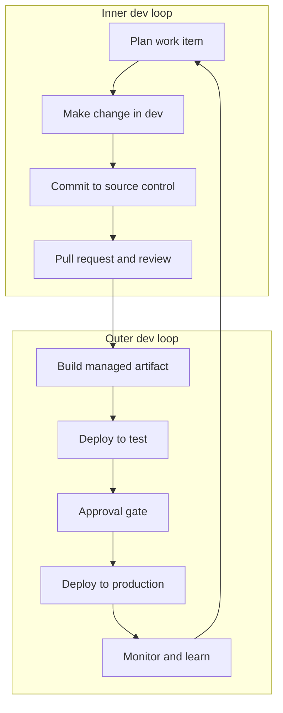
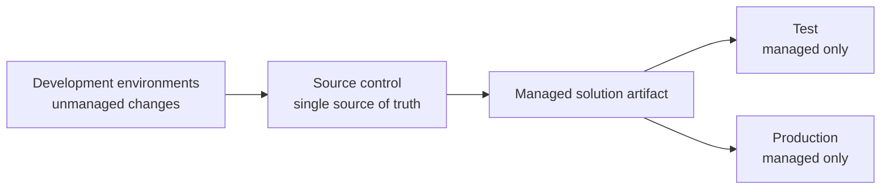

# Lab 01: Design the ALM blueprint

## Goal

Design the working model before you configure tools. The blueprint defines the inner loop, outer loop, environment strategy, solution strategy, and source-of-truth rules.

**Estimated time:** about 30-45 minutes.

## State you carry forward

- Completed [Reliable ALM setup](00-setup.md).
- Environment map and owners are known.
- Existing Power Pages site uses the enhanced data model.

## Why this lab matters

Most ALM failures start as design gaps: unclear environments, direct production edits, solutions used as branches, or missing ownership. This lab turns those choices into a simple blueprint the rest of the guide implements.

## Step 1: define the two loops

Write down:

- What happens in development.
- What must happen through a pull request.
- What checks must pass before a release candidate exists.
- What approval is required before production.

## Step 2: choose the solution strategy

Start with one solution unless you know you need modularization.

| Strategy | Use when |
|---|---|
| Single solution | One site or small-to-medium implementation with one delivery team |
| Multiple solutions in one development environment | Independent functional areas with minimal shared components |
| Multiple solutions with dedicated development environments | Large programs with base components and extension teams |

For most Power Pages teams, begin with a single solution that includes the site and required dependencies. Split later only when dependency ownership and release cadence justify it.

## Step 3: define source of truth

Use this rule:

> Development changes sync to source control. Test and production receive managed solution imports only.

Document what is not allowed:

- No direct unmanaged edits in test.
- No direct unmanaged edits in production.
- No zip-only releases without source history.
- No unreviewed changes to shared branches.

## Step 4: define environment-specific configuration

List values that must differ by environment.

| Configuration | Example | ALM handling |
|---|---|---|
| Site setting | Identity provider client ID | Environment variable |
| Secret | Client secret or API key | Secret-backed environment variable or approved secret store |
| Connection | Flow connector connection | Connection reference |
| Reference data | Lookup values or config rows | Configuration migration or scripted import |

Environment variables and connection references prevent direct production edits for settings that vary by stage.

## Step 5: define release and hotfix rules

Decide how releases move:

- Feature work merges into the shared branch only through pull requests.
- Release candidates are built from reviewed source.
- Hotfixes branch from the production mirror or current release branch.
- Hotfixes merge back into the active development branch after production.

## Checkpoint

You have completed this lab when:

- [ ] Inner loop and outer loop are documented.
- [ ] Solution strategy is chosen.
- [ ] Source control is declared the source of truth.
- [ ] Direct changes in test and production are explicitly blocked.
- [ ] Environment-specific configuration is listed.
- [ ] Release and hotfix rules are agreed.

## Troubleshooting

| Problem | Fix |
|---|---|
| Team wants to use solutions as branches | Use Git branches for change isolation; use solutions for packaging |
| Several teams share one solution | Confirm ownership and release cadence, or split into base and extension solutions |
| Production has unmanaged edits | Remove unmanaged layers or move the change back through development and a managed release |

## Next step

Continue to [Lab 02: Create the solution and connect source control](02-create-solution-and-source-control.md).
