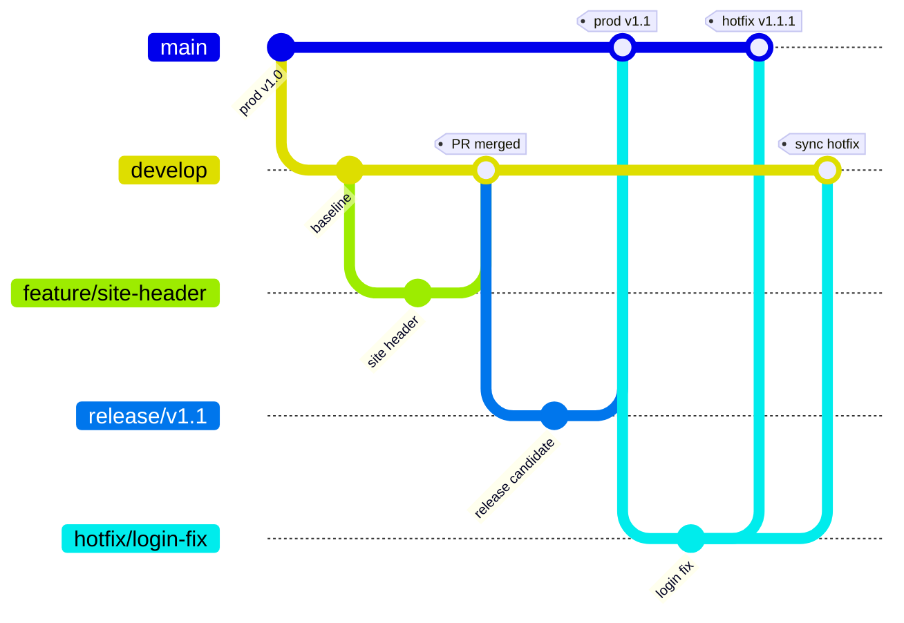

# Lab 03: Define branching and review strategy

## Goal

Create a branch and review model that supports daily collaboration, release candidates, and hotfixes without using solutions as branches.

**Estimated time:** about 35-50 minutes.

## State you carry forward

- Completed [Lab 02: Create the solution and connect source control](02-create-solution-and-source-control.md).
- Baseline solution is committed to source control.

## Step 1: choose the starting branch model

Use the simplest model that supports your team.

| Model | Use when |
|---|---|
| Single branch | One maker or very small team, low release complexity |
| Feature branches | Most teams: stable shared branch plus isolated feature work |
| Tailored GitFlow | Enterprise teams with release candidates, production mirror, and hotfixes |

Recommended baseline:

- `feature/*` for feature work.
- `bugfix/*` for non-urgent fixes.
- `release/*` for release candidates when you need selective revert.
- `hotfix/*` for urgent production patches.
- `main` as the production mirror after a successful production deployment.

## Step 2: map branches to environments

Use this as a branch-to-environment model: `feature/*` maps to isolated development, `develop` maps to integration, `release/*` maps to a release-candidate or test path, `main` mirrors production, and `hotfix/*` starts from production and merges back into both `main` and active development.

For small teams, you can skip `develop` and merge feature branches into `main`, then promote from `main`. For larger teams, keep `develop` as integration and use `release/*` when you need a stable candidate.

## Step 3: define pull request requirements

Every PR should include:

- Business summary.
- Components changed.
- Screenshots for visible site changes.
- Environment variables or connection references affected.
- Solution checker result.
- Test evidence.
- Rollback or hotfix note.

## Step 4: assign review ownership

| Area | Reviewer |
|---|---|
| Power Pages content and navigation | Site owner |
| Dataverse schema | Data model owner |
| Web roles and table permissions | Security owner |
| Pipelines and deployment files | DevOps owner |
| Environment variables and secrets | Platform admin |

## Step 5: define conflict rules

Native Git integration provides conflict resolution in the Solutions experience. The team still needs ownership rules.

- Resolve conflicts before committing.
- Pull updates before starting major work.
- Assign makers to separate pages or components when possible.
- Communicate before changing shared components, tables, or permissions.

## Step 6: define hotfix flow

Hotfix rules:

1. Branch from the production mirror.
2. Keep the change minimal.
3. Run required checks.
4. Promote through the fastest approved path.
5. Merge the fix back to active development.
6. Tag or record the released version.

## Checkpoint

You have completed this lab when:

- [ ] Branch model is selected.
- [ ] Branch-to-environment mapping is documented.
- [ ] PR template or checklist exists.
- [ ] Review ownership is assigned.
- [ ] Conflict and hotfix rules are documented.

## Troubleshooting

| Problem | Fix |
|---|---|
| Team uses solutions as branches | Move isolation to Git branches and environments |
| Release candidate contains an unapproved feature | Revert from the release branch before production |
| Hotfix skips development forever | Merge it back into the active development branch |
| Same page conflicts repeatedly | Split ownership or create smaller work items |

## Next step

Continue to [Lab 04: Configure quality and security gates](04-quality-security-gates.md).
