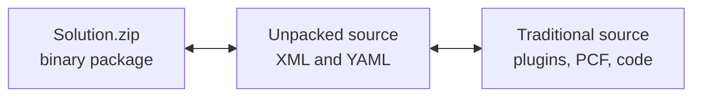

# Lab 05: Prepare release artifacts

## Goal

Prepare the managed solution artifact and environment-specific configuration that can move safely through test and production.

**Estimated time:** about 45-60 minutes.

## State you carry forward

- Completed [Lab 04: Configure quality and security gates](04-quality-security-gates.md).
- Shared branch is protected.
- Solution is ready for export.

## Step 1: understand the three solution forms



Use each form intentionally:

| Form | Use |
|---|---|
| Unmanaged solution | Active development |
| Unpacked source | Review, source control, diffs |
| Managed solution | Test and production deployment |

## Step 2: export and unpack source

Use PAC CLI or your build tool:

```bash
pac solution export --name <SolutionName> --path build/<SolutionName>.zip --managed false --overwrite
pac solution unpack --zipfile build/<SolutionName>.zip --folder src/solution --packagetype Unmanaged
```

Commit unpacked source, not zip files.

## Step 3: create the managed artifact

```bash
pac solution export --name <SolutionName> --path build/<SolutionName>_managed.zip --managed true --overwrite
```

Treat the managed zip as a build artifact. Store it in the CI/CD system with version metadata.

## Step 4: configure environment variables and connection references

Environment variables and connection references prevent direct target edits.

| Configuration type | Use for |
|---|---|
| Environment variable | Site settings, API endpoints, toggles, tenant-specific IDs |
| Secret environment variable | Secrets backed by the approved secret store |
| Connection reference | Connector bindings for flows or apps |
| Configuration data | Reference data that is not a solution component |

For Power Pages site settings, set the site setting source to **Environment Variable** and include the definition in the solution.

## Step 5: prepare deployment values

Create a deployment-values record for each stage.

| Variable | Test | Production | Secret? |
|---|---|---|---|
| `cr_authClientId` | Test app registration | Production app registration | No |
| `cr_featureEnabled` | `true` | `false` until launch | No |
| `cr_authClientSecret` | Secret store | Secret store | Yes |

Never commit secret values in plain text.

## Step 6: publish before export

Before exporting a release candidate:

- Publish customizations.
- Confirm solution checker status.
- Confirm no unmanaged production edits need to be back-ported.
- Confirm the version number strategy.

## Checkpoint

You have completed this lab when:

- [ ] Unmanaged source is unpacked and reviewable.
- [ ] Managed solution artifact is produced.
- [ ] Environment variables and connection references are included where needed.
- [ ] Secret handling is documented.
- [ ] Deployment values are ready for test and production.

## Troubleshooting

| Problem | Fix |
|---|---|
| Managed export fails | Publish customizations and rerun checker |
| Target receives dev values | Verify environment-variable values are supplied during import or pipeline deployment |
| Zip is committed | Remove it from source control and keep unpacked source only |
| Reference data is missing | Move it with a configuration-data process, not a solution |

## Next step

Continue to [Lab 06: Set up CI/CD and Pipelines](06-set-up-ci-cd-and-pipelines.md).
