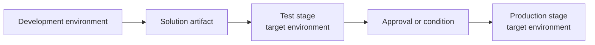

# Lab 06: Set up CI/CD and Pipelines

## Goal

Automate validation and artifact creation, then configure Power Platform Pipelines for governed promotion.

**Estimated time:** about 60-90 minutes.

## State you carry forward

- Completed [Lab 05: Prepare release artifacts](05-prepare-release-artifacts.md).
- Managed solution artifact can be produced.
- Environment values are documented.

## Step 1: define tool responsibilities

| Layer | Tool | Responsibility |
|---|---|---|
| PR validation | Azure DevOps Pipelines or GitHub Actions | Build, pack, scan, check |
| Artifact build | Azure DevOps Pipelines or GitHub Actions | Produce versioned managed solution |
| Promotion | Power Platform Pipelines | Deploy managed solution through stages |
| Operations | Power Platform admin center, logs, release runbook | Validate, recover, and monitor |

## Step 2: build the CI workflow

Your PR validation should:

1. Pack or validate solution source.
2. Run Power Platform Checker.
3. Run source security checks.
4. Publish reports.
5. Block merge when required gates fail.

## Step 3: build the artifact workflow

After merge to the release branch or shared branch:

1. Export or pack the solution.
2. Increment or set the solution version.
3. Produce managed and unmanaged artifacts if required.
4. Store reports and deployment notes.

The artifact should be immutable: the same artifact that passed test should be the one promoted to production.

## Step 4: configure Power Platform Pipelines

Power Platform Pipelines uses development environments, deployment stages, target environments, and solution artifacts.

In Power Platform:

1. Confirm or create the pipeline host.
2. Add the source development environment.
3. Add target environments.
4. Create stages.
5. Configure deployment identity.
6. Add approvals or pre-stage conditions as required.

## Step 5: define approval evidence

Before production, require:

- Pull request link.
- Solution version.
- Managed artifact link.
- CI validation result.
- Solution checker report.
- Test deployment result.
- Environment values confirmation.
- Rollback plan.

## Checkpoint

You have completed this lab when:

- [ ] PR validation workflow exists.
- [ ] Artifact build workflow exists.
- [ ] Managed artifact is versioned and stored.
- [ ] Power Platform Pipelines stages are configured.
- [ ] Production approval evidence is documented.

## Troubleshooting

| Problem | Fix |
|---|---|
| CI cannot authenticate | Use an approved service principal or service connection |
| Pipeline stage is not visible | Confirm source and target environment links |
| Production approval is informal | Add a documented approval step or pipeline condition |
| Artifact differs between test and production | Promote the same stored artifact, not a rebuilt one |

## Next step

Continue to [Lab 07: Promote and operate](07-promote-and-operate.md).
