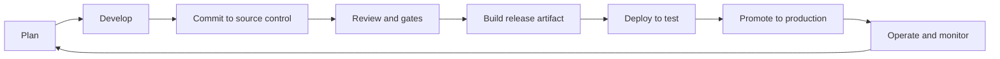

import { GitBranch, PackageCheck, Rocket, ShieldCheck, Workflow } from 'lucide-react';

# Setup reliable ALM Lab

  <strong>Work in progress</strong>
  

    This ALM lab guide is still being refined. Use it as a guided draft, and validate the steps against your tenant, environment strategy, and organization policies before using it for production rollout.
  

<section className="landingHero">
  
Manual Power Pages ALM lab

  <h2>Set up a reliable delivery path for an existing site</h2>
  

    Build a working ALM setup for a Power Pages site: source control, branching, review gates, release artifacts, CI/CD, Power Platform Pipelines, validation, and recovery.
  

  

    <a className="button button--primary button--lg" href="00-setup">Start setup</a>
    <a className="button button--secondary button--lg" href="#labs-in-this-guide">View the lab sequence</a>
  

</section>

## What you will have when you finish

By the end, your team has:

- A clear environment strategy for development, test, and production.
- A Power Platform solution that contains the Power Pages site and dependencies.
- Native Dataverse Git integration for the development inner loop.
- A branching and review model that supports feature work, release candidates, and hotfixes.
- Quality and security gates that protect the shared branch.
- Managed release artifacts with environment-specific values handled safely.
- Power Platform Pipelines or equivalent CI/CD that promotes the site through target environments.
- A repeatable operating cadence for verification, rollback, and recovery.

## Choose this guide when

  <a className="phaseCard" href="#the-learner-journey">
    <GitBranch className="phaseCard__icon" aria-hidden="true" />
    Inner dev loop
    <h3>Your team is actively changing the site</h3>
    
Set up source control, native Git integration, branching, code review, conflict ownership, and quality gates.

  </a>
  <a className="phaseCard" href="#the-learner-journey">
    <Rocket className="phaseCard__icon" aria-hidden="true" />
    Outer dev loop
    <h3>You need governed promotion</h3>
    
Build managed artifacts, configure environment values, deploy through Pipelines, validate targets, and recover safely.

  </a>

## What you will set up

  

    <GitBranch className="rootCard__icon" aria-hidden="true" />
    <h3>Source-controlled development</h3>
    
Development changes sync to Azure DevOps Git, while test and production receive managed solution imports only.

  

  

    <ShieldCheck className="rootCard__icon" aria-hidden="true" />
    <h3>Quality and security gates</h3>
    
Pull requests, reviewers, solution checks, code scanning, and release evidence protect the shared branch.

  

  

    <PackageCheck className="rootCard__icon" aria-hidden="true" />
    <h3>Release artifacts</h3>
    
Managed solutions, environment values, connection references, and version metadata are ready for each stage.

  

  

    <Workflow className="rootCard__icon" aria-hidden="true" />
    <h3>Pipeline operations</h3>
    
Power Platform Pipelines move the same artifact through test and production with validation and recovery steps.

  

## The learner journey

This guide separates the work into two loops.

| Loop | What happens there | Labs |
|---|---|---|
| **Inner dev loop** | Makers and developers actively change the site, sync source, review changes, and keep the shared branch healthy | Setup through Lab 04 |
| **Outer dev loop** | The team builds artifacts, promotes them to test and production, verifies the site, and learns from production feedback | Labs 05 through 07 |

## Labs in this guide

| # | Lab | Outcome |
|---|---|---|
| Setup | [Reliable ALM setup](00-setup.md) | Environments, tools, roles, repository, and ownership are ready |
| 01 | [Design the ALM blueprint](01-design-alm-blueprint.md) | Inner loop, outer loop, environments, solutions, and source-of-truth rules are defined |
| 02 | [Create the solution and connect source control](02-create-solution-and-source-control.md) | Site and dependencies are in an unmanaged solution connected to Azure DevOps Git |
| 03 | [Define branching and review strategy](03-branching-and-review-strategy.md) | Branches, pull requests, conflict ownership, and hotfix rules are documented |
| 04 | [Configure quality and security gates](04-quality-security-gates.md) | Required checks, reviewers, and branch policies protect the shared branch |
| 05 | [Prepare release artifacts](05-prepare-release-artifacts.md) | Managed solution artifacts and environment values are ready for target deployment |
| 06 | [Set up CI/CD and Pipelines](06-set-up-ci-cd-and-pipelines.md) | Validation, artifact build, and Power Platform Pipelines stages are configured |
| 07 | [Promote and operate](07-promote-and-operate.md) | Test and production promotion, activation, cache clearing, validation, and recovery are repeatable |

## What makes the setup reliable

Reliable ALM answers the hard questions before an incident:

- What changed, and who approved it?
- Which source version produced the deployed solution?
- Which solution version is in each environment?
- Which values differ by environment?
- Which gates stop risky changes?
- How do we recover if import, activation, cache, or validation fails?

## Start here

  <h3>Start with setup</h3>
  
Begin with <a href="00-setup">Reliable ALM setup</a>. It confirms your environments, repository, tools, roles, and ownership before you design the ALM blueprint.

